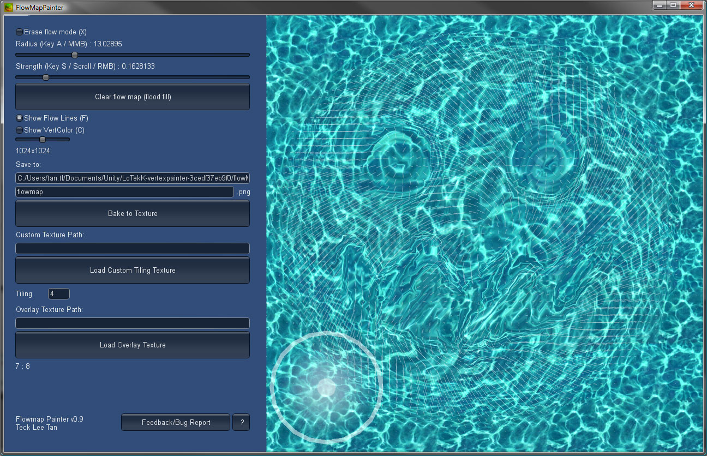

# Flow Mapping

Flow mapping is 

## Authoring a Flow Map

How to author a flowmap is not a simple process and can involve specific tools. However the principle of a flowmap stays the same regardless of the tool that authors it. This can be analoguous to the way we bake a normal map : some tools will try to project a high-def geometry on a low-poly geometry, others will only process a 2D heightmap and deduce the normal direction.

Regardless of how the tool works. The flowmap principle stays the same.

#### Principle of a flow map

A flow map is a texture containing per-pixel information of a 2D Flow deformation. If the pixel values is neutral, it considers that this pixel shall not be animated. 

* **Distortion Values** are stored most of the time in **tangent-space** so the flow is described as **2D in UV space**, which makes computations more easy.

* Depending on the **texture format** chosen, values can be stored directly as **signed floating-point** (high precision but most of the time hard or impossible to compress) or packed into **8-bit per channel textures, with unsigned normalized values** (zero-centered on middle-gray, with negative values darker and positive values lighter, such as 8-bit normal maps).

* Regardless of the texture format chosen these textures need to be **imported and sampled as linear** values (like normal maps)

### Using Flowmap Painter

Flowmap painter is a simple tool dedicated to the authoring of flowmaps in 2D. It displays a canvas that can be painted.



You can download the tool here : http://teckartist.com/?page_id=107

### Using Other DCCs

Other DCCs can also use render-to-texture to export flowmaps in 3D that have been baked to meshes. Most of the time this process involves a physical gas or fluid simulation that is projected on a mesh, which makes it a more realistic effect but give less artist control.

## Baking in Vertex Colors / TexCoords

For flowmaps that do not require a high density of pixels, 2D Flow vectors can be baked right within the mesh either in Vertex Colors or in a dedicated Texture Coordinate channel.

## Using a flow map in a shader

A flowmap contains most of the time two-directional vectors aligned to the tangent-space (UV space) so the computation for the deformation is reduced to a minimum of math operations. It's somewhat similar to deformation maps (see Math for artists section).

In the case of flow maps, we need to animate the intensity of the deformation over time. 

```c
float2 flow = tex2D(_FlowMap, input.uv).xy;
// if unsigned normalized, we put the 0..1 range into -1..1 range
// flow = flow * 2.0 - 1.0;

// then We add the read values of flow
float2 color = tex2D(_ColorMap, input.uv + flow * _Time);

```

However, doing so, will tend to stretch the texture to an infinity which is not what we want,

#### The Flow Cycle Trick

To simulate the flow of a texture, we are going to use a trick that simulates a cycle of flow that will repeat over time. this cycle can be described of a repetition of  (pre-deformed ,  neutral,  deformed) states

To do that, instead of increasing the time infinitely (0 to infinity), we will use cycles from -1 to 1 that repeats over time.

```c
float2 flow = tex2D(_FlowMap, input.uv).xy;
// if unsigned normalized, we put the 0..1 range into -1..1 range
// flow = flow * 2.0 - 1.0;

// We compute a cycle based on a duration, and remap it on a -1..1 range
float cycle = frac(_Time / _CycleDuration) * 2.0 - 1.0;
// then We add the read values of flow
float2 color = tex2D(_ColorMap, input.uv + flow * cycle);

```

Now we have this (pre-deformed, neutral, deformed) interpolation, but we have a cut every cycle loop.

The trick to make it repeat over time is to **make this cycle overlapped by another cycle, offset in time**. So when the cut we don't want is supposed to be visible, we display another cycle.

To do that, we offset 2 cycles in time, to the half of a cycle duration. Then we use a lerp to bounce from one cycle to another