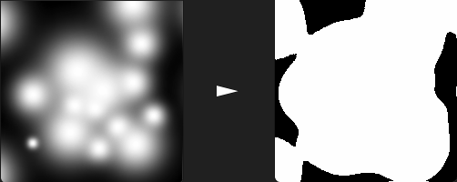
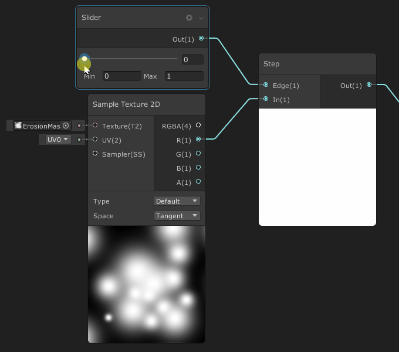
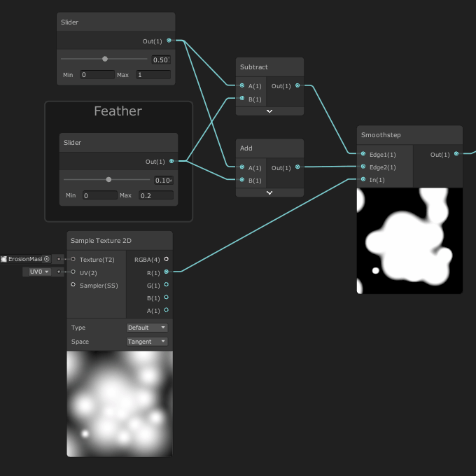
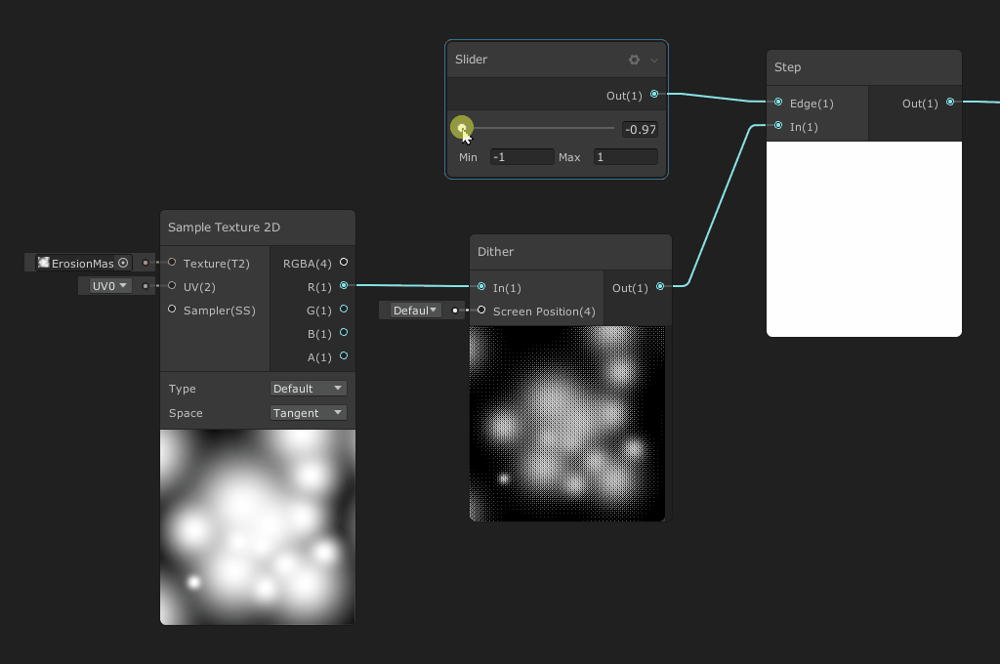

# Alpha Erosion

Alpha erosion is a process of eroding opaque (or at least non-transparent) pixels based on different criteria.  The outcome of this is a control over the alpha channel that differs from a simple fade as all the pixels do not fade equally but instead are eroded progressively until all pixels are transparent.



## Principles

Alpha erosion is based on determining an **erosion threshold** in an **alpha mask** and animate this threshold based on various criteria so the shape dissolves itself into nothing.

#### Equation and Algorithm

The base equation for erosion is :

```C
if(pixel.a < threshold)
{
    pixel.a = 0.0;
}
else
{
    pixel.a = 1.0;
}
```

#### Step function

instead of using this long comparison, we can use the `step(threshold, alpha);` [HLSL function](https://docs.microsoft.com/en-us/windows/win32/direct3dhlsl/dx-graphics-hlsl-step) that will return 0 for any value below the `threshold`, and 1 for any value greater or equal to the `threshold`

This algorithm can be simplified down to :

```c
pixel.a = step(threshold, pixel.a); // pixel.a = (pixel.a >= thredhold)? 1 : 0;
```

Step function is a hard-stepping function that will output fully opaque or fully transparent pixels. No feather will be present so the erosion will be subject to **Aliasing**.

In a Shader graph, the algorithm is the following:




#### Smooth Step function

In addition to the `step(threshold, alpha)` function exists a `smoothstep(min, max, alpha)` [HLSL Function](https://docs.microsoft.com/en-us/windows/win32/direct3dhlsl/dx-graphics-hlsl-smoothstep), that will erode not only based on a hard threshold but instead using a feathered threshold that will interpolate alpha between a min Threshold and a max Threshold.



## Authoring and Importing Erosion Maps

Erosion maps are textures that convey a mathematical progress of alpha erosion. As such, they do not behave like color, and need to be imported as linear (sRGB off). Failing to do so can result in a non-linear progression of the mask, as shown as below.


## Advanced Erosion Processes

### Dithered Erosion

An alternative Method for erosion involve a per-pixel pattern that offsets the result of the alpha channel based on a screen-space repeating pattern. [Bayer patterns](https://en.wikipedia.org/wiki/Bayer_filter) are often used procedurally (as seen in the example below) in order to offset the color.

In the following example, the Dither Node modifies the input gradient (in the 0..1 range) and outputs it as a dithered pattern in the -1..1 range. It is then easy to perform a threshold on this modified gradient. The result of the step function is still either zeroes or ones.




**Use Case :** The result of such erosion using a step function is rendered as pseudo-transparency that can be used on  Alpha-Clipped opaque rendered objects to simulate transparency. In such cases, every opaque pixels is used as an occluder and will prevent overdraw from happening. In the example below (Strike Vector EX), Oil tanks can be destroyed and the camera go through it, causing huge frame drops during the traversal of the smoke. At the beginning, the huge explosion are rendered as fully opaque spheres (that can still dither while going through, by using [camera fading](fading.md#camera-fading))

<video loop="true" autoplay="true" ><source  src="../img/erosion-dithering-svex.mp4" type='video/mp4' /></video>

### Correct Threshold for Soft Erosion

### 

### Progression Maps

