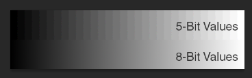
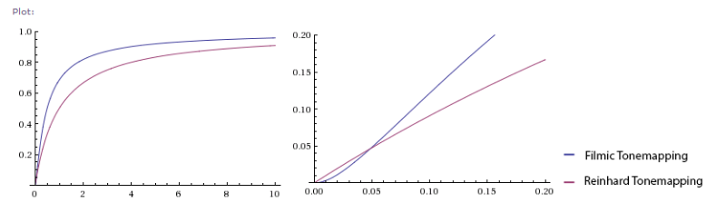

# Color processing in our game engine

Explaining all color and math to artists can be from piece of cake to real headache. Some concepts like HDR can be explained easily, but there are a lot more information that can be confusing, like color precision, gamma, and a lot of other stuff that composes your game engine but that’s not self explanatory.

### HDR Vs LDR Color

While HDR color stands for High-Dynamic Range , its counterpart LDR (Low-Dynamic Range) is a bit misunderstood as It does not work exactly the same way.

Let’s take an example, as the best camera ever : your eye. If you go outside on summer on very sunny places then go rapidly inside on a very dark place, you will have trouble adjusting your sight in order to see clearly in the penumbra. This is something I often experienced at disneyland on summers when entering the pirates of the caribbean rollercoaster : the interior is only lit by very faint lights and it takes a few minutes for the eye to adapt to the new ambient lighting.

This is basically HDR for the eye. Your eye’s photoreceptors, besides being saturated for a minute, and your iris being dilated are what we could call **tonemapping**.

This process is the way to reduce the range of luminosity to an acceptable range by the receptor so It can be interpreted within its capabilities.

Cameras work the same way, CCD receptors on your phone are configured to recieve a certain quantity of light during an amount of time. That’s why taking pictures in low light makes you see a lot of motion blur and experience low framerates on your camera’s screen : in order to gather the correct amount of light on the CCD, you have to “open” the receptor a larger time than if you were in a sunny afternoon outdoors situation.

Basically here are some light values comparisons:

1. Cloudy Overcast Night without Moon : 0.001 Lux
2. Moonless clear Night with airglow 0.002 Lux
3. Clear Night with full Moon 0.25~1.0 Lux
4. Civil Twilight (just after sunset) : 3.4 Lux
5. Interior living room house lighting ~50 Lux
6. Dark Overcast day 100 Lux
7. Office Lighting 300~500 Lux
8. Clear Sunrise/Sunset : 400 Lux
9. Bright Overcast day : 1000 Lux
10. Sunny Daylight (not direct sun) 10k~25k Lux
11. Direct sunlight 32k~130k Lux

In order to comprehend this scale here are some notions of how the color is used in computer graphics.

#### LDR Color Precision

LDR color is what your monitor is able to display (except some Dolby Prototypes presented in 2016, that can display HDR color), color is encoded at a maximum of 10 bits (on some recent monitors), and more generally at a **precision **of 8 bits per channel (Red, Green, and Blue). This is the reason why a lot of image editing tools are coding color from 0 to 255 : 8bit colors so 28 equals 2x2x2x2x2x2x2x2 = 256 values. 10 bit colors enable the color to go from 256 values per channel to 1024 values per channel.

But this improvement is only an improvement of precision. A good example of how precision works is to reduce a gradient using posterize filter, by reducing to 32 values, you emulate a downgrade of your color precision to 5-bit, so only 32 shades of gray are available.

#### HDR Color Precision and floating-point

HDR Color, is on the other side a really wider range, that goes from one thousandth of a Lux to Hundreds of Thousands of Luxes. So basically using 256 distinct values will not be handy in this case.

That’s why color used in HDR is not coded using integer values from 0 to 255 (8 bit), but instead using floating-point values of 16(half) or 32(float) bits. The main advantage of floating point operations is that you have a really good tradeoff between range, and precision, so we can match our Luminance values.

Below is an example of luminance values, most of the "dark" ambiences need precision into the fractional part rather than the integer part, while "bright" values need more bits to describe their integer part than their fractional part.

#### HDR Color to LDR Color : Tonemapping

Tonemapping is the process of going from HDR to LDR, as we all know that our monitors can only display 256 colors per channel, we will have to choose which range we want to display, and how to display It correctly. So in order :

- We choose a range within the HDR Range. (Luminance evaluation)
- We apply a curve to balance the color. (Tonemapping)
- We downsample the color precision of the image to LDR Color (LDR Downsampling)

### sRGB Color and Gamma Correction

When performing computations in modern PCs, Consoles and Mobile, the graphics hardware is suited to perform color conversion in order to be mathematically correct when performing all computations.

#### sRGB - the Color space of the human eye

Human eye is one of the most precise image acquisition devices that can interpret light in a really wide range, but the perception of the color is unbalanced between the dark tones and the light tones. As a matter of fact, humans tend to be more sensitive to dark values than bright values. 

When designing a color texture, an artist will paint values and most software will handle a color correction so all the darker tones have a better precision than the light ones. 

On an exaggerated manner we can take our earlier example with 5-bit precision gradient and display the repartition of all the tones either in linear or sRGB.

In the sRGB Example, the step gap between darker value is narrower than for brighter values.

