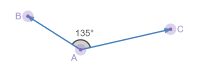
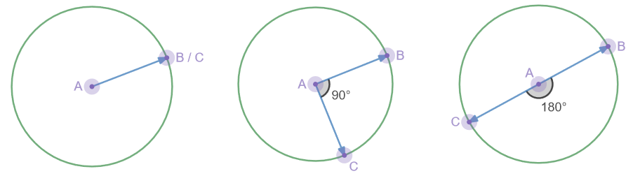
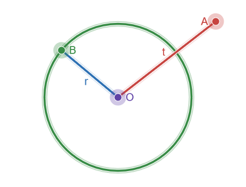
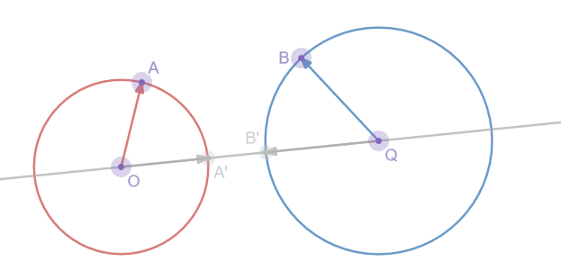
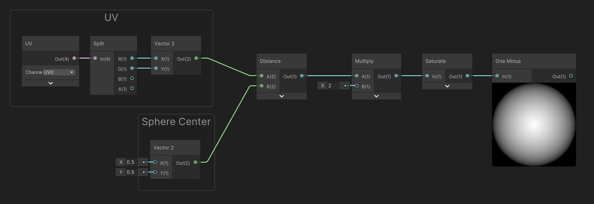
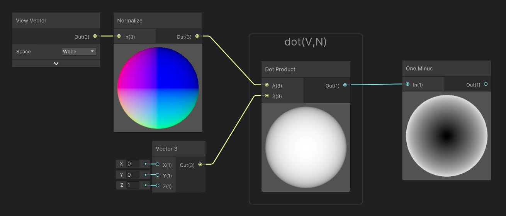
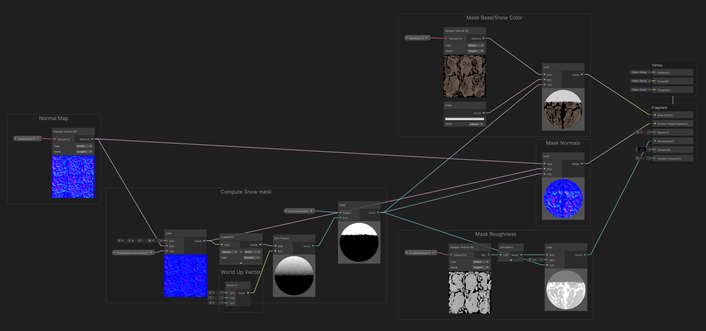
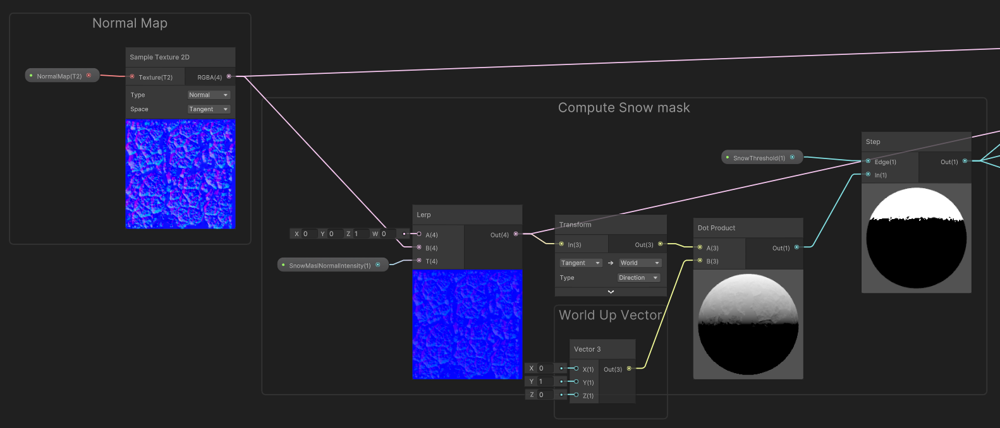
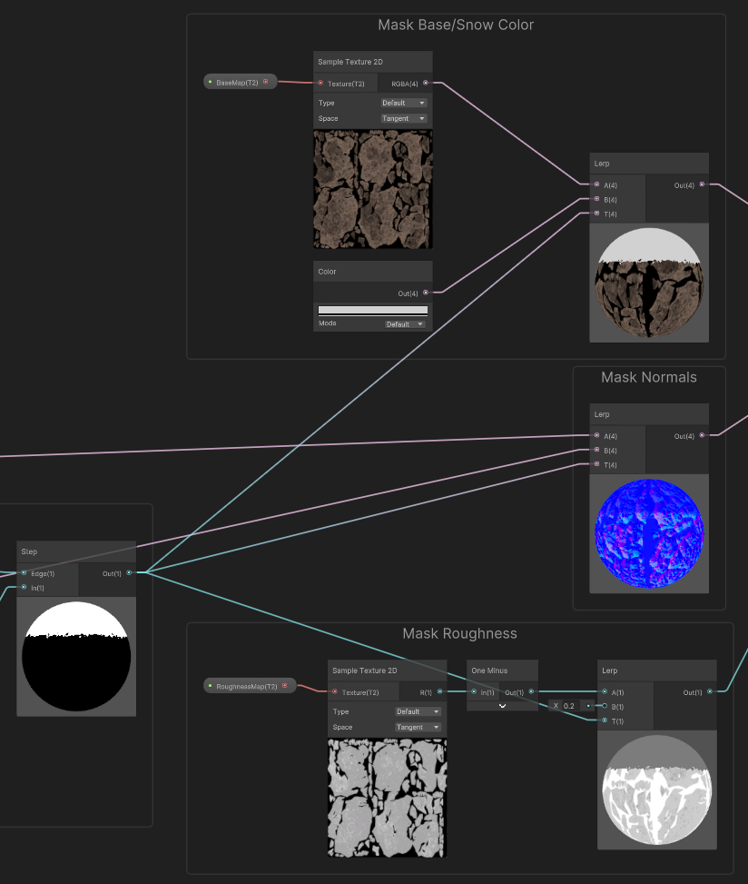

# Dot Product

Dot product (also known as *Scalar Product*) is a pretty common math algebraic operation used in trigonometry that helps solving many cases. It works by comparing two vectors of any length and **returns a value based on their length and the angle they are forming.**

## Principles

### Behavior



The dot product compares two vectors based on their **length** and the **angle** they form and returns a single value. The resulting value can be interpreted in the following cases:



1. When the two vectors AB and AC are **normalized** (length = 1): Returns the **co-linearity coefficient**: which means how much the two vectors are parallel and in the same direction:
   - 1.0 if they are **equal**
   - 0.0 if they are **perpendicular** (90 degrees)
   - -1.0 if they are **opposed** (exact opposite directions, 180 degree angle)

   > Values are interpolated based on the angle and are equal to the **cosine of the angle formed by these two vectors.**
   
   
   
2. With at least one normalized vector: **Projects** the end of the first vector on the second vector and determines the length of its projection.

   

3. When used on a vector **with itself** : Determines the **squared length** of the vector. 

   - Using a **square root** on the result of the dot product will give the actual length of the vector.

   

The dot product operation is **Symmetric**: Meaning that A dot B equals B dot A

### Formula

The dot product of two vectors `v1` and `v2` can be computed by the following formula:

`dot(v1,v2) = len(v1)*len(v2)*cos(angle(v1,v2))`

It can also be resolved by the following formula:

`dot(v1,v2) = (v1.x * v2.x) + (v1.y * v2.y) + (v1.z * v2.z)`

Thus resolving the cosine of the angle without using an actual cosine, if the lengths of v1 and v2 are known.

##  Use Cases

Here is a more detailed section where the dot product can be useful.

### Comparing Squared Lengths/Distances

The use of dot products is the most straightforward way to compare vector lengths (and consequently distances). In the case of strict comparison, instead of comparing the actual distances, we can compare these squared distances as the outcome of the comparison (equal, less or greater).

> **Optimization tip:** If the need is to compare distances, it is often advised to do it in squared space instead of using un-necessary square roots operations to convert the squared length to actual length.

#### Example 1 : Simple Distance to Circle

In this example we need to test whether the point A is contained in the Circle of center O and radius OB.



 To do so: we are going to compute the square lengths of the two vectors, OA and OB. by doing the following: 

```c
t_squared = dot(OA, OA);
r_squared = dot(OB, OB);
```

It is then easy to compare `t_squared` with `r_squared`

#### Example 2 : Distance between Two Circles

By extension of the first example : we can detect if two circles are intersecting  by computing squared distances.



In our case, we can say that the two circles will be intersecting by **comparing the distance between their centers** (length of the OQ vector) to **the combined length of their radius** (length of OA + length of QB).  

> In the figure above, we can see that the OA' and QB' have the same length as OA and QB but showing them on the same line as OQ is more explicit to understand the combined lenghts.

As before, we are using the dot product to compute in squared space instead of 

```
sqr_distance_OQ = dot(OQ,OQ)
sqr_radius_sum = dot(OA,OA) + dot(QB,QB)
```

Then, we just need to compare these two squared distances.

## Practical Examples

Dot product theory can be a bit vague, even with its use cases : Here are some practical examples that make use of the dot product.

### SphereMask Distance Gradients

These simple masks can help generate procedural, (infinitely precise) masks that can be used for glow sprites. The Radial gradient can be altered using an [exponent](math.md#power-exponent) to control the attenuation of the outer part of the gradient.



### Fresnel and Inverse-Fresnel



### World-Space oriented coverage

Another use case of dot products is to generate masks that are computed from a particular point of view in the scene. For example a coverage mask for snow, based on the normals of the objects, and a vertical projection axis.


For that example, we used a simple master shader based on Albedo, Normal Map, and Roughness. The shader blends between the rock properties (from the input textures, and the snow properties (color and roughness as constants, and the normal being a flattened version of the rock normals).



In order to compute the snow mask, we first **sample the normals of the object** and we blend them towards a flat normal to diminish the influence of the high frequency normals of the rock (using a `Texture2DBias Sample` could also help as it would use a more blurred mip of the normal map). Once sampled and flattened, the normals are transformed from tangent (texture) space, to world space. 

Then, we perform the **dot product** between the **world-space normals,** and the **World-Up Vector** (in our case, it was Y-up as we are in unity).

The result of this operation is determining *How much the normals are facing upwards* : our **colinearity coefficient** with the up vector.

Then, we performed a threshold (Step) on that value, in order to generate the mask : 1.0 (snow) for values above the threshold, and 0.0 (rock) for values below.



Finally, the mask is used in various lerp operations to perform the blending on Color, Normals and Roughness* 

**in our case it was smoothness (inverse roughness)*




