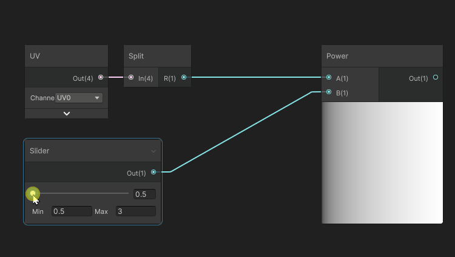
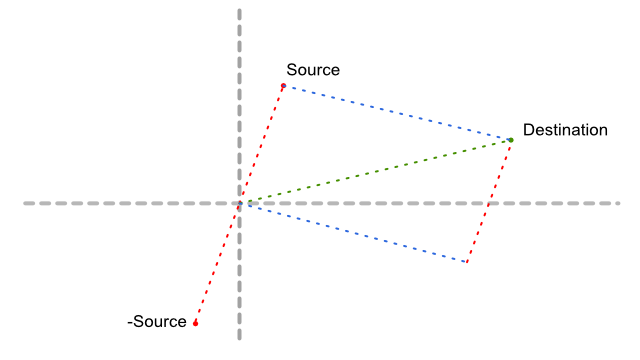

Shader Math for Artists

Here is a series of shortform articles that cover common shader cases for use in visual effects and general purpose shader authoring.


### Additive Color  (Add)

The Add operation used in color math is rather simple, it is simply an addition of the values per component, as does the Linear Lighting blend mode in Photoshop. 


### Subtractive Color (Multiply)

The multiply operation is also really simple, it applies some kind of masking to our color, by darkening the first color by the other. This affirmation is true when using LDR color (between 0.0 and 1.0).


### Linear Interpolation Blending (Lerp)

The linear interpolation is basically the transition from one value to another using a **grayscale mask** that represents **the proportion of B to be blended with A**.


Some Facts:

* For each black (0.0) pixel mask. only the X image is output, 
* For each white (1.0) pixel mask. only the Y image is output. 
* When the mask is at 0.5 the output will be a perfect blend of X and Y, each at 50%
* When the mask is at 0.25, the output will be 25% of Y and 75% of X

> Note: If you author a grayscale texture mask, you have to ensure that the texture is not imported as sRGB so the mask values are correctly weighted.


## Math Operations

### Fractional Part (Frac) and Modulo

Fractional part removes then integer part of a number and leaves us only with its fraction of 1. It is roughly the same as a Modulo 1. 


One common use case is to make perdiodic repetition over time, frac or modulo can be used to repeat time.


### Round, Ceiling and Floor


### Exponent (Power)

The power operation (A exponent n) is an operation that will multiply a value A, N times by itself. A exponent 3 will result in A x A x A.

#### Power used in color

When used in color, it has an effect of altering the hardness of a linear gradient with the following properties:

* An exponent between 0 and 1 will tend to brighten the darker values.
* An exponent greater than 1 will tend to darken the darker values.
* A value of 1 will NEVER change, with any exponent.
* An exponent of 1 does not alter the gradient
* Values above 1 will grow exponentially as N is greater than 1
* Values above 1 will gros logarithmically as N is lower than 1
* Negative values of the exponent result in root exponents (eg: square root for a exponent of -2)


Here is now, how it applies to color using the same exponent coefficients: we can see that it affects the color  in a non-uniform way. In our example, the darker the color will be, the more it will be affected by the exponent.

In the graph above, it is visible as the green curve will always have f(1) = 1 (the curves cross at (1,1)). However in our graph below, it only displays the [0..1] range.



One of the purposes of an exponent, applied to color, in a [0..1] range is **to manipulate the attenuation** of the darker tones. 

### Sine and Cosine

Sine and cosine are operations used for a various range of purposes : 

* Computing coordinates based on an angle, such as [rotator](shaders/texcoord.md#rotating-uvs-rotator).
* Performing Repeating interpolation back and forth from a value A to a value B, with dampening at source/target.

Sine and cosine are basically used to compute a position on an **unit circle** based on an angle on this circle.

### Procedural Gradients

##### Linear

Linear Gradients are pretty straightforward to attain as they can be made using any linear space data, such as UV, or position.

##### Square Mask

Square mask is a combination of linear gradients multiplied together, that will perform linear attenuation to the sides of an UV space (or position space)

##### Sphere Mask

Sphere mask results in a 2D or 3D radial gradient that will correspond to a gradient based on a 2d or 3d distance to a point.

### Tri-Projection

Tri-projection is a way of projecting textures on a mesh that either does not possess UVs or on a series of contiguous meshes. Its principle is pretty straightforward : Textures are projected from the 3 axes (X,Y,Z) in local or world space. Then blended accordingly to the mesh normals.

* A projection from the XY plane will be projected along the Z axis
* A projection from the YZ plane will be projected along the X axis
* A projection from the ZX plane will be projected along the Y axis

```c
// Declarations
sampler2D _TextureToTriProject; // Texture that needs to be tri-projected
float3 WorldTilingScale; // The world texel ratio for the projection

// Plane Coordinate Computation
float2 coord_xy = mesh.worldPosition.xy / WorldTilingScale.xy;
float2 coord_yz = mesh.worldPosition.yz / WorldTilingScale.yz;
float2 coord_zx = mesh.worldPosition.zx / WorldTilingScale.zx;

// Sampling based on the three planes
float3 colorXY = tex2D(_TextureToTriProject, coord_xy);
float3 colorYZ = tex2D(_TextureToTriProject, coord_yz);
float3 colorZX = tex2D(_TextureToTriProject, coord_zx);
```


Blending per-axis is decided by **the absolute value of the dot product** between the mesh normal and the projection axis.

`float blend = abs(dot(projectionAxis, mesh.normal));`

```c
// compute per-axis blend weights based here on worldNormal
float blendX = abs(dot(float3(1,0,0), mesh.worldNormal));
float blendY = abs(dot(float3(0,1,0), mesh.worldNormal));
float blendZ = abs(dot(float3(0,0,1), mesh.worldNormal));

// if normals are normalized, we ensure that blendX + blendY + blendZ = 1 at all 
//times, otherwise, we need to normalize mesh.worldNormal beforehand

// and finally we can compute the blended output by weighting every plane projection // by its projection axis and adding everything together.
float outColor = (colorXY * blendZ) + (colorYZ * blendX) + (colorZX * blendY);

```

> **Performance Warning**: Tri-projection is an expensive method that will degrade performance accordingly with the amount of textures used in the projection. The amount of texture reads per-pixel amounts to 3*N where N is the amount of textures used (diffuse, specular, roughness)

### Gradient Sampling

Gradient Sampling is a method to evaluate the direction of a gradient. It involves evaluating the gradient on each dimension axis at least two times to evaluate the direction. It is often used to compute a normal from a bump map.

#### 1D Principle

The Gradient sampling involves computing the derivative of the gradient for each axis. In 1D, this corresponds to the following:


However, if we take a look at the red vector, it corresponds roughly to the curve tangent at the midpoint between the two sampling points.


However this is an approximation as the sampling distance discretizes the curve and can lead to approximation errors such as this diagram:


In this example, the two sample points are too far to catch the actual slope of the curve. That's precisely the reason why sample points should always be as close as possible.

#### Multi-Dimensional Principle

When dealing with 2D or 3D gradients, the computation of every point is done per-axis and the tangent value reassembled into a 2D or 3D value. However if we take a look at all values that need to be sampled, we need to compute 4 or 6 Points (2 per dimension) then sample 4 or 6 times to fetch the actual tangent.

> #### Optimization
>
> Sampling so many times can often lead to poor performance, and becoming more expensive than reading an actual derivative stored inside a texture (for instance, a normal map instead of a bump map).
>
> The optimization to solve this is : instead of sampling around the target point (at the two black vertical lines around the red vertical line), we sample at the target point, and at one point around (for instance the black line right to it). Every time we will sample, we will have to sample three times at the target position, which can be reduced to 1 sample.

#### Implementation example : 2D (Optimized Sampling)

Here is an implementation of a gradient sampling to generate a normal map from a height (bump) map. This example uses a user-driven sampling distance and an arbitrary height scale interpretation to adjust the "bumpiness" of the output normal.


```c
float2 _SamplingDistance;
float _HeightScale;

float3 HeightToNormal(float2 uv, sampler2D tex)
{
    float2 uv_smpx = uv + float2(_SamplingDistance.x, 0);
    float2 uv_smpy = uv + float2(0, _SamplingDistance.y);
 
    // Sample source and each axis with a delta
    float smp_source = tex2D(tex, uv).x;
    float smp_x = tex2D(tex, uv_smpx).x;
    float smp_y = tex2D(tex, uv_smpy).x;
    
    // compute dervatives
    float2 derivative = float2(smp_x - smp_source, smp_y - smp_source);
    
    // Scale the derivative
    derivative *= _HeightScale / _SamplingDistance;
    
    // Pack into a normal, then re-normalize
    float3 normal = normalize(float3(derivative, 1.0));
    
    return normal;   
}
```


## Geometric Operations

### Expressing Vectors and Positions

In Geometry, points are expressed as 2D or 3D space vectors.  Every vector or position is expressed as a tuple of 2 or 3 values (depending if expressed on 2D or 3D). For instance (0,1,3) for a point that would be at X=0, Y=1, Z=3.

A vector value can express either a position in space or a displacement in this space (For instance how to go to a point A to a point B). Regardless of the meaning, all three values stay a vector, and a position can even be considered as a vector from the origin (0,0,0) to the point position.

### Transforming Vectors, Spaces, and The Homogeneous Coordinates

Vectors in shaders are expressed in a reference space, for instance a local position for a 3d mesh. or a position in UV (tangent) space. Really often, we will need to transform vectors from a space to another, for instance, transform a local mesh position to the world position.

#### Transformation and Matrix Multiplication

To transform vectors from one space to another, we use a **transformation matrix**: an array of values that is multiplied by the vector and will output the transformed vector. 

Game engines will often provide you these matrices so you can apply transforms yourself. For instance, to transform the local 3d position from local to world we can use the following:

```c
// matrix declaration (if not provided by the engine)
float4x4 _LocalToWorld;
...

float3 worldPosition = mul(float4(localPosition, 1.0), _LocalToWorld).xyz;
```

in HLSL we can use the `mul(vector, matrix)` operation to perform the transform. 

In shader graphs, there are nodes you can use to perform transformations on positions or vectors from one space to another, they will gather automatically the needed matrices and perform the multiplication for you


> #### Advanced Topic : Homogeneous Coordinates (Good for general knowledge)
>
> In the previous example you probably noticed that we performed the operation on a 3d vector, by setting it inside a 4d vector (`float4`). This is required to be able to perform the multiplication with the 4x4 float matrix. 
>
> <u>Here's a quick explanation:</u>
>
> In 3d transformations we can transform either positions or vectors by transformation matrices. Each transformation matrix contains values to translate, rotate and scale the vector. However, in some cases, we do not want to apply the translation to the vector. For example : mesh normals. We only need to rotate them. Scale will be also applied but we will re-normalize them (see [Normalization](#Normalization) for more info).
>
> To control whether we apply translation, we use an additional, 4th component to the vector. If this component has a value of 1.0, the translation will be applied, if it is zero, only the rotation/scale will be applied.
>
> This 4D Space is called **Homogeneous Coordinates** as it is used to be transformed either as a position, or a vector.

### Delta Vector between two positions

Sometimes you need to find the vector that binds a point to another, for instance if you want to move a point to a destination, so it fits this equation :

``` c
source + delta = destination;
```

By reversing the source component, the computation of the delta vector is pretty easy :

```c++
float3 delta = destination - source;
```



In this schenatic if we follow from the origin to the destination, then move along the -Source vector (going down), 


### Normalization

Normalization is the process that ensures that a vector keeps a length of 1 unit. This is highly critical, for example when performing computations of normals, that their length is 1 at all times.

Normalization will take any non-zero vector and will compute **a vector of the same direction**, but **with a length of 1**. In the following figure, all three vectors of different lengths (colored dashed ones) are being normalized and become of length one so they are inscribed into a norm circle.


> Troubleshooting: Zero-length vectors cannot be normalized, and performing a normalize operation on it will return an erroneous value (NaN, most of the time). If such cases can be predicted, you can add an Epsilon (really small offset) to any component to ensure that a zero-length vector can be avoided.

### Dot Product

Dot Product (often also known as Scalar Product) is a math operation that takes two vectors and will return a value depending on various factors:

* A difference of direction : angle
* A difference of length

#### Differences of Normalized Directions

One of the properties of a  Dot Product is that it will respond with the cosine of the angle described the two vectors. If the normalized vectors:

* ... have exactly the same direction (angle is 0 radians), it will respond with a value of 1
* ... are strictly perpendicular (angle is pi/2 radians), it will respond with a value of 0
* ... are exactly in opposite directions (angle is pi radians), it will respond with a value of -1


#### Computing the squared length of a vector

Another property of the dot product operation is that it can compute the squared length of a vector. When used on the same vector, it shall return the squared length of this vector.

This can be pretty useful to generate radial gradients by using the following :

`float gradient = sqrt(dot(uv.xy - center.xy, uv.xy - center.xy));`


#### Projecting a position along a line

Another property of a dot product is that it can project a point over a line by using a Thales's proportion computation.

This uses both the property of **co-linearity** and **distance** between two vectors. In the example below we want to project a point C on a line segment AB.


To compute the position, we use :

* A normalized vector with the same direction of AB : AA'
* the AC vector

By doing a `dot(AA', AC)` we are able to compute the length ratio `AC'/AA'`  that can be reduced to `AC'` length because AA' is normalized and is of length 1. To compute the position of C' we just have to do the following `C' = A + (AA' * AC')`

which leads us to the following code:

```c
float2 ac = c - a;
float2 ab = b - a;
float2 aaprime = normalize(ab);
// First, we compute the ratio between AC and AA'
float r = dot(ac, aaprime);
// Then we add the ratio to A position to compute C' position
float2 cprime = a + (r * aaprime);
```

also, this projection can be reduced to this expression:

`float2 cprime = a + dot(c-a, normalize(b-a))) * normalize(b-a);`

## Utility functions

### Depth Bias Fading (Soft Particle Fading)

Depth bias fading is a method that blends the transparent geometry as it gets close to opaque objects behind them. This is often used to avoid hard cuts between large particle sprites and the level's geometry.

)

It involves comparing the depth between the currently drawn pixel (the one for the particle sprite) and the depth of the first opaque pixel behind it. Then we apply a ratio comparison to determine if the pixel will not be faded (if the difference of depth is greater of equal to the wanted fade distance), or faded proportionally as the difference gets closer to zero.


```c++
float depth = in.position.w; // W in NDC space represents the depth of our pixel.
float sceneDepth = tex2D(_SceneDepth, in.position.xy);

// sometimes scene depth is normalized to 0..1 so it needs to be refit to the range
// of nearPlane .. farPlane of the camera like this:
//
// sceneDepth = lerp(_CameraInfo.nearPlane, _CameraInfo.farPlane, sceneDepth);
//
// in some other cases the encoding of the depth can be even more complex, see
// your engine specifications for this

// then we calculate the fade factor by comparing the difference of depth to the
// reference soft particle distance.

float fadeFactor = saturate((depth-sceneDepth)/max(0,001,_SoftParticleDistance));

// in some cases wou will want to apply an exponent so the fade factor
// fadeFactor = pow(_fadeFactor, 2.0f);

```

The implementation in most material graph editors is pretty straightforward. Unreal Engine 3 has the `Depth Bias Alpha` node while its name has changed a bit in Unreal Engine 4 to `Depth Fade` (which is IMO more vague)


In unity, the legacy renderer implements the `Soft Particle` feature as a global setting. But in recent render pipelines such as Lightweight Render pipeline or HD Render Pipeline, Depth bias fading can be achieved using the following nodes:


