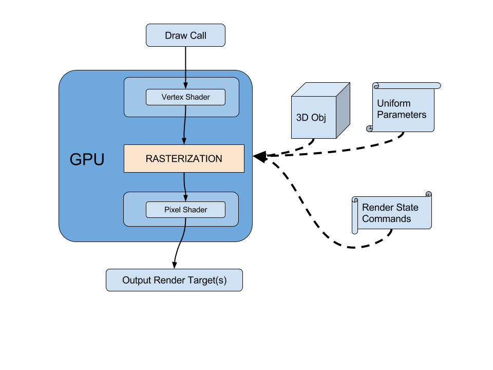
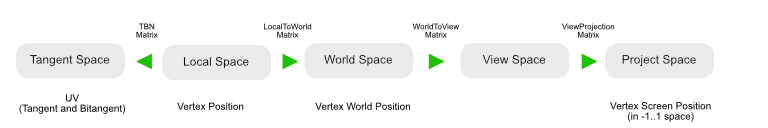
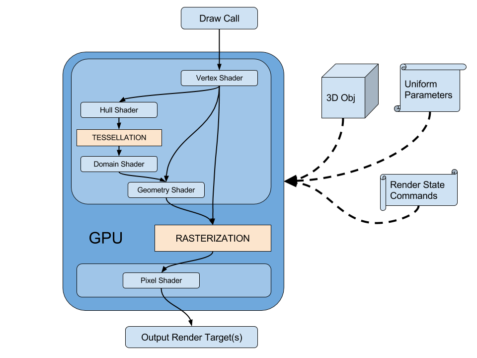

# Shaders Overview

In this section, we will cover the theory behind rendering a 3d object using shaders in our favorite engine. Most of the time this is what happens, some times your engine will have more optimized ways to render your objects, but this is the common case that is covered here.


## What is a Shader?

Shaders are **small programs designed to be run on a GPU** (Graphics Card), since these pieces of hardware are extremely fast, these programs are small, with really simple instructions, and are targeted to be **executed in parallel** for large amounts of elements.

These elements are most of the time, geometry vertices, and pixels needed to be drawn on screen.

There are many types of shaders depending on what you want to achieve: 

| Type                    | For each        | Description                              |
| ----------------------- | --------------- | ---------------------------------------- |
| **Vertex**              | Vertex          | Vertex Shaders are executed for every vertex of your input geometry and are responsible of the correct placement on screen of your object (based on camera, and world position, rotation and scale of your object) |
| **Pixel/Fragment**      | Pixel candidate | Pixel (Fragment) Shaders are executed for every pixel of your object that needs to be rendered on screen (1). |
| **Geometry**            | Primitive       | Geometry Shaders are executed between vertex and pixel shaders, and for each primitive (triangle, line, ....) generate additional geometry or alter current one. |
| **Domain** and **Hull** | Vertex          | Domain and Hull Shaders are executed after vertex shader and |
| **Compute**             | Arbitrary (2)   | Compute Shaders are a special kind of shaders that can be invoked outside a drawcall to perform generic tasks on agnostic elements stored in buffers. |

> (1) Sometimes, more than one pixel needs to be rendered for one pixel position (for example when particles are overlapping). That's why we call **fragment** a **candidate for one pixel**, because we can have multiple fragments covering one pixel.
>
> (2) Compute shaders are executed with arbitrary count defined by the user.

## What is actually happening?

When we want to render an object, the engine passes by different steps in order to configure the rendering and display it onscreen or store it in one or multiple Render Target(s) to be used later.



This example renders a simple object for this, and describe all the stages before rendering this object, in the case where is neither **tesselation** nor **geometry shader**

### 1 - Draw Call (CPU)

Let’s say we want to render an object, the engine has loaded the geometry, also has a currently rendering camera, and finally want a Shader to render the object (configured with textures).

#### Preparing the Render Target

Before starting rendering the object, the engine sets the Render Target where the object should be drawn. This render target can be a simple color buffer but can offer features such as Z-Buffer or stencil buffer.

#### Setting Shader and the Parameters

First, the engine will issue a command to start render the object, for this, it will upload the shader code to the graphics card.

We also have to configure the shader by setting all its common parameters (transformation matrices, textures & colors, etc.) these parameters are called **uniform parameters **because they will be applied uniformly on all the geometry.

*On the contrary, the vertex attributes of the geometry will vary from one vertex to another*

Uniform Parameters comes in two forms:

- Set by the engine
  - Transformation matrices
  - Time, player position, any other gameplay information...
  - Lighting information
- Those defined by the author : the actual **material parameters**
  - Textures
  - Colors
  - Other parameters

#### Setting the Geometry

Along with the shader, we also upload the model to the graphics card.

At this stage, the only geometry we know is the object as it was exported (as local space), not the object in the scene.

The geometry contains a list of vertices and a layout to be rendered (Triangles, lines, points). For each vertex, there is a structure of attributes that defines the point (Position, Normal, Tangent, Vertex Color, UVs, UV2s,...) this structure varies from one mesh to another depending on what you authored.

#### Configuring the Draw Call

Before executing the shader on the geometry, we have to issue commands to configure the blend mode (if any), backface culling, depth testing, depth writing, etc… these configuration options are called **renderstates **and are common for the whole geometry (which means that you cannot apply backface culling for some triangles only for instance).

### 2 - Vertex Shader (GPU)

In the general case, a standard vertex shader will be executed to compute the position of the geometry according to the mesh position in the level’s world, according to the camera position in space, then project the geometry on 2D screen. This is done by using a **WorldViewProjection **matrix, that corresponds to all the transformations to be applied to one vertex:

* in order to place it at the correct world position : **local to world** (with translation, rotation and scale), 
* view it at a correct angle: **world to view**
* and project it on 2D screen correct camera field of view, and pixel ratio : **view to projection**

All these transformations are often stored into the **WorldViewProjection** matrix if no intermediate computation is required. But often engines provide intermediate matrices to pass from one space to another.



When the vertex shader is executed, it also will be computing another transformations, such as transforming the tangent, binormals & normals.

At this time, all the data that needs to be calculated and transferred to the pixel shader have to be prepared and sent as the output of the vertex shader (uvs, vertex color, etc).

### 3 - Rasterization (GPU)

When all the vertices of the geometry have been processed by the vertex shader, the GPU enters the **rasterization **phase.

At this time, the hardware will try to **determine all the pixels that will have to be drawn on screen**.

During this stage, the hardware can perform the following:

- Pixel culling for off-screen triangles
- Back-face culling depending on how the draw call was configured. (Culling front faces, back faces or no culling at all)
- Pixel culling based on a Z-Buffer to cull pixels based on depth.
- If a stencil operation is set, it will be executed here too.
- Write depths in Z-Buffer if configured in render states.

Also, at this time, the per-vertex values will become interpolated to be available per-pixel. (This is for instance this operation that computes the vertex color gradient interpolations).

The rasterization is a fixed pass and is not programmable such as a vertex or pixel shader.

### 4 - Pixel (fragment) shader

In the end, for each pixel candidate (fragment) that has suceeded to the rasterization phase and is about to be drawn on screen, the pixel shader computes the final color that will have to be rendered. Based on the interpolated data recieved by the rasterizer, we can now read textures based on geometry uv’s, compute lighting based on interpolated vertex normals (or normalmaps), read vertex colors to modify the output, etc.

The output of a pixel shader is, most of the time, a color value. In some cases, one pixel shader can output multiplue values. This value (or these values) are output to the initially set **RenderTarget**

## Transferring Attributes from one state to another.

#### Vertex Attributes

We saw previously that shaders transfer data from one state to another. At first, the vertex shader is able to read attributes from the input geometry, and outputs transformed attributes for rasterization & pixel shader. Input attribute structure can include position, vertex colors/alpha, texture coordinate channels, normals, and much more. Every attribute that's required for processing in vertex/pixel shader has to be declared and sent to the pipeline.

Most of the engines provide built-in semantics to access these data, and some of them (Unreal) generate all the corresponding structures depending on the needs of the shader. Here is an example of an input structure that is passed to the vertex shader.

```c
struct VertexInput
{
    float3 position : POSITION;
    float2 texcoord : TEXCOORD0;
    float4 color : COLOR;
    float3 normal : NORMAL;
};

```

In this example, the input geometry vertices have : positions, one channel of texture coordinates (UV), vertex color with alpha channel, and a normal channel .

#### Vertex to Pixel attributes : Interpolants

Some attributes are required in vertex shader but not pixel shader, so different data can be transferred from vertex shader to pixel shader. These attributes will be transferred from the vertex to the pixel and can be interpolated. To pass attributes to the pixel shader, the vertex shader needs to output a structure of data to be transferred.

```c
struct vertex_to_pixel
{
    float3 position : SV_POSITION;
    float2 texcoord : TEXCOORD0;
    float4 color : COLOR0;
    float3 normal : TEXCOORD1;
};
```

The syntax is almost the same as the vertex input declaration at the following exceptions:

* the position semantic is not POSITION but SV_POSITION (System-Value position) and need to be in normalized device coordinate space (-1... +1, meaning 0,0 is the center of screen)
* the NORMAL channels does not exist anymore, so it has to be set inside a TEXCOORD channel instead.

#### The pixel output structure (optional)

When rendering

## Tesselation and Geometry Shader

Earlier, we saw that the Vertex Shader processes vertices and send them to the rasterizer, which is in charge of establishing the list of pixels that will need



## Compute Shaders

Compute shaders are general-purpose shaders not bound to any kind of specific processing. They can be invoked by CPU programs or even indirectly by other shaders.

The number of parallel invocations is set by the user or the parent shader. Output from kernels can vary, from counters to textures to more complex structured buffers.

Recently, Compute Shaders have been preferred to standard shaders to perform graphic passes because of their versatility and genericity.


## Writing Shaders : choose your weapon

Writing a shader can be a tough and complex task for an artist, especially because of the syntax of the language and the learning curve. For a VFX Artist, we are not expected to handle the text-based version of the shader language, even though this is a must if you want to master shader authoring.

Node-based authoring has been on the edge recently with the spread of graph editors among all popular engines (Unreal, Unity,...)  and are really a good way for artists to dig into shader authoring without the daunt of learning the syntax of a language. Most of the graph editors reproduce the terminology of the code so mastering in graph view can be a good practice to introduce yourself to actual code writing.

> My opinion on this is you should know how both work and practice the two on a regular basis, so you can know how to optimize your graphs, and save time while prototyping on graph editors. Below is a more in-depth explanation of both systems.

#### Node-Based editors

Node-based editors are the way to go if you are still afraid by the code syntax and want a way to experiment on a workbench before writing actual shaders. These editors are often shipped with intermediate result preview and it will be your best ally to understand the outcome of the math operations.

Most of the time, you will be able to write what you need using these editors, as they work by hiding a lot of complexity under the hood. This can help you save a lot of time writing macros to access a particular value. On the other hand, many node-based editors hide a large part of the engine understanding and/or are designed so things cannot be achieved or achieved using ugly and inefficient workarounds.

Some paradigms such as loops are also hard to design. And code factorization can become a hassle when dealing with complex graphs : in my own experience node-based editors attain their limits when it comes to design something too complex that you do not want to get back at it because it's become out of control and unreadable.

#### Text-Based editors

Text-based editors are boring, often lack features such as completion or in-between previews but are the real deal when it comes to write full and complex shaders with variants and optimizations. As modern languages such as Java, C# have really efficient IDEs and editors with a lot of features for refactoring, code highlighting, completion and snippets.

HLSL and GLSL are a legacy of the C language, a really old-fashioned, yet efficient language. However tools are really lacking features so it is really complicated to find your way and figure out where to start, especially when you are a newbie to shader authoring.

On the contrary, when It comes to write really complex shaders with shared code in libraries, use of keywords to perform static optimizations and ensure your code is robust and easy to update, text-based editors are the way to go. You will never find a better ally because complex code is way more easily tidied up by manipulating text, than manipulating node trees.

## Additional Links

[Shaders on Wikipedia](https://en.wikipedia.org/wiki/Shader)