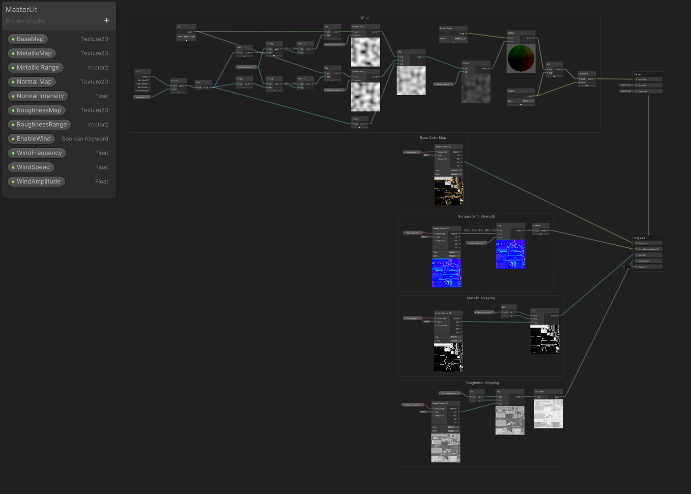

# Shader and Material Purposes

This page presents an overview of the Shaders and Materials. It is not aimed to be exhaustive as there is a [detailed overview about shaders](../shaders/overview.md). 

In this document, you will find basic information about how to use shaders in general, and what can be achieved with them, in an artist's perspective.

## Programmable rendering

In layman's terms, shaders are programmable rendering functions. They enable users to customize the rendering by providing functions to blend, animate, mask and compute all sorts of things. All modern engines and hardware use shaders in a form or another, with more complexity or more user-friendliness. 

## What you can do

Shaders enable a lot of possibilities by using different paradigms that can be reused, mixed and combined together to create new paradigms. This section covers generic aspects of what can be done. For more detailed use cases, see the **Workflow** section in [Shader Home](index.md) section and the [Shader Utility](utility.md) section for more code or graph snippets.

### Pixel effects

#### Master Shaders

Shaders are mainly used in a game engine artist pipeline to establish a model for all rendering by making generic templates for artists. Unity provides a standard, generic-purpose shader while unreal lets the user make its own template for the project, using a material graph. Nowadays, Unity tends to follow this same paradigm, to ensure production needs are fulfilled.

These shaders are often complex and make uses of switches to toggle on or off some features, in order to save performance.

#### Animated Scrolling and Flow

LIS ocean / shore shader

#### Advanced Masking and material animation

LIS rain mask

#### Effect blending and composition

Fire / 

###Vertex Effects

#### Wind, Noise and procedural animation

Flex and shiver

#### Transforms and Texture Baking

Houdini tools, pivot baker, animation textures

### Other

#### Tesselation and Geometry Scattering

Compute Shaders / Geometry Shaders

#### Procedural Mask Generation

Unity Custom Texture / Unreal Blueprint + Render to texture

#### Complex Systems / Other

keijiro stuff

