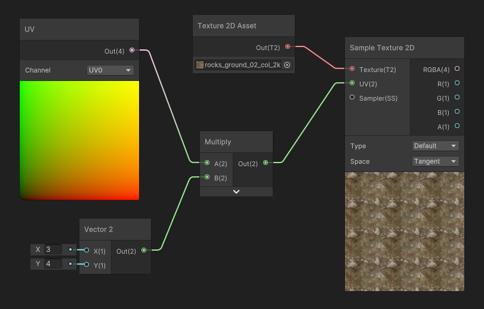

# Texture Coordinates (UVs) in Shaders

## Sampling textures using coordinates

Reading a texture to display it in a Shader is called **Sampling** : It requires a texture to read, and **Texture Coordinates**, often called UVs to read them and position them at the correct position.


These **texture coordinates** can be altered before reading the texture: for instance, in the example below, we apply a multiplier to the UVs to apply some tiling.




During the **Sampling** of the Texture, a **Sampler State** is used to control how the texture read will behave. By default, most Game Engines will store these settings for each texture, but you can also override them in your shader editors. 

For more details, see [Texture Sampling](../textures/sampling.md).


## Scrolling UVs (Panner)

A pretty handy use case of manipulating the UVs before reading the texture is that you can dynamically alter them. One simple use of this manipulation is texture scrolling : after reading the UVs, we add an offset based on the current game time to apply a scrolling effect.


> **Why do you use subtract instead of Add?**
>
> It would be legitimate to think that adding an offset would move the texture in that direction, however, if you take as 1D example, the range [0.0 .. 1.0] with 1/s scroll speed, would become at 0.1s : [0.1 .. 1.1].  So you would read the texture, a bit more to the right. However here, what we want is not to move our eye to the right, but instead move the texture to the right. So we need to go the opposite direction.
>
> **Why do you use the fraction node?**
>
> There are two reasons we use a `frac(time*scrollDirection)` :
>
> 1) First: So you can preview the scrolling in the modified UVs, before it's used in the Sample Texture Node. No doing so would result in large values and in our case, the subtract node preview would appear full black (negative values). The fraction instruction has limited impact on the shader performance and can help solve issues in the second case.
> 2) Some node-based shader editors (such as unreal) can detect that a part of the computation network can be computed at CPU. If such a thing is possible, this means that the `time*scroll` value sent to the shader will always be low, thus preventing UV precision errors when time becomes big. If your shadergraph too does not handle that, produced will produce precision errors with large time values.


## Rotating UVs

Rotating UVs can be useful to apply simple movement to non-moving geometry, for instance making in-place markers in your game so the player see a target position in a game level.


The [math behind such a transformation](https://gist.github.com/ayamflow/c06bc0c8a64f985dd431bd0ac5b557cd) of texture coordinates are however not as trivial, as they involve sine/cosine transformations. Most of the time, game engines provide an implementation for 2D rotations of coordinates. However, if you find this missing here's the HLSL code (retranscribed from the snipped from ayamflow) :

```c
float2 rotateUV(float2 uv, float rotation, float2 center)
{
    float2 delta = uv - center;
    
    return float2(
      cos(rotation) * delta.x + sin(rotation) * delta.y + center.x,
      cos(rotation) * delta.y - sin(rotation) * delta.x + center.y
    );
}
```


Implementing this function in a shadergraph produces quite a messy, yet working graph. Anyway, we can still package this transformation graph into a subgraph to simplify its use.


 

## Transforming UVs : Rectangular to Radial

Sometimes, we want to deform our texture sampling to make effects such as vortices or radial effects. However, using a simple rotation of the UVs it is not enough if we want to have scrolling that goes pushes outwards, such as the example below.


In order to achieve that, we are going to convert the rectangular UV space to a **Radial UV Space**.

<u>The transformation of UVs happens in a radial coordinate space:</u>

* **Circular Coordinate (U)** : a coordinates that revolves around a central point. It is computed using an arc-tangent2 function (which is equivalent to `atan(y/x)`) It produces the angle around the point where the current point coordinate is. It is expressed in radians in the range [-π ... π] in order to use it as a more user-friendly coordinate, we remap the range to [0..1]
* **Radial Coordinate (V)** : a coordinates that represents the distance to a central point.


### Animated Radial Scrolling / Rotation

By converting traditional UV space into Radial Space, textures can be panned and rotated into that space to create both rotation, and radial scrolling:

- **Rotation** will happen when applying panning to the the **transformed U coordinate**
- Radial scrolling will happen when applying panning to the **transformed V coordinate** 


### Spirals and Twirls

By extension, the coordinates can be modified to apply a rotation angle that increases based on the distance to the center. 

* U Coordinate stays the same
* We add the Distance (U coordinate) to the Angle (V Coordinate). Intensity is controlled by multiplying the distance by a scale : Please note that in order to conserve texture tiling, we need to apply integer scales only.


## Deformation

A common, more sophisticated effect involves adding the result of a deforming texture to the texture coordinates before reading the final texture. It is called Texture Coordinate Deformation (or UV Deformation).


In order to implement such deformation, we need to understand a bit more what we can do with our UVs: In the previous example, we added a function of time and a direction to subtract to the pixels. So it was applied in a evenly to all pixels.

Now, let's ask ourselves: What If we could apply a different direction, for each pixel? We would not have a continuous scrolling in one direction, but could have a scrolling that flows in **many** directions. 

But we are not yet there. Let's put the infinite flow scrolling on hold, pause the time and look at this :


In this example, My UVs have been subtracted by not a single, uniform value, but instead by the result of a distortion map. The values are then applied to the UVs, and these distorted UVs will sample the texture with more or less strength.

 

Finally, a common use case for deformation, is to scroll the deformation map, and apply it to the UVs. It will make the deformation animated. You can also scroll the UVs for both the Deformation Map and the Color map at different speeds to create some parallax effect.


### Authoring Deformation Maps

In the examples above, the Deformation Map was authored using specific generation software to be already in the [-1.. 1] range. Such software like [Mixture for Unity](https://github.com/alelievr/Mixture/) , can help you author these maps for your projects. However, you can also author these textures from simple Normal Maps. 

Normal maps are usually encoded in the [0..1] range as **unsigned-normalized** (which means that the neutral value is the 127 gray). However, if you need to use these maps as deformers, please make sure you read them correctly, using a texture node that samples the normal map correctly, or remap the value from the [0...1] range to the [-1...1] range by yourself.


Regardless of the input texture type, the deformation maps need to be imported as **linear (non-sRGB)** in all cases.

### Deformation Continued : Flow Mapping

Now that we know how to perform UV deformation, let's go back at our previous question: *Can I scroll infinitely every pixel in any direction?*

The simple answer is : *Yes! .... but not so easy!*


If we go back to our previous example, when we apply the deformation intensity to the deformation map, the intensity acts as our initial "time", and the pixels of the texture act as our initial "direction". For the purpose of that example, We will use a hand painted deformation map in all directions.


Here, we used a slider to simulate time, the deformation will start at zero, then grow infinitely.... and after a quick value (around 0.4), it becomes so stretched that it becomes unusable, and we can even see inverse deformation. But something that was interesting was the beginning of the movement, when it was *not so deformed*, around 0.0 to 0.4.

Now, instead of running our time value between 0 and infinity, let's cycle it between -0.5 and 0.5. To do so, we are gonna change the range of the slider from [0 .. 2], to [-0.5 .. 0.5]


Now, the deformation is way better, we get inverse deformation when time is at -0.5, no deformation at 0 then forward deformation at 0.5. But the problem is now that it **does not cycle**.

#### Making the flow loop

The flow mapping workflow involves a process where two sequences of deformation ranges [-0.5 .. 0.5] are blended and alternate along time, **so the gap in the cycle becomes hidden when we shot the other sequence**. 

To do so, we offset the time of the second sequence by *half a period* : when the first sequence is at -0.5 (or 0.5), the other is at 0. Then, we blend between the two sequences to hide the gap (green line). 


When applied to our graph, it looks like this:


**Let's break this down a little:**

In that big graph, we first compute the time for each sequence, cycled in the [-0.5...0.5] range (`fraction` loops into the [0..1] range, then subtract remaps loops to [-0.5 to 0.5]. In order to offset the sequence B, we just apply a -0.5 value to the time **before** computing the cycle.


Using this cycling time, we can now sample deformed color (just like we did in the beginning), but this time using the looped time instead of the slider. 

Here's what it looks only for sequence A:


When used to sample Sequences A and B, we can see that we have both deformations alternating, each with its gap offset in time. At that point, we just need to do the blend between these two flow sequences.


To do so, we can blend between the two sequences using a lerp, to hide the gap in sequence A by showing the Sequence B in the meantime, and vice versa. In order to alternate between the two sequences we use an alternating blend factor.


In order to compute the blend factor, we used a **triangle wave function** to interpolate between the two sequences, it has a period of two, so it alternates every second from A to B, then B to A. For convenience in the master graph, we used an utility node. Here are the contents of that function. 


Finally, we get this infinite scrolling effect. And by adjusting the intensity of the flow, we can tweak how it affects the temporal tiling,

As an addition: In order to enlighten the alternating two sequences, the example below shows each sequence with a different tint for color maps.


> **Question: Can I tweak the speed of blending between the two sequences? The intensity of the flow?** 
>
> Absolutely! For simplicity convenience, this example was made in the -0.5...0.5] range. But the flow mapping can be tweaked in two ways:
>
> 1) By dividing input time value by the period you want to use to blend between the two sequences.
> 2) By applying an intensity multiplier to the values you read from the deformation map.

> **Question : How to simplify this graph? ** 
>
> As flow mapping can be a bit complex to handle. It is often recommended to either do a HLSL custom node function or a sub-graph node to simplify the workflow.

#### The shader Code

If you want to implement flow mapping in a code fashion here's a HLSL code snippet that can help you.

```c
float4 SampleFlowMap(
    	float2 uv,
    	sampler2d colorMap, 
    	sampler2d flowMap, 
    	float cycleDuration, 
    	float flowIntensity, c
    	float time)
{
    time /= max(cycleDuration,0.01f);               // ensure no divide by zero
    float2 t = float2(time, time-1) % 2.0 - 1.0;    // two sequence times
    float2 d = tex2d(flowMap, uv).rg * 0.5 - 0.5;   // Assume flowmap unsigned-normalized
    float2 uv1 = uv + (d * t.x * flowIntensity);
    float2 uv2 = uv + (d * t.y * flowIntensity);
    float4 c1 = tex2d(colorMap, uv1);
    float4 c2 = tex2d(colorMap, uv2);
    return lerp(c1,c2, 1.0-abs(t.x));
}
```

#### Authoring Flowmap Textures

Authoring flowmaps can be done using a wide variety of tools today. However, these tools are either old, unmaintained, or lacking functionality. 


* [Flowmap Painter](http://teckartist.com/?page_id=107) : Historically the standalone free tool widely used by early adopter artists. Quite simple and rudimentary, with only few options but a really good preview. Not updated since 2012.
* [**Substance Painter** Plugin](https://substance3d.adobe.com/documentation/spdoc/flow-map-painting-143327274.html) : Integrated to substance workflow, can benefit from other masks.
* [Flowmap Painter for **Blender**](https://www.blendernation.com/2021/03/03/free-flow-map-painter-addon/) : Does the minimum (flow painting), can do some preview but not out-of-the-box.
* [**Krita** flow brush](https://docs.krita.org/en/reference_manual/brushes/brush_settings/options.html) : Rudimentary options, but built-in to the free painting tool. A pain to set up as there are no out-of-the-box brush preset. Lacks preview.

## UV to Gradient Color Mapping

Color mapping is the use of a grayscale texture as coordinates to read inside a gradient texture. Basically to a black to white gradient we correspond a more complex gradient.


#### Authoring assets

The method involves authoring gradient maps that are used as lookup tables. The general setup for a color-mapped process is as following:

* Temperature Maps imported as grayscale and linear (non-sRGB)
* Gradient Maps imported as sRGB with no texture wrapping (clamp outside 0..1 UV range)

#### The shader Code

The base of shader code is pretty straightforward but can be enriched depending on the needs of your shader.

```c
// we sample the grayscale temperature map and we scale it by the temperature scale
// for instance, the particle's alpha.
// if you need to apply soft-particle depth fading, this is a good place to multiply
// the temperature by the soft particl fading factor.
float temperature = tex2D(_TemperatureMap, input.uv).r * temperatureScale;

// then we use the temperature as UVs to sample the gradient map
// for this, we prefer a tex2DLOD as we do not need mip-mapping derivative 
// computation
float4 finalColor = tex2DLOD(_GradientMap, float4(temperature,0,0,0)).rgba;
```

#### Pros and Cons

| Pros                                                         | Cons                                                         |
| ------------------------------------------------------------ | ------------------------------------------------------------ |
| - Unified Color mapping enables consistent colors for fire all across the game.<br />-  Fire Color fades more accurately compared to an already mapped flame.<br />- Enables the use of a single temperature map through multiple lookup tables. | - Use of a Lookup table Induces a texture dependency and degrade performance in some cases.<br /><br />-Requires a custom shader to enable the feature.<br />-Range is limited to the extents of the texture. HDR needs a separate scale channel (divider) or the use of FP16/FP32 textures. |
