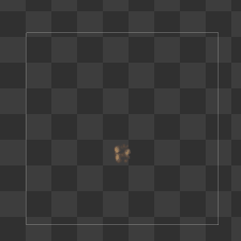

# Flipbooks and Texture Sheets

Flipbooks and texture sheets are a way to bake animation and different states to a single texture. All sub-images are generally packed into an array of given rows and columns such as this example.

Sometimes, texture sheets  can be packed into more sophisticated atlases with non rectilinear layout. For instance, fonts can be packed into more complex layouts. For example, the example below contains packed rectangles that maximize the efficiency of space usage. however in order to compute the position of every character, a table of all characters need to be used.

### Purpose and benefits

The purpose of these textures can vary but it is generally used in the following cases:

* Bake multiple frames of an animation from a DCC Package
* Bake multiple variations of a sprite
* Bake multiple states of a single object (ex: viewed from 360 degrees around)

The general benefit of using a flipbook is that the texture is loaded once and can be used almost out-of the box for all its purposes. Here's a quick pros and cons of using flipbooks.

| Pros                                                         | Cons                                                         |
| ------------------------------------------------------------ | ------------------------------------------------------------ |
| &bull; No need to stream animations &bull; Can bake utterly complex simulations from DCC &bull; Can benefit blending and optical flow blending to reduce frame count | &bull; Memory usage &bull; Handling border coverage and mip-maps can be tricky. &bull; Animation resolution decreases as the frame count increases |

## Authoring texture sheets

Texture sheets authoring involves a various range of methods that are used altogether

### Sequencing

Sequencing flipbooks is the operation where we take all the raw input frames (cards) and we prepare them to be packed into a texture sheet. Sequencing often reduces the range of input frames to the desired count, operates cropping, placement and adjusts color.

For flipbook animations, sequencing will also decide to adjust the timing (temporal remapping) of the sequence or making it loop.

##### Looping

Looping a sequence is basically the operation where you can play a sequence of given length infinitely without noticing it is repeating itself. Looping a sequence of images is pretty close to making a texture tile spatially, but it occurs over time itself. Many methods exist for making a correct sequence loop but for better results you will probably need an image sequence longer the sequence you want to achieve.

##### Temporal Remapping

Temporal remapping is an operation that will make fit a sequence of given N length into a sequence of given M length using either linear or non linear time stretching.

This operation helps fitting a sequence of non-desired length into a given length but also fine-tune acceleration and dampening of the motion

### Cleaning up and optimizing

##### Cropping

Cropping images is a process where every card/frame will be cropped of any pixels at top, bottom, left and right in order to reduce the blank space around the actual image. Cropping is one of the most useful workflow in order to keep the alpha coverage efficient.

Often, you can perform over-cropping in order to increase the coverage even more : over-cropping induces features going out of the card and require edge fixing in order to make it fade for example.

##### Fixing edges

Fixing edges is a method that will fade the alpha as it comes close to the edge of the card. In a good process, frames are rendered by making sure there is sufficient space around the effect so it's fully contained in the card. However, sometimes, rendering is focused on one part (eg: a fire) and other parts (eg: fire's upping smoke) are deliberately kept out of scope (most of the time because it's not interesting) so they are just partially rendered and the rest is just out of the card.

Edge fixing is basically erasing the contents so the effect fades as it comes close to the edge of the card. It can be done manually for very specific cases, in order to fine-tune details. But it can also be faded away by applying a gradient to the alpha channel.

##### Fixing Background Color

Fixing background color is a process that is not necessarily used every time and can help fix the color of your effect for all the pixels that are half-transparent. The general issue is all these pixels are rendered on a specific background that is blended to the actual color. When used on effects, the background color is still taken into account. 

On the example below, background fixing helps removing the gray rim below the cloud as it fades. it also strengthens the contrasts by recovering initial lighting.

Fixing background color assumes we already know the background color and will de-blend the effect color based on the alpha channel and this background color using an *inverse lerp* function. Because the inverse lerp uses a division, some infinity values can occur so it's a good idea to apply this fix for all pixel's alpha, down to a low alpha value where it's not meaningful anymore.

### Packing and Exporting

##### Packing and Assembly 

Packing is the process where all images get assembled into one single texture based on rows and columns. Packing process is essential because it will determine the final **size** , **mip generation** and **ratio** of the texture sheet. 

**Ratio** of a texture sheet need to align with standard texture ratios matching a 2^n size (...,128,256,512,1024,...) so the ratios need to be ..., 8:1, 4:1, 2:1,1:1, 1:2, 1:4, 1:8, ... or close to these ratios. If such a ratio cannot be achieved, this is not utterly dramatic as the final texture can be resized to match the closest ratio. In this case, you can observe some non-square pixel ratio for your card's pixels. The more astray you will be from this ratio, the more noticeable it will be.

**Mip Generation** is also important as the split of the cards does not necessary happen on full pixels when in deeper mips. 

Mip issues are likely to happen if **any** of the following conditions is not met:

* Rows or Column count is not a power of two (2n : 2,4,8,16,32,...)
* Texture dimension is not a power of two (2n  : 256,512,1024,2048,...) 

While it is advised to abide by these two rules at all times, you can bend the rules a little if you assume that some artifacts can occur.

## Workflow Software Solutions

#### AfterEffects + Photoshop/XnView

This solution is probably the most historic and widely-spread one as it helps doing all the sequencing/fixing in aftereffects then use packing tools in Photoshop or XnView.

The downside of this solution is that it involves many manual operations and intermediate files that are not required for the final image.

#### Unity Image Sequencer

Image sequencer is a tool from the Unity VFX Toolbox that helps authoring flipbooks from the ground. Templates are created directly into your project. The tool requires all frames exported from the DCC to be imported in unity in a special folder.

The tool stores flipbook generation settings inside assets and provides a one-click update for the texture generation in order to iterate fast.

#### FacedownFX Slate Editor

Slate editor is a standalone utility that solves the same issues as the image sequencer and provides some advanced features such as optical flow motion vectors generation.

Website: https://facedownfx.com

