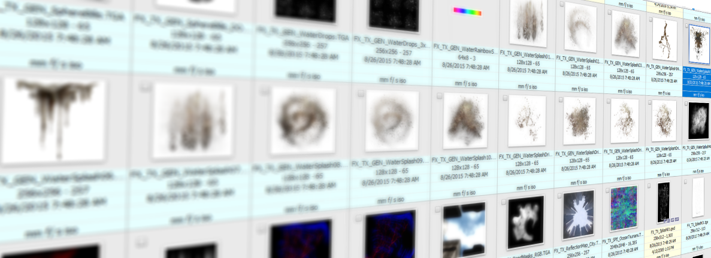
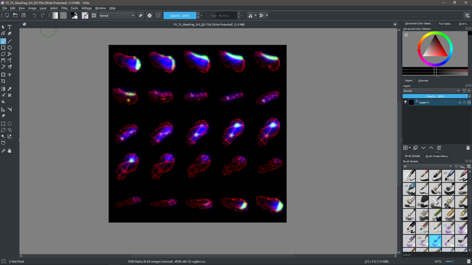
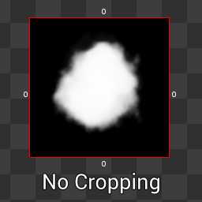
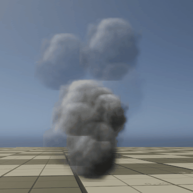
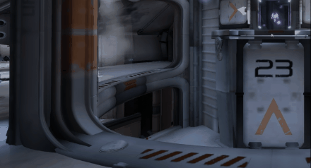

# Texturing Visual Effects

One of the key elements of making good visual effects is choosing the right assets to make your effects. One of the most important aspects of this is choosing among a wide variety of techniques involving textures. Depending on what you want to achieve, the process will be completely different. This chapter covers most of the common use cases involving textures and try to explain in which cases they can be useful, or not.

Textures mechanics take always a big part of your game engine, and obey a relatively constant set of rules. These conventions will help you master the quality and the performance of what you are importing and thus what you will be rendering. It is mostly a matter of process, but in some cases knowing the underlying gears of textures in your engine can help you come up with new processes.

## Authoring For Particles

Authoring textures for particles is a delicate work that requires clever and subtle artistic knowledge in order to create reusable and efficient textures that avoid common pitfalls.

### Software, Tools and Processes

Tools for particle authoring are quite various and serve very different purposes. They go from 2D Painting Software to DCC Renderers or Procedural Generators. Most of the time we cope with a set of weapons-of-choice that we sharpen in order to cover most of our use cases.

#### 2D Painting/Editing Software

Basically anything Photoshop or alike. Photoshop being the most commonly used in big studios, it is often a requirement for vfx jobs as many companies use it. Some alternatives exist with different feature sets, prices and user base. Among free alternatives you will be able to use The GiMP or Krita (the latter having new cool features in order to paint normals or use particle brushes)

#### DCC Packages and Renderers

These will be used to render 3D objects to sprites, export point caches, meshes or even 3D Textures based on the VFX capabilities of the package. Autodesk provides many alternatives regarding basic 3d authoring and rendering : 3DSMax / Maya (the latter being more featured regarding fluid, particle and dynamic simulations). Houdini is also a really good asset when it comes to work with VFX  because of the breadth of the tools, solvers and the extent of capabilities of rendering and compositing.

Free alternatives exist with more or less success, but Blender is as 2019 making a huge catch-up in terms of user experience and rendering quality.

#### Generators, painters and other software

Adobe Substance is also one of the many other tools that will be able to help you work your specific maps, especially if you work based on other data sets. You can also generate procedural masks, noises and shapes.

## Particle Sprites & Texture Sheets

Deciding what will be the output of your rendering will imply relatively different process for making good effects. So it’s a good idea to have a clear view of what we can achieve with each method, and decide quickly which method can be most effective for our needs.

### Methods Overview

#### Simple Sprites

Simple sprites are the "low-tech" way of making particles and often considered to be the fastest in terms of performance for your game. Designing effects by only dealing with textures can be a bit of a headache, especially if you are not used to this kind of process. 

> If you want to approach these kind of effects, I advise you to take a look at Torchlight and Torchlight II's effects. If you acquire either game you can access the level editor and their particle editor. The tech is pretty simple but the particle effects are really worth taking a look at.

Making good textures in this kind of pipeline is a bigger challenge, as our sprites will look the same and we will need to take extra caution to avoid **outstanding details** that could ruin your effects.

Also, use of simple sprites tend to increase the overdraw in order to generate a really uniform mass. This can be balanced by the simplicity of the shader used only to display sprites. However, this can lead to overuse of particle overdraw if you are not .

#### Advanced Shader Sprites

Using a shader to display your sprites is the "next-gen" way to deal with sprites. Instead of using a single texture for every particle, we use a shader that can combine none, one or many textures, randomizes some deformation and computes everything based on the artist's needs. 

This method increases the pixel cost but can help solve many outstanding details issues as every particle can have a distinct and unique look and feel.

#### Flipbook Texture Sheet

Flipbook texture sheets are a way to bake complex simulations rendered in DCC Packages directly into a sequence of images packed into a texture sheet. These textures are known to be really memory consuming at the expense of relatively low detail.

### Different Kinds of Texture Sheets

#### Flipbooks Sprite Sheets

#### Random Packed Sprite Sheets

### Usual Pitfalls

##### Alpha Coverage Efficiency

Alpha coverage of a particle sprite is one of the most underestimated sources of performance. Bad coverage can lead to overly expensive effects that will require more particles or larger particles, as the surface coverage of one sprite will decrease. Below is a comparison of different coverage. Coverage can be optimized by cropping efficiently the flipbook cards in order to maintain as few transparent pixels around.

Over-cropping can lead to seams being visible on particles. To reduce this artifact, you can apply edge fading to each card in order to fade alpha as it comes close to the edge of the quad. Moreover some pixels from the adjacent cards in the flipbook. 

##### Outstanding details

Outstanding details are a nightmare of every VFX Artist. These patterns are often part of one sprite texture and make this texture stand out as a single element while being inside a pack of particles. These patterns induce **spatial tiling** : a repetition of all the outstanding details that betrays the effect.

 **Temporal tiling **artifacts.

<video loop="true" autoplay="true" ><source  src="../../vfx/img/temporaltiling.mp4" type='video/mp4' /></video>

Temporal tiling is the worst artifact that can happen to one of your flipbooks, and will lead to make them stand out as repeating and un-natural. In the video above, all the trails end up in a circular shape that catches the eye in a really annoying manner. This is utmost important that you try to remove this kind of shapes so the flipbook can be used in many particles without having your spectator noticing.

##### Pre-baked lighting

Using pre-baked lighting within a single sprite texture can prevent it to be rotated in order to reduce the **spatial tiling** of one texture. Depending on the pre-baked lighting hardness, the effect can use more or less   angle randomization. While Angle Randomization helps solving outstanding detail issues, some outstanding details can still appear in the pre-baked lighting.

The best bet is not to bake any directional lighting, only self occlusion and micro-shadowing and use a normal map to compute the directional lighting.

## Textures for Shader Animation

### Alpha Erosion Maps

Alpha Erosion Maps are used to 

### Progression Maps

Progress Maps are textures containing progression gradients to create animated masks. The principle is the following: At T time (relatively evolving from 0.0 the beginning of the animation to 1.0 the end of the animation), I will draw only the pixels from the mask which values are below T.

Figure showing an animation progress map

> **Warning :** these maps need to be imported as linear data (such as normal maps) as the grayscale gradients as you see them are in-fact temporal data. Importing them as sRGB will create an acceleration effect while playing the animation.

### RGB(A) Maps

Sometimes we want to create different masks or maps to store various information for our particles (lighting, occlusion, deformation, temperature) and these maps are often using only one or two channels. 

Instead of keeping all these into separate textures, it is often interesting to pack all these data inside RGB/RGBA maps. Every mask will be present in the R,G,B, or A channel of the texture. This method has some advantages, but also some other constraints so every gain can hide drawbacks.

##### Packing to reduce the number of texture reads.

The main advantage of packing data inside RGB(A) maps is to benefit reading 3 (or 4) different values in a single texture read. Reading textures inside a shader is not trivial and can become quickly expensive. Every texture read ("*I need this pixel from this texture to draw my current pixel*") will cost. Reading twice the same texture at different locations (by tiling/offset) will cost roughly the same as reading different textures. (For more information, see Performance sections of this documentation).

> To sum up, if we need to read this texture once at the same tiling/offset for each channel, we have a winner, otherwise RGBA packing will be less effective.

##### Packing to reduce the texture count bound to the shader.

Another advantage is to reduce the CPU overhead of binding textures, this is a slight optimization but can prove useful if used on a regular basis. However, packing data inside the same texture will mean your data will be present at the same resolution, so if you needed a 16x16 tiling mask, it is not necessarily a good idea to pack it inside a 256x256 channel.

##### Effects of DXT1/5 Compression on RGB(A) Maps

Compressing a RGBA map can be tough at times, especially if your RGB composition creates a really colorful composition. Every compressed block of 4x4 pixels will have a hard time being compressed and will present artifacts. (To understand more of this, see the BC Compression section on this page).

Most of the time the culprit channel will be a channel that presents high contrast and high-frequency variations. The best idea in this case is to swap it with the alpha channel or use it in the alpha channel if it was previously unused. 

*(Need figure with RGBMap Poorly Compressed, with comparison with a Alpha Swap)*

> <u>What's happening when moving data to a compressed Alpha channel?</u> The data compressed by BC(DXT) compression is compressed separately RGB on one side, Alpha on the other side. So if a channel creates a perturbation in RGB, let's say the G, both R and B will be altered as well. However this does not apply to the alpha channel as it is compressed separately. Also in DXT5, the Alpha channel benefits from 8 grayscale values by 4x4 pixel block instead of a 4 grayscale value per 4x4 pixel block if it was present in a RGB channel.

### Flow Maps

Flow maps are 2D textures containing 2D deformation Data intended to apply offset while reading other textures, or to be used inside Screen-Space deformation Channels.

### Lookup Tables (LUTs)

Look up Tables are indirection textures that contain information to be looked up by another computation. The most common Lookup Tables in VFX are Color Mapping tables. Such textures are often layout in 1xN 1D Textures (the wider the)

### Dithering Patterns

![img](data:image/png;base64,iVBORw0KGgoAAAANSUhEUgAAAL4AAAC1CAYAAADhs0VeAAAGwklEQVR4nO3dyU4bTRSG4SLMc0BcQ8QtsWbDkvtAbGHJTbBFrLLkEtizQAwK82B+HUuOLCtdR/JR9/HP9z4SIshddhpeO05XUz2zvb39VQAxM9l/ASAD4UMS4UMS4UMS4UMS4UMS4UMS4UMS4UMS4UMS4UMS4UMS4UMS4UMS4UMS4UPSxIT/9cXvwyiYmprK/iv0pYY/HDvh68l8EqSFb6EPPgZf4/sbxD76uWsp4Q9HP/oEwPdmoY/GnhF/5+EPh35xcVFeX18bt/38/Kze1/T0dPX22vjZ2dlyeHhY7u7uGrd5eXmp3v/CwkL19tr4tbW1sre3V56fnxu3aXP/5+bmytnZWbm/v2/c5u3trXr/dh81tfErKyvl5OTk79ddx5/6im/Rv7+/j30/vV5v7LH2uBb91dXV2PcRZdHXnviej4+P0ONb9Le3t2OPf3x8DD3+4F95iVf8Ad7awBqQeI/Pe3oMG22hyyfBxBzHB7pE+JBE+JBE+JCUGr53nLpNdgzcO07fJpsDyN5/7zh9m7w5gLbxig9JhA9JhA9JhA9JhA9JhA9JhA9JqeHbseTIqcURdgzdO5++TTaHYPsfPbV4XLb/diw9emrxuDLnEAyv+JBE+JBE+JBE+JBE+JBE+JBE+JDE+fhJOB+f8/GBzhE+JBE+JBE+JBE+JBE+JKWGb0t111ZLjiyD7Y2fn5/vL9VdE1kG3Bv/8+dP95Bem/u/uLjYX6q7JrIMuDd+fX29OrZtqeHv7++X6+vrxtv//PlTHb+6ulq9vTZ+Y2Oj7OzslIeHh8ZtvCXM7YlbUxu/tLRUjo6Oys3NTeM23rnyy8vL1dtr4+2Jt7u7W56enhq38X5XYGamnk9tfObvQpjU8C16uzhEhl+/fvWj955cNdEJMIv+8vIydB8RFn0tfE/2L5NE8B4fkggfkggfkggfkggfkggfklLDjxxKjLI5gMilRqNsDiBrTRtjcwBZa/oYbw6g9cdPfXQgCeFDEuFDEuFDEuFDEuFDEuFDUmr43vn0bbI5BDuWnrW2js0heOfTt8nmEOxYetapxZlzCIZXfEgifEgifEgifEgifEgifEgifEjifPwknI/P+fhA5wgfkggfkggfkggfkggfklLDt6W6bdXiJpFlwL3xW1tb/aW6ayLLgHvjbW16W6q7JrIMuDd+c3PTXao7sgy4N9773rctNfyDg4Py/PzceHvkwgfeeLtowdnZWbm/v2/cJnLhA2+8hX98fFxeX18bt2lz/+1JeXh4WO7u7hq3iVz4whvvXZSjbanhW/S1H7wnOgFj0d/e3o49PjoBZfsemUTr9Xpjj7XHteivrq7Gvo//M97jQxLhQxLhQxLhQxLhQxLhQ1Jq+N5x6jbZMfDMy1XaHED2/metKWSkr3MLZCF8SCJ8SCJ8SCJ8SCJ8SCJ8SEoN344lZ63tYsfQ7Vh61to2Nodg+x85tTjC9j/zWHrmHILhFR+SCB+SCB+SCB+SCB+SCB+SCB+SOB8/Cefjcz4+0DnChyTChyTChyTChyTCh6TU8L1ltiPLYHvjFxcX+0t110SWAffGr6+v95fqrq2W3Ob+z8/Pu0t1R5YB98Z71wZoW2r4R0dH5ebmpvH2yIUPvPH2jd/d3S1PT0+N20QufOCNtyj29/fL9fV14zaRC1944+2iHDs7O+Xh4aFxm8iFL7zx0heGsOgvLy/THt+ir4XviU6AWfQXFxeh+xiXXYnGoo9cZDv7l0kieI8PSYQPSYQPSYQPSYQPSYQPSanhZ61pY2wOIGtNH2NzAJFDiVE2BxC51GiUNwfQNl7xIYnwIYnwIYnwIYnwIYnwIYnwISk1fO98+jbZHIIdS89aW8fmELzz6dtkcwh2LD3r1OLMOQTDKz4kET4kET4kET4kET4kET4kET4kcT5+Es7H53x8oHOED0mED0mED0mED0mED0mp4XtrpEeWAffGb25uuuu/R5YB98bbMtm2VLetWtwksgy4N35ra8tdqjuyDLg33rs2QdtSw//9+3fp9Xrl6+ur//Xgc1dOT087fbxJc35+3unjTU1N/f3848eP/keWTsMf3vHhD2PRD/6M72v0Zz/aQVfSXvGzdhi5MmMflhL+6D959mrf9dsc5Mh+pR/oPPzhHR2OnvA1TMLbHJP6ij/8NeFr+Nf/8zKkvscf/kz4GoZDl3uPP8B/bPVMys98YmZuJ+UbAg0TEz7QJcKHJMKHJMKHJMKHJMKHJMKHJMKHJMKHJMKHJMKHJMKHJMKHJMKHJMKHJMKHJMKHJMKHJMKHJMKHJMKHJMKHJMKHpP8AMwKRfUuvOWwAAAAASUVORK5CYII=) ![img](data:image/png;base64,iVBORw0KGgoAAAANSUhEUgAAAggAAAEBCAYAAAAdG102AAAaQ0lEQVR4nO3dD3RU1YHH8V9ISCAaAgbQBKlgejyu2uqqXVI5KmSLRWpZ152uiLQe+VNbFNqCLS4FFYkglT9WTlH3CJ6seKAWpAVa2FSTela2EpWtrqXWmoLyJyVh2GCEQEhg585kksncyUz+TOa9ZL4fTpiZ+9697z5Icn9z359Ju/zyy88JAAAgRJrTHQAAAO5DQAAAABYCAgAAsBAQAACAhYAAAAAsBAQAAGAhIAAAAAsBAQAAWAgIAADAQkAAAAAWAgIAALAQEAAAgIWAAAAALAQEAABgISAAAAALAQEAAFgICEAceb1e5eTkKCUlRefOnXO6OwB6CfM7xaipqVF2dnZCtklAAOLEBILc3FwNGDBAGRkZSkvjxwtAfDQ0NOj06dP+3y319fU6e/Zst2+T32BAHJw4cUIXXHCBPxyYH9yTJ0863SUAvUyfPn2UlZXl//1iZhL69u3brdsjIABxMGjQIPXr18+f8gGgO5g3H+YrPT1dmZmZOnPmTLduj4AAxEEwGCRi2g+Ae73//vu66qqr2nwdq64RXD/8dajuDgcGAQHoBHO+gQkDjY2N/h/U8847z+kuAXCYGdBfeOEFrVixIuLrWF555RUdP35c9957r/+1qWtOSHz44Ycjrm8ObZrDDKmpqf7DD8ETGeOFgAB0kvlhND+YwR9KrloAktcf//hH/4BumN8F4a/bY+HChVq8eHFzPRMOTFlbzKGG7ggGQQQEIE4ICEDy2rx5sz799FP/c/O7IPx1e91xxx3NAcE8v+KKK+Lf2XYiIAAA0EXBd//BUBD+uj327t3rDwfmaijDPDeHG5wKCQQEIE6YQQCS24IFC1RUVNT8uyD8dSxm1iFYzzB1TVnwdaIREIA4ISAA+PGPfxz1dXfV7Q4EBCBOCAgAehMCAgAAsBAQgDgw90gHgEQxv3PMJY7diYAAxIH5AJUbb7yx2++N7jbmJlHl5eUaNmyY010Bkoa5QdvHH3/MrZaBnuLYsWNOd8ER5p1MRy7lAtAzEBAAdBknaAK9DwEBAABYCAhAIpypVfXRz9TyYdBpOn/wEGUl5JSFM6qtPqpT/QZriG+DZ2qrdfSzBvUflKuB/RKxfQCxvPvuu1GXX3311QnqSQsCApAIn/tXLV89Thc2FxzRbx5ZoB21Wer+jDBM31i+Wle/96SW7ajUyLtXavWYIdq7cY6eL4/PFjjEAHTNunXroi5/6qmnEtOREAQEIIH+d/0cvbAnV7fO+6Em3D9JHzz6kt76v7qmpf01KHegVFOp5qK08zV4iC9EnKpRpa8wLS1NDQ1mHqJlBuJUyPpp5w/WkL4n/Os2lfjq/J2GmmRy5rgqa05JL8/TXc/VNc8gWPX7nQqZ7Qj0iYkGID7ee+89q+yLX/yipk6dGrWeWSfRCAhAAjXWVaqyMlP+i5OOVuvgDT/QhilfaFq6Vy/NWKqTszdoxjVNRUd+owX/tl0nCwPrHamq1oVDh8g/A/HYIu04UKu/D1n/yG8e0YLqb2vDPcE2q1VdPUSmhiYUacOIjZqz50p/Wyas/Pvr1Vb9B3eP0vLVE5pmO/Zq45znFWuigRkEoH1eeeUV1dTUNL8eOHCgHnnkkZgzCKtWrermntkICEACXTNjgzbMMM98A+8y37B77ZX+8qrXVuqJXx/U0G8s10PXVOm1lU/o1wev070r71bRD45pTtPhyZT3X9Sc7Y2BGYh/GqX/OTLeN7j7wsKC7+vFS+b52p6pb5RUtWrTtxFfO1M09LeBQwzBbRrDfNsLr7/i+gs11AST77+oiuAMRmL/mYBey4SBRYsW+UNCMBwY5lMbo2EGAejlAocY7PIjlQf9j8Nzzfv2d3Vwn++h7wFVHpG+oJTgWvpDuVlvqPzv13Mv1pf7BN7nTyjaoAlNa12cV9WqzWbnGq3tBrbXuv7Ro3s19IoJKtrgKzmyU48XlchLQgDiJhgSguHAMB/tHA0zCECSO+Kt9v19kYZkV6qyInDuQPWfjjQt9b2zz/GVv9t0TsHeav3Bt36hzgZmACoUOGfhq7O1+qrQVtP8EePCoTmqrPlEudb2Wtc/v+9n+syck1BoZhSu0+iRJdoaljUAdE1oODCYQQCSVWpfmbump4b/xKWlBhY3lR/culQbh67UpOA7+urfaaUZna8NLG91iOL5ch3UYf3uyjktMwBm/ddatymV6/29k3TVNTO04cGNmvNey/KDW1+06v+ueozGXNFUde/GdoUDzkEAuibWDMLKlSsT1JMWBAQgEQ5u1dI5W+3y8uc1pzy8aE6bJwXahygOauvSOQpvOXqb5SHLI9XfarUHoHs5EQBiISAAPUFa+KwAAHQvft0APUGEmQY34RAD0PsQEAAAgIWAAKDLjh8/7nQXAMQZAQFAp6Wnp6uwsNDpbgBJp7S0tNu3QUAA0Gn19fU6cuRI7BUB9DgEBAAAYCEgAAAACwEBAABYCAgAAMBCQAAcUFdXp+rqajU2NurEiRNdauu8885TSkqKhgwZ4n8OAPFAQAAcUFlZ6X80A/uAAQN09uzZTrXTp08ff11zJ8NDhw7psssui2c3ASQxAgLggIaGBl1wwQVxbZPLDQHEEwEBcIAJCGb2IJ6fYWDaC7dnz54Ia3bMtdde2+U2APQ8BATAIcHDCh9//HGX2rnkkkvaXPbcc891qe14tQGg5yEgAA5bvXp1l+ovX748Tj0BgBYEBMAB4YcDcnIGt7vu3Llzmp/Pnz+/zTZj2b9/v7xer2/bORoxYkSH6rZbfa28tfVKz8pRVrpDbba5fr1qvbWqT89STtw6B/QeBATAIcHzD8yjOSehLT/60Q+jttHR8xhOnz6tkpISHT58uLksLy9Pt9xyizIyMjrUVkDTQGuVpynz9iUq+96X9NZqj5a93ommIxlXpLJZHWizzfXHqahslr701mp54tY5oPcgIAAu0NDQ2KH1V65c5X88erQ6Rrt28Ni1a1ercGCY16b8pptu6lA/AsZradlM2acyVmrbrw52oj0AbkBAABwQegXDmTNn1NjYeiBfsODHUesHT3A0dYPtRDrEYG7EFO4vf/lLxDZN+ejRo2N33lKqJR7z0bMjNOXp5bo97y2t9iyT/z35zfP0ddPfeq+83sDa/ql+NU37p6f7PxHSlGWc9qo2OA2RlqmB2f2VGj47Ycqbnlptpjeq7niNTjb/U6YrKydLrQ8ehK5Tr87dfQJIDgQEwAGhg7kZxM0MwqOPPhy1zk9+8mSrOqGP4W0GRZpBMHdx7N+/f8TyaIc6umLU3DKVzQ08373qa3oiLTDtv3v3bo0aNUrlq8bpv24o09xRTRUOb9IDM17SJw036zFfxWCxKrdp3qbIbT7+6kjdW7xFnrzgyru1YtxjeiOkH411w8LWAdAWAgLgMDMoh88gRBLpbouxBvRIMwiB7TUqNTW11XrB8u4QOP5/s29wn6VRd85Q/uZAuQkHxvA7izU377A2ffdu/Uz366VnPJo//ff65edMOPAN9GMf0nazojmh8LaFEdqcrsJLRvkG/sP61bzZerFijB7a9IDmFk/X4c0t/bh0+nx/OHhnjUdLSwN1v9Qtewz0fAQEwCGhhxgee2yRtXzJkidavW5stANC6CGGSCIN+BMnTtTatWuVnZ3tPynRnLR4/PhxTZs2rdsCQluCJw6OeWiTHvAN3J5nyuQJLrwkX6Vv7tHM60ZpblmZ/JMFu5/SxPJILQ3XjQVmWqBc+z/0PaTu04HD0vV5wzVSLf8+Iy4OrPPGb8063bprQI9HQAAcEHoOgnnnHnz++ONLmtc5ezb2YB1at72HGAYNGqT77rtPr7/+uo4dO6bc3FxNmjRJWVlZ3XaIIZYD/s+mOBeYQfggUJaWOVD9G36hsb8wry7X/S89I8+omzS+PNK/y0H9/p1hui7vYg27yCvvB19WnskCvnYP6KLmtQKTJsF1OAcBiIaAADgsdFCONEsQycMPL/A/Tp8+Pep6bc0IZGZm6tZbb23Xuu2XqtSUpsfmotSQh6bylNTmwxvBoxwVxbO0ZtgmzQyZQajcNk9bhi3TzJDLI/asWaLS1PmaGaHNA8VPadv1y0JmIfZozaxiVRTOb95W6ZI1Ktg0s/VMRSpTCUAkBATAIaEzCI8++pj/ebRPdXzkkYVWWegMQiSJPWRQoeJZHhWHFpUukf8Ch8CLpqsdAkKeNq3qUViRWStCWdttVoRvP0YfALSNgAA4IPRwgBnkIx1OWLTo0ZjthM4+tPcyRwBoDwICkGDhA/nnP//5iOstWmSfuNietkNnFHbs2NHhNgDAICAADjKDeVFRkdPdAAALAQFIsLS0NPXt29d6t99Vpj3Ttrn0EQC6ioAAJJg5g98M5Ob8gY5+AmM0ffr08bdNQAAQDwQEIMFMKBg6dKgOHToU9aqFjjDhwHwio3kEgHggIAAJZj6cyNysaPDgwXGbQTCHKswVC6dOnYpLewBAQAASzAzkJ06ccLobABAVAQEAAFhcHRDieYY33CueJ+oBAOLDdQEhNBQQEJIPYQEA3MFVAcEEguBX8DV6v2AoCH/sacxVCQDQW7gmIISGg/CggN7NBILwUNATQ0JBQYHTXQCQJHbu3Nnt23BFQAgNBB9++KGjfZk8ebK8Xm+byz/99NOo9QcMGBB1ebT62dnZCflPj8bp/f/rX//a/LqnhYQDBw443QUAPcj+/fv9NzcL3uTMPAbfMIV/mfHR3DfFfCXqzbMrAoLhlhkDMziWlJQ4sm03vAN1ev+D3wM9LRwAQG/jmoBguCEgwFnme4BwAADOczwgcM4BQoV/LxAWAMAZjgcEAADgPgQEAABgISAAAAALAQEAAFgICGFiXeffnWLdQyARnN7/qqoqx7YPAGhBQAAAABYCAgAAsBAQAACAhYAAAAAsBAQAAGAhIAAAAAsBAQAAWAgIYZy8F4GT9yAISvb9BwAEEBAAh3RXICopKdEtt9zSLW27YXtObJN97PnbS8Q23XCzu3giIAAAAAsBAQAAWAgIAADAQkAAAAAWAgIAALAQEAAAgIWAEMbJa/HdcImM0/tfVVXl2PYBAC0ICAAAwEJAAAAAFgICAACwEBAAAICFgAAAACwEBAAAYCEghMnOzlZBQUGby2NdihjrMsFo9XNycqJ3LgGc3v+PPvooegcBAAnhuoAwefJkeb3eNpd3ZQCKVd8Mjjt37ozewW6W7Pufn5/v6PYBAAGuCwhmcDSf2e2EaO+cEyXZ9x8A4A6uCwgAAMB5BAQAAGAhIAAAAAsBAQAAWAgIAADAQkAAAAAW1wWEWNf5d6dY9xBIhGTffwCAO7guIAAAAOcREAAAgIWAAAAALAQEAABgISAAAAALAQEAAFgICAAAwOK6gODktfhO3oMgKNn3HwDgDq4LCAAAwHkEBAAAYCEgAAAACwEBAABYCAgAAMBCQAAAABYCAgAAsLguIDh5Lb6T9yAISvb9BwC4g+sCAgAAcB4BAQAAWAgIAADAQkAAAAAWAgIAALAQEAAAgMV1ASE7O1sFBQVtLo91KV6sywSj1c/JyYneuQRI9v0HALiD6wLCzp07Hd3+5MmT5fV621zelQE4Vn0TDpJ9/wEA7uC6gOA0MziWlJQ4su1oMweJkuz7DwAIICAAAAALAQEAAFgICAAAwEJAAAAAFgICAACwEBAAAICFgBAm1nX+3SnWPQQSwen9r6qqcmz7AIAWBAQAAGAhIAAAAAsBAQAAWAgIAADAQkAAAAAWAgIAALAQEAAAgIWAEMbJexE4eQ+CoGTffwBAAAEBAABYCAgAAMBCQAAAABYCAgAAsBAQAACAhYAAAAAsBAQAAGAhIIRx8lp8J+9BEOT0/ldVVTm2fQBACwICAACwEBAAAICFgAAAACwEBAAAYCEgAAAACwEBAABYCAhhsrOzVVBQ0ObyWJcixrpMMFr9nJyc6J1LAKf3/6OPPoreQQBAQrguIEyePFler7fN5V0ZgGLVN4Pjzp07o3ewmyX7/ufn5zu6fQBAgOsCghkcS0pKHNl2tHfOiZLs+w8AcAfXBQQAAOA8AgIAALAQEAAAgIWAAAAALAQEAABgISAAAACL6wJCrOv8u1OsewgkQrLvPwDAHVwXEAAAgPMICAAAwEJAAAAAFgICAACwEBAAAICFgAAAACwEBAAAYHFdQHDyWnwn70EQlOz7DwBwB9cFBAAA4DwCAgAAsBAQAACAhYAAAAAsBAQAAGAhIAAAAAsBAXBId13S6vF4Enq5bKK358Q2u7K9U6dO6dixYxo4cKAyMzMTss3O6O3bc2qbPZnrAoKT1+K74Rsn2fcf6E3q6+t14sQJ3XPPPdq8ebM/LPTr18/pbgHt4rqAAAC9QUNDg3/m4L777tPEiRP9MwjPPvusUlJSlJGR4XT3gJgICAAQZ42NjTp69KjuuusufeUrX9HJkyd10003+R+ff/55DR48WH379nW6m0BUBAQAiKOzZ8/6w8Ftt92m8ePH+0NBkAkJ5jDiyy+/rKFDhyo1NdXBngLRERAAII6qq6s1evRoTZgwwX/+QbixY8eqtrZWO3bsUG5urgM9BNqHgAAAcXTmzBndfvvtrWYOwpnDDtu3b09gr4COIyAAQBz16dNHhw4d0qBBg9pcx5zAeO7cuQT2Cug41wWE7OxsFRQUtLk81qV4sS4TjFY/JycneucSINn3H+gN3n77bf9hhrb8+c9/9l/NALiZ6wKC+cExJ/kE03WiU/bw4cMTuj23SfT+B39Jmkfzzst8AT3Z+eefr9dee02vvvpq1PW47wjczvGAEDpAhH4ZJhyQsnu/8P/78O8DoCcxd0vsyB0TAbdyPCCEYmBIToQC9CZpaa76tQp0mmu+k8Onms3sASfxJAdmDgDAfVwREEIHhNBwQEBIDhxeAAD3cUVAMMIHBPOagJAcIp2HAgBwlmsCghE6UBgEhOQQGggIBwDgDq4KCAYDRPLh/xwA3Md1ASEUAwcAAM5wdUAAgEgqKiqc7kK75OfnO90FoNMICAB6pIyMDKe7ENXp06ed7gLQJQQEAD0St+UGuhcBAXCL+lp5T2coJys98e1FXLdetd7TysjJUpx61IFtt49bz1PiCiz0BgQEIKHMoFvr+ztMWqYGTixSWcGb8ix7PT6bGteB9iKuO05FZQV607NMrVowA3pdmgZm91dqovsJIGEICEBCjdfSspm6Nry4cpvmbXKiP51gBvR/OaQHZ6/Xfqf7AqDbEBCAhCrVEk+p/9mIKU9rjlZq9vr9gUU3z5PONei416sGmUmFgcrun9r0jv2s0hp8pf4yqe54jU42BKqlZ+UoK7VOx2tOKlCU5lstW/3N00jtqdGu39y/0GX1Otvu/Qpvc6DS6mrU0N/Xtjly0DzrkK76GNturtNJhYt3aWzZaC0s9b/QrsWFgQX71mnKlLXap0It3rVYha3KAIQjIABucvGd+o+yHyjX9/Twptn6zsbDSve/Yx+myrw8ads8zXz2hKYVb9EdeYEq5au+pkX77lXxFo8CRZW+1WapuI32UuuGta6/4qsqatp8o2/Zvb5lnrxgh95SeTu63Rje5qrv62+TtujCn0/Uk2/4QkHhYyq7s0oPTv9P3RDW96XNreRrRvFyDdvsUeeONrQM/KVlTUWlCzXa9+Vf6gsOUwvXqmzsYmnhaF+5NHLaei2eVqopa4kIQDgCAuAqb+kpz4uqyP+mnl72TY3bGDz+31Tue3bp9KdV8N/f1diffSBdfr9eWjhd3678Zx1cMVZ3b1fgfAZzfsDFkdvbP32+Ct6aJ8+Lvtbyv+UrX6x//Glg65f6lnkq18gz27z9vlnzNhW0q9emXus+3ayfb3lHK24Yq7rXyzTuy6P0ji/AnIvQ90s3B1tJVWqK7+9On9hQ6hv392n/+vUa0c4a+/bt08ixI82zzm4U6LUICICbHPrEHwJU8YkOKc8u9xk5PE951z+jMk9w4R4d+uk2/cOyMpXNlZkq0OzvbNThNtoz9Q+88Sffs3Tpw1K9efhHGjHiUPOy8jd+KzNYq/Gs2nsufqQ+5Zf+XFtv/56mDZMuHvWOdj/pW++hCOupsen5h3r2W2O7fIghcgenaerIdVq40ISCdZq6fpd2LW5a1jzdACAUAQHoYQ5UVurwK4/p7tUfBArSMpXZ56R+MXal/+VtvqBwz/iNWtrYdv0HbrhZ3l9t972Ln6SCvL/pl5/4FuQFlt0x7CJ5vb62rxwuMwmxO2IrDTrh9crrf56ufRH6ZGYxLntb+t78O6WtP9VPfMX5kdab+Khm+l909RBDWwq1eP0IrRu9MDBPsG+tpoxe61/iP8TA7AEQEQEBcEhqaopSQi8UNHPrzfPrqU1/wsuliuKn9M5q37vwO5oKKrdpW+XX9fVrW17PM6NxYeT2TP1tq5epzD/d4HsPv8aj0tT5mulbt6J4i/62qekdvm8wN3+sGX/TZp5HzzRPA+zRGo/dp3mzilWx6x2lTLxeb++qaLPv87YE+9nVQwwRjJym9U3hoNRaWKipU6WyKQQEIBICAuCQiuJZmhVaULpEnuZRrOVqh9bl/poqnuUJnITYrDjsdZT2ItZvWXeJxx5K2243hNWm2VSxrzi0NNK21dyeWdZ5IVcnLN6lkSOnaKHGaqTvz+JdvmX+vi/U6HUjfaFhqkb6X44W5ycCkREQAPQS5iRF31ersilqOprQujRSIYBWCAgAehS33l45EtNXbruMnoqAAKBHMR/S1BMGXdNH09fGxjbOFgVcjoAAoEdJT0/vEYOu6aPpa11dndNdATqFgACgR8nIyPAPvjU1NU53JSbTVwICeioCAoAexbwrHzNmjNPdAHo9AgKAHqWqqsrpLgBJgYAAAAAsBAQAAGAhIAAAAAsBAQAAWAgIAADAQkAAAAAWAgIAALAQEAAAgIWAAAAALAQEAABgISAAAAALAQEAAFgICAAAwEJAAAAAFgICAACwEBAAAICFgAAAACz/DzIIkblOvnNsAAAAAElFTkSuQmCC)

## Texture Import Options

Correctly importing a texture is important as it will determine how the color data or the other data (normals, etc.) behaves in the engine. Here are some key points that covers the import options commonly found in game engines. You will find more information about some options and their consequences in the  [texture sampling](sampling.md) section. 

### Texture size

Texture size rules in video games are really often the same for every game engine:

- Power of two sizes textures for mip-mapping (and sometimes mip streaming)
- Multiples of 4 for DXT Compression
- Not necessarily square textures
- XXX Size limit (depending on the Rendering API your engine is using)

While making effects you will be abiding by these rules on most of the cases, because of technical requirements that we will cover briefly :

- **Power of Two** textures are required by most of the engines to generate Mip-Maps. Moreover, textures have to be multiples of 4 to be Compressed using DXT/BC compression on PC and Console.

- **Non-square textures** is also a convenience that will ensure generating mipmaps, but in the end, lower Mip-Maps will stop generating depending on the smaller dimension of the two. For instance a 1024x*256 will end up with its lower mipmap being 16*4.

There is technically nothing (aside from import checks) that prevents you from importing any texture size you want. The only downsides of these unconventional imports will be that your asset will be less optimized. So, in some cases, if you technically require a particular texture resolution and are ready to understand and take responsibility for the underlying implications, go for It.

Engines will try to resize your textures to nearest power of twos (unless you tell them not to). While this is historically required it mainly serves the purpose of keeping a consistent mip chain.

Also, Engines will enable you to contain the sizes to consistent budgets by setting maximum sizes in order to respect the project's texture size guidelines.

### Wrap Modes

Wrap modes will enable you to make a texture tile, clamp or repeat as a mirror when outside of the 0..1 UV Range. These modes can be set per-axis so one axis can be clamped while the other is repeating.

### Filtering Modes / Anisotropy

Filtering and Anisotropy controls the quality vs performance ratio on how the texture is read. Filtering enables to smooth from one pixel to another using less or more precision, while the anisotropy uses extra texture reads in order to reduce blurriness in the distance and keep the visuals sharp, at the expense of extra performance. For more information see the [sampling](sampling.md) section.

### Mip Generation

When importing a texture into the engine, the importer can generate mip-maps : lower resolution variants of the texture. While these are still part of the texture, the engine can automatically detect which mip is required based on the distance to the camera and the view angle. Mip maps help reduce texture aliasing and save a lot of performance in the cases where the texel density per pixel density would be too high.

For more information see the  [sampling](sampling.md) section.

## Coding and Decoding data on multiple channels.

##### The Value/Multiplier Couple

Simple multiplier coding is a technique that involves at least two channels interpreted at different ranges. A common example of this is RGBM (RGB-Multiplier) encoding. To sum up roughly, the alpha channel serves as a multiplier applied to the RGB Values based on an arbitrary range. For example deciding on a (1.0 ... 6.0) range for the black to white values of the Alpha channel results in color values inside the (0.0 ... 6.0) range.

[More information about RGBM](https://graphicrants.blogspot.fr/2009/04/rgbm-color-encoding.html)

##### The High-Bits / Low-Bits Packing

While packing data inside 8-bit channels, you end up using (at maximum) 256 different values by channel. For instance if we want to use a 8-bit mask for a progression map, we will end up with only 256 interpolated states of the animation (256 frames). However, for longer animations, we would need more animation steps. High-Bits/Low-Bits packing solves this by introducing another channel where 256 sub-steps will be used for higer precision animation.

## Texture Streaming

Texture streaming is a method to load and free textures resources on demand to save up video memory. It is used in some Game Engines and has some behavior that has to be known in order to work correctly with.

#### Engine without Streaming

When loading textures in your engine, simplest game engines will try to load all textures at all times so they are available whenever needed. This method is simple but has many drawbacks : first, the loading time of the editor or the game level will increase  dramatically, especially when working in AAA-size projects. Another drawback is loading everything all the time can fill up and exceed the maximum texture memory available in VRAM (Graphics Memory used by your GPU). The latter involves that all your textures of all your game level will be loaded in memory regardless they are used or not. 

As this is not (or I guess "less of") a problem nowadays on PC or PS4/XONE console targets, It was really problematic on the 7th Console generation (PS3/X360) when the video memory was around 160MB of VRAM.

#### Engines with texture Streaming

Engines with texture streaming provides a **Texture Streaming Pool** where textures can be loaded into and unloaded from. This pool is a reserved GPU Memory area where texture data will be streamed in and out by the engine.

When a Mesh is displayed on screen, its shader/material will require some textures to display : At that time, the texture streaming system will start loading from the disk the texture and fit its data inside the Texture Pool. As textures can take up a lot of space, meaning a lot of time to load, the streaming system will start loading Mip-Maps, from the highest (small size) to the lowest (best size). 

This process will sometimes produce a blurry-to-sharp effect on the scene.  Most of the time, it will be noticeable at level start, when all textures are not loaded but are needed at the same time.

<u>At other times, texture streaming will also induce this artifact when changing viewpoint of an object:</u>

- If the object is viewed from close view point, the texture streaming will try to load lower Mip-Maps in order to display most details. 
- Then, when the object is displayed from afar, the lower Mip-Maps can be discarded as they are not needed anymore (often, the streaming out of low mip-maps happens after some delay in order to avoid crazy In/Out streaming of these mip-maps).  
- If the viewpoint goes back close after that, the artifact can happen again as the streaming in will happen again.

#### VFX and Texture Streaming

Texture streaming in VFX can be really efficient in order to save up texture budget (which is often quite tight). However, the automatic streaming systems have a major drawback when it comes to display an effect where the textures were not streamed in beforehand. 

Most of the time it's referred by the "Shitty blurry crap effect" that happens when I need a majestic unexpected explosion, and I end up in a pile of blurry sprites because it is so sudden that the texture streaming hasn't been able to load up mid-range mip-maps by the time the effect ended.

To avoid this, some engines implement **texture streaming hinting** to pre-stream textures in advance (when it is possible, for instance, during a cut-scene). This process tells the texture streaming system that a texture (or many) will be required shortly.

## Nomenclature

So, we have started going into pre-production and now, the team is starting throwing ideas for the file structure of the project, and the nomenclature of the file names. You also are a part of it and this stage will be crucial during all the production so you will have to decide what’s the best for you, in conjunction of what the rest of the team find important for themselves.

As the nomenclature is something decided collectively it is not a good idea to come up with your own nomenclature, regardless of other team’s choices. Also, It is not a good idea to try to fit perfectly into other team’s nomenclature, as every job has its own requirements, you do not want to add unnecessary complexity to your namings.

#### Directory Tree

Most of the time, your VFX assets will be sorted into a VFX directory where you will be the only one master onboard, and you will be in charge to keep your realm clean and accessible.

In some cases, some of your effects will have to be separated from your hierarchy : this can happen for instance if gameplay programmers want all the assets (mesh, textures, sounds, VFX) associated with a gameplay element (e.g. a weapon), to reside in the same directory as the weapon’s script or game object. In this case you will have to ensure that you will be able to track these resources out of your realm, and access them easily.

To sort your VFX directory structure, you have multiple choices and you can use one or multiple criterias to create a powerful database. Such criterias can be **asset type**, **theme**, **level**, **usage**, etc.

| **Criteria** | **Description**                                              |
| ------------ | ------------------------------------------------------------ |
| Asset Type   | The kind of asset used for this effect, directory names could be : Mesh, Particles, Shaders, Materials, Textures, AnimationsAlso please note that in this kind of structure It can be best to keep all the VFX at the root of the folder and all the asset used in these effects in asset type subfolders. |
| Theme        | The theme of the effect, can be Fire, Water, Blood, Explosions, Electric, Weather, ... |
| Level        | The level name of where the effects will be placed           |
| Usage        | What will be the main usage of your effect. Can be : Gameplay, Cinematic, Environment, Scripted Events, ... |

![img](data:image/png;base64,iVBORw0KGgoAAAANSUhEUgAAAQYAAALBCAYAAAC6MA+tAABDXklEQVR4nO3dbYwjWZ4W+n84s6poBAg0oKvmRexuL9Njh501iwYVaKRhr1jgAzv0TNkRzqyVpurLjsT9OivdbXWWw+HK1tRKyxc+gDQr3bqX1VSlHXbNahoEElqxjBiJ0mqnVZl+yWK5C+iK7eVetXQXCqbozLQ550SEfewT4YxwnnxxxPOTejrTGW85UjyOiHT/n80JQ2viDz/+Gv2JP19lX42JxGEH/0zG8/9mP//0P/wz+tN/9aOrPFyAtbV51QeQhp9gZ4cC/zpN2nWsm/QN49fpTaeu/ZgB1tGlBMN4PKZCoZD49VgiC84OBf+1ZNEw6beoNXqPvjppkdu3ySkbyY9n2XYnXbI3HCof9LVtE+CyXHgwPHnyhI6Ojmhvb49u3Lgxff34+Jh2d3epWCzSgwcPEm1rkjQU2NdJb5AG3S4VrO+SM/kFutfjJ3Elza8HkEkXGgwnJyciFF68eCFCIAyHMBT46+Fym5tJD+XsUEh8tTAZUNc7pWq7TCbVaLzdpb5ToXLwM5eFhDv0t2V3Tmm/NlJea1sFcdVRrjg0ZK8VjBo9Pa1Tt2BRl33frRTo29Y+/ZjtI2pdgOvoQoOBn+yPHj2ihw8fTsPBcRxyXVd8f+fOHREWiUNBXCwkCYWE4TDoUZedyPv8Un9SpdrEpl6/SWX+vdeix+Yzmgxmzx0mnYjX+C3DVpvsw7G4ZZh06nS79S69HHtztxL89cV1Aa6rC7+VuHnzpjj5wysE27bp9evX01CQby/OMr2VOCMUJuNj8eX4+L9S4cYfj91eeBvBrxDIYNcM1gZ9qdUhhz+ELJn0jrdNW26JDpzg9iLqtcGQhpOhuDJoBtu9Zd1l/7sxv7OodQGuqUt5+MhPfjkcVgmFqbOuFNj3f/gHB7Sx+UfoD4/26E9VfiV6M+yd3nUP6ZC2yGjOXi8YXepQnexygwaTBvWb7OfGYXDpr762X2SZUqhR+5RdISxsX2ZEbg+3EnA9XdqfK8NwePr0Ke3s7KwUCv7dwfJQ4K9/9ub/p8/9hb9Kn/4//yZ+Y55Hv2E26LDv+lcMNHuu0PPGZAcnbbl5IMLj3nDAvquor9VKVBw7tMdCxk5wJRC1PYDr5lI/x8DD4P79+6tvYHJ2KPB/81uOjc1btOyzW573PSpavzMNBc4QtxNl+hILjcnkORXqHfE6f6D4bFwRzwkWXzPYyd05ZOFSmV153LL2xWcirOo9qocPH2vq9gCuq/X7gNMZoSD+HT6kXPL80fY+m7v0D/F39DfiqzpN7PbCSm31NZrdJizfR8T2AK6ptQoGmruViAkFfsUQLLw2n/UGuGbWKhjmPxIdHQr+z0n6NwCktVbBwAPh//v3/2L6dfgIQTxLmMwuKPi1wh/83z8kY/OPXtWRAqy1tQqGP/PX/slVHwJALqxVMADA5UAwAIACwQAACgQDACgQDACgQDAAgALBAACKTAXDf3n5dfXDTtNPQc2+5v/aeOsn6E9W/sGVHSvAdZapYOAn/p/4czWa/+8pomdEfvof/+lVHirAtZapYFD/I6tlg2Ov7jABrrtMBcN16Z3wh8PyOZAXMzr+orcPkKlguC69E3HzGVa12FGhe/sAizIVDOidANAjU8Hgu6zeCf9d3GyY5LqeWL7SPBAToOV3+IbZ85fbt8mrN0X3BB8E+3DwRaq4h3Prcfy2pd49Fl/fEn0UG2QrHRUb86PppV4LIqnvYskxAiyTrWC4zN4Jsb8hPR422KY6Yh7k5naLOo5HlnJcQ/qwNaaP2T5NPjfS3qARO0Enk8rcenwMXDgOLjypW4M+dRY7KqQJ1GI5FgplFgaDaflNhdxDHkrxxxg11g4glKlguNTeCfFaid5vBKeYZdHdbYdGfbZhc2FDbLnd/aZ/pcGWq233qVwtq+sFxTTh0FiDSnPDaqMPckijQo0awVRr/vzBqe1RbxQcR9wx4qElLJGpYBAuqXdCuSrQcejs3b6yM6Y2O1ZLjLLH+zpcjUwFw2X2Tli1C/gFhgN6VSyx6wQStzHekM6+5Df9XouwC0P8FeX5e9TwCvisBqwsU8Fwmb0TVNuIXXdlVoM+cCtUMVrszqVG1VK439p8R0V7tm/+M7/XYoP4zQG//XAO+/5zCv1HCDmRqWC43N4JFh7j2WUDP0Fn38d9vbjc4vcmNQfjaQfmsuOZ20bM5xqW7wsgXqaCAb0TAHpkKhjQOwGgR6aCAb0TAHpkKhjQOwGgR6aCAQD0QDAAgALBAAAKBAMAKBAMAKBAMACAAsEAAIpMBQN6JQD0yFQwoFcCQI9MBQN6JQD0yFQwXESvRDicxR36a2yaDfq475K5MNIdIEsyFQy6eyXC6ct80OokmKkoJiR5YzKvYKzBYr8EwEXJVDDo7JUQVwr1pgiFdhAKnBi2Wk6UKwBrK1PB4NPUK8FHxx9Vp9OXY/c2bJFZ8fsilvVD8Hq78B2fqgY97xXp2dgjilhObHfhFqbWbhPV63P9EmKbUqdEwaiJbVqL+zllxydty14IO4BF2QoG3b0S4WDW2P3N90Us64fg9XZhz8Or8gGdekHpS+RyQxEKz+2XNJHKYfjtzGK/hL3FOyzH/vfsGG67h3x05Nx++Otvmc9oMkjWvQmQqWDQ3StBo6F4J47tdljoi0jUD8HWqVZnW4xcLrxaOasxasCOjwUAv4JoBi/dsu6y/92Y30/JpHe8bdpyS2ihgkQyFQyCpl4JMqtU+0JzOpY91SEk7IfQ0SNhFGrUPp1vlpKbqsQywbDYfnOLDOMQtxJwpkwFg85eCT4q3nEsUSdH0onkt1/vUmPZXyWS9kPELReE0h67LbCXvcMHnRJnLhfgE655gc49tl8iXDlAvEwFg85eCc6w2zRml+FhZwPnf47hjDKXmH6IpMuJUOp3aFCYtWD57/Lz/RL84aPfKTFb7tZC74T4v0W6XfEfUCIUYLlMBYPOXolQXGcDrdQPsbhOfI+E2F5EcC32S8Qd39x+WMBN2D8ASWUqGNArAaBHpoIBvRIAemQqGNArAaBHpoIBvRIAemQqGABADwQDACgQDACg2PzOSzyaB4B5m3/5f7nqQwCA6wa3EgCgQDAAgCJTwfD5/3w3ca/E/7jxF+n330avBECUTAUDeiUA9MhUMKBXAkCPTAWD3l6JLv3y2zb9pvTK3/q1U/rw5w2ij7bpr3yzQ5vvNui7v9Wkn1r8Xv+vBnCprkUw8FsAw1B7EuJej98QJQoFStgrwecmfvNfHtIvvisfAwsMFgLTkFC+T4ut/2eb9I6yH4Crc+XB8FH7/6T/8LtH9L/98h5tbM4O5/TkhP7h4136yc8X6eft+4m2pbNXYikWGD/xl5Z8D7DmrjQYxqenIhT6P3ohQiAMhzAU+OvhcoWNjTO2FtLUKxFpdnvxmz+7Qf/iWw791N93p9//y186oKffKhO9apH9s0369+SPUvvw9zv0c2L9AX3nr2/Rr/1bf/9/4zttom/Wp+v/X1/dp3/9HXNumdWvRABWd6XBwE/2v/e/P6J/9CsPp+HwzV9y6Du/6orvy3/5jgiLxKGgu1diMqTvsBP2OzQ7wR9/0pm/9P8lc+FWgIXH/9qhv/lbp/73H23Tvb/fp5/7liFO+N/6uy/pt78lDaT/xJhfny3/j999Rr/9r9JPjAbQ5cpvJTZv3BAnf3iF8Mu/aNN//2+vp6Eg316cJW2vROH0NY03/lj8BiOfMZzh1ZB+jwXKbwaBwt366l32+hH95r+r0i9+K7alwvf5Ev1ZESYl/+oD4ApceTBw/OSXw2GVUJhK0Svxp/9gj/7fP/dY568i8K6Hb/+n8PYhwG4vEnm3QZ1PGvR7v7pFf+XtPm4l4Epci2DgwnD458+f0t/++s5KoZC2V+J0Sa/Eyt4t0U+Om/R/iNsH6R3/3Sr9jZ921ddj/NQvHVCbtmj31YDo53HlAJfr2gQDx8Pg79jfWH0Dmnsl5GcM3F8SDxfPOogaPf6tJtk/y97xf9V/5ZZ4qGjTN/9Vm37v7dnr/tVAjX7u79yj98OHj199Lj4TwfnPNRAKcPmuVTCcl95eCXaCfzKOeL1Mj3+/Nr/c3Pc0vR1Ius2f+7XPpNsOm377k/1lBwZw4TIVDOiVANAjU8GAXgkAPTIVDGl7JcYb6JUAiJKpYPiPP/nRVR8CQCZkKhgAQA8EAwAoNn/0n6/6EADgutn85m183BYA5uFWAgAUCAYAUCAYAECRq2D4Ly+/nrh3YuOtn6A/WUHvBORTroIBvRMAyeQqGNA7AZBMroJBb+9EsM3JgNxyhdyhv8am2aCP+y6Z/RaVK22yD/vklK/Hn4Qn1/CY4Hpai2AYj8dUKBQSvx5Lc++Ef6I5VO6c0sQqTF9reWMqWw0aTKJmMlyeyaRL9gY7vgM/CIzy1R8TrIdrHwxPnjyho6Mj2tvboxs3bkxfPz4+pt3dXSoWi/TgwYNE29LZOyGuFOpNEQptaxZO/ORzMHQJ1ty1DoaTkxMRCi9evBAhEIZDGAr89XC5zcQzIjX1Tgx61D2qUsOKvmKR360bZk98bTZMcl1P/LzSPKADp+IvG1x5DMkf5/Zs7JEVrG/u2+SxAOI/s1kIPRx8kSruobKNjnWT6t1j8fUta59+3N4gu2BRl33frRTo2+Fr0hXE4m2QvRBykF/XOhj4yf7o0SN6+PDhNBwcx2Enlyu+v3PnjgiLxKGgu3eiWKJS0l9mMqTHwwbbbIcmnTptbreo4wQBsMXv+8f+ycp+dpud+FbDX+fD1pg+ZsdistcL9gaNWBhMJpW5bfAGCtv7TPw7DKTWoE8dFjDzQdCdHU4QCs/tlzQJwgUgdK2Dgbt586Y4+cMrBNu26fXr19NQkG8vzpK2d2J8/F+pcOOPx29wNBTv5InuHIwSvd8ISmQsi+5uOzTq8/2xbbAA4O/qzWDRW9Zd9r8bYp3d/abY/oStU9vuU7laVrcRBEqh7g+RNVhcnXlM4RUPQgEiXPtg4PjJL4fDKqEwlaJ34g+P9uhPVX4lejtmlWpfaFLPG5N9zstv3kPRPvXf+aeHKb27n4XfilR2xtRmv4MlrgTQYgXnsxbBwIXh8PTpU9rZ2VkpFNL2Tny6pHfCMEx2W2OJy3uS7s3FXyVGu9Soxa46zyxRcezQHrt9sFd99x4O6FV4W8OuBLwh0ZnREATbufYLmbU2wcDxMLh///7qG9DcO2HYbRqXTCpXNij8VID/OYZC4g9IGUaNOocu28YWGU3/tfDhYWJWgz5wK1QxWmSYNaqWZtu2qveoLj18nO2XBVu/Q4PCbL94+AihtQqG89LbO+GL/WwAOym9cXjZIH/tn7Bz38dsY+k6c9+b1ByMp88oZOFDydhtrtz8DVmWq2BA7wRAMrkKBvROACSTq2BI2zthbKJ3AvIpV8HwZ/7aP7nqQwBYC7kKBgBIBsEAAAoEAwAoEAwAoEAwAIACwQAACgQDACgQDBL0TgD4EAwS9E4A+BAMMvROAAgIBonO3onF0e3ajzVi+/4cyLEYJosZTnAeCAaZ5t6JyzKd9lyqUg09MqABgkGis3fiMvFpTHxQi8OvIjbbV304kAEIBoWm3olle1jskTht0pC944+aJ7PZkey24GbrC1Ld3ULvxLmOAGA5BINMd+9E1C6ieiRaY3rpWPSW5xFZdbGc532P7jpvyFzWOwFwQRAMEu29E1EGMT0SDYu+utOmDtVFCU139L7fctVf0jsBcEEQDIt09U4sEdUjwTkPW3SPXQ2UJi06sr7rF83ELJ+mdwIgLQSDRGfvRKwlPRJmrUbj7Ra59C7t9itnLg9wURAMMs29E7x7sindAvgltNE9Em86db8EZtKkx+Yz8oJ1tPROAKSEYJDo7J1Y1tkQ1yMR/tmxmXB5uSNius/TpBVYAPEQDDL0TgAICAYJeicAfAgGGXonAAQEgwS9EwA+BAMAKBAMAKBAMACAAsEAAAoEAwAoEAwAoEAwAIACwSBBrwSAD8EgQa8EgA/BIEOvBICAYJCsc69Ex7pJ9e6x+Jk/9wFDXWB1CAbZuvZK9Fs0st/QxCsEgbFNbvViAgnyAcEgWdteiXKDhUD4XZHM4lUeDWQBgkGx7r0SIxoclcjC1QKcA4JBloFeCc++R68av4PuSjgXBINknXslwv7K5/ZLPHiEc0MwLFrDXgk/FGwy2qd0gFsI0ADBIFnbXgmvRY/NBr1BKIAmCAbZmvZKDIYj+h/eNlt2e/oaPssA54FgkKxtr0T5gCaLKwGcA4JBhl4JAAHBIEGvBIAPwSBDrwSAgGCQoFcCwIdgAAAFggEAFAgGAFAgGABAgWAAAAWCAQAUCAYAUOQqGNAbAZBMroIBvREAyeQqGNAbAZBMroJBZ2/EdJvSoFZu02yIAa7lpWtdnIvus4B8WItgGI/HVCgUEr8eS3NvhB8Ks0GtXMeyREhcVTAA6HDtg+HJkyd0dHREe3t7dOPGjenrx8fHtLu7S8VikR48eJBoWzp7I8ScxXqTyp2TuXdm2/OWrAWwHq51MJycnIhQePHihQiBMBzCUOCvh8ttbib9VTT1Rgx61D2q+pOcY8i1ceH4tvBS39y3yWPBwq8u7M4pPRx8kSruoVhWHsumdFDwTomIbcSNcls8hh+3y2KadFyHBa50gLvWwcBP9kePHtHDhw+n4eA4DrmuK76/c+eOCIvEoaC7N6JYolLwZb+5JU5sg73iHPr397b3mZjsHIaB27epYZKYBflha0wfs32Y7KQs2BvsRD1gy1XESbq53aKOEwRAXKeEvA0RHn4tndi+ZPEYWgN2bDEdFggFCF3rYOBu3rwpTv7wCsG2bXr9+vU0FOTbi7No740YDafPE8rsxB47/sk33R8/6esd8TUPjOmJZ5Rod7/pj4e3LKpt96lcDX7Kvr+77dCoz49lSaeEtA3iFXW1PeqN2DoLwRB5DFZMhwVA4NoHA8dPfjkcVgmFKV29EXys+6Ttn8ART//5LUBlZ0xttl0r6H1YxVmdEv73AxoOTxIfAx9UG9VhARBai2DgwnB4+vQp7ezsrBQKOnsjxMnVaNHtLZuKY7U8hoYDehXeagx65LFLi9TRsKxTgl1J9Hr8lqUy/7xDvgNacgzTDovJKVXbiAWYtzbBwPEwuH///uob0NwbwW8fTkrsUt0wqB68xh8Cevx5gNmgD9wKVYwWGWaNqqWlm4q0tFOC3Uq8299hywzE6/wBpk0Ln8uy4o+Bj6RvFG/SN4xfF8cLIFurYDgvnb0RIcNu04T9o7we0xFBVJv1QVDQP7Hs+4hOifBWouwckufNn9Tz68cdw8x7VnxvNuRXroIBvREz/PlDa/Q+7eOhI0TIVTCgN4KmrditYVH8WRVPFyBKroIhK70Ri7cb6dY9+/YCIFfBgN4IgGRyFQwAkAyCAQAUCAYAUCAYAECBYAAABYIBABQIBgBQIBgk6J0A8CEYJOidAPAhGGTonQAQEAwSnb0Tcf0O6H2AdYBgkGnunQBYVwgGic7eCYB1hmBQaOqdSLq3Jb0RVDXoea/ov7ZQhcdHubUxZAUuCIJBprt3YjKkpjT6PRSOcZ+c0RvxqnxAp17FX46FQpmFwYCFgR8mFXIP8ZwCLgaCQaK9d8IoUTPm4aMwWN4bUQ27Jthyo0Jt2v1gyD0SCAa4AAiGRbp6JxJK0hsBcNkQDBKdvROJLOuNiFiu543JDm4lWs/fo4aHZwxwMRAMMs29E2dZ2hsRudwG8RuHsB9ztW4rgLMhGCQ6eyfiBrYm6Y3gFteNWw7gIiAYZOidABAQDBL0TgD4EAyyjPROAJwXgkGC3gkAH4IBABQIBgBQIBgAQIFgAAAFggEAFAgGAFAgGABAgWCQoFcCwIdgkKBXAsCHYJChVwJAQDBItPdKFCz6yNqnN536/OtBr0TD7IllwnlN4ZyF+VFwA3LLFXKH/h43zQZ93HepvGSf8vynJENj0XUBixAMMt29EkaJ3hnsUN2z4k9OaS5kv7lFP7PdpGpw4ocTpPkQ2Emwvpje5I2pnGB7fNnK7Tp1LA9DXSAVBIPkInolLMehrutS34p+l5eZToO+1nKo12+SaQ7JrTdFKMihIgbBnrWh6QZLVJy0adTH0FhIB8Gg0NsrYZQa1CjeontujQ6WzXVcNOhR96g6nQy9Es+jj2oN8oJQmJzRTTEZtsisNMXPK82DdMcLmYJgkOnulQhYnafkbWyTW+XPFeKXG7gt+o1Szb/P77MXiiUqpf4dZl0WfoGN/3xjWTeFOCa23oetMX3Mfi9T/Mw/XjxzyCcEg0R7r0RADHPd9+itVocaC4Ne1RM5eL7AfzYainfvpHcO/s7mnzGUDZNG/OSnJd0Upr/e7n7T3xd6K3IPwbDoonolrAb9slsh29uffz2ilEYwq1T7QnM6Mn4lbBtWid0a8BO8mHw1/peQ4fBktX1CJiAYJBfZK2Gwd26nzd6RK3UaBRV1Zy7vWFSw2RWG9CxA/FVitEtOkrAY9MgbFskuGsu7KcSF0pB6PR5QFT3PN2CtIRhkF9wrwS/f206XttzTZMvbbRqXzGmfBOd/jmHJCSvdmsx/LiK+m0L8FuzK5d3+DgukgdgMfzCJP3HmF4JBchm9EuXmAY2b4XfRy8xtJ0WfhNjnkrCK21bcsUJ+IRhka9IrEfUJR//BJT7IBHogGCTr0itx1pUBwHkhGGTolQAQEAwS9EoA+BAMAKBAMACAAsEAAAoEAwAoEAwAoEAwAIACwQAACgSDBL0SAD4EgwS9EgA+BIMMvRIAAoJBsu69Eovbx7xGWBWCQZaFXgkADRAMksz1SgCsCMGgyFCvBNOxblK9eyy+vhXc1oS3G2bDJNf1xM/kHgm5fwIDYPIJwSDLQq/EAtv7zJ/rGISB27enPRKPhw32eocmLCw2t1vUcTyy+HJbbbIPx/4Ievaz2+4h2SifyRUEgyQTvRKLvxM7sQv1jn8c8nRqo0TvN4LrAMuiu9uOX2XH9jhkx9QNjom7Zd1l/4tgyBMEw6IM9UqIUtudMbXZsVvirxvJbgiMQo3ap7h9yDMEgyQTvRKeN7sd6QzoVXg7Ijom6OyTPeif2MPtQ64hGGRr3CsRfm6iJz4Lse/fjrCrlA/YVUrFaJFh1qia4IGFuO0R/RNbZDT9124tfBYDsg/BIFnnXomoydH8qqM5GE+fFczM73fxWNN0WUA2IRhk6JUAEBAMEvRKAPgQDDL0SgAICAYJeiUAfAgGAFAgGABAgWAAAAWCAQAUCAYAUCAYAECBYAAABYJBgl4JAB+CQYJeCQAfgkGGXgkAAcEg0dkrwYew9uw3swErEX0PfOzaW9279OP2xpn9EpHHKw1t5c7qnABICsEg09grYVlfp294HvsiGHAy8GcpvurxE74SvDSiz5t8esqrpf0SkYcqQmE2tJXrWNa5Z0QCcAgGidZeiZJJPz0cimHP/EQddLtUchw6GvBTtyIaprreKVXb/Kev5laV+yXKEVcNop1KdE6czF1V2J638u8OIEMwKDT1SvBhrhN7Wh7DQ8Bsm0S3O9ShOlk0osFRiSx+Yqd9XnFG58TibYtSi7ekUwKAQzDINPZK8LFqpdLvUm/EljNHNDRq1ChbVLrr+mPahx59VK2RR2ouzPVLxJE6J/itR8U9nD6bWNZd4f+e0Z0SmP4EIQSDRHevxPQ5w+Q5fb90l0S7g1mgvV6fqpPw+UK48+h+iVhS54SYI+n4VwWJxHVKoAQXAgiGRTp7JYLnDN5wRO+xE5AzazUau+xWYBg+XwjE9UtE4SPeJ22czHBhEAwS7b0S4jlDhbbdIrvED05gflJ3LXrErwpWPKn5zEen0aLbWzYVIwfAFsksstuXURAc7KqlN8FfKyA5BINMc68Ef85Qs8r0YffrVA1CgJ/UVu0GfcT+fZ57en77cFKqs9sOg8LGB/4Q0RP7mZXViNsXdpVSw4UFpIBgkOjslQjxE/i4Of9aWDQbiuugOAsvpJmwf9L9bHmnBACHYJBds14J9EfAVUEwSK5brwT6I+CqIBhk6JUAEBAMEvRKAPgQDACgQDAAgALBAAAKBAMAKBAMAKBAMACAAsEAAAoEgwS9EgA+BIMEvRIAPgSDDL0SAAKCQbIuvRJR/9Wl3TkV+5qNlQ8GwbJ9FOod0Tnxo8MKtRaOASAKgkG2Rr0S8vJioGu9zsLII7vcoMGk4f86PEBYKExDY9KN2xrAHASDZF16JRTLBrqyACkVcXUA6SAYFGvQK7GIXZmE4+bDWxbzoEmDii1uN7qVAvWaB/SysfCbShV3GAADMgSDbJ16JaRx87esfTru16e/gtg/1ajDT/S54pnZlYkIkK1ZxR2/HbntHpKN4hkgBMOcteqVCJ4xNOgRVW53xVVIqnf74JlHN9gnd8u6S/w2BwDBsGgdeiUkRrlB+w+36N4K7/ZGoUbtU9w+gArBIFmXXgllN06D3t3YJreaoJ5uuhI7jrFDe7h9gAgIBtka9UrM78cvoOF/4rx7mOwk5+t0DtntSmWLjKb/Gn9W8aZTX7oe5AOCQbIuvRJRy8v7mf1seYeEIX3mAUCGYJChVwJAQDBI0CsB4EMwyNArASAgGCTolQDwIRgAQIFgAAAFggEAFAgGAFAgGABAgWAAAAWCAQAUuQoG9EYAJJOrYEBvBEAyuQoG9EYAJJOrYNDZGzHdpjRQleP9DR8vG/uuwWJ3BIBuaxEM4/GYCoVC4tdjaeyNEJubnqDj6QnasSwREhcZDJijABft2gfDkydP6OjoiPb29ujGjRvT14+Pj2l3d5eKxSI9ePAg0bZ09kbwXgi33qRy52TuXdvmw18B1ty1DoaTkxMRCi9evBAhEIZDGAr89XC5zc2kv4qm3ohBj7pHVWpY8VcsUb0NVtj70DDJdf0QqTQP6CCYu7hsHaoa9LxXpKenderOjYVnIVWukDv0jztsngJY1bUOBn6yP3r0iB4+fDgNB8dx2Anliu/v3LkjwiJxKGjsjRCKJQoHwPNauYp7OO2dbJi9yN4Gi98BTIb0eNhgu+j49XLbLeo4QQAsWedV+YBOvYqY7BROdQpD4bn9kiYY6gqaXOtg4G7evClO/vAKwbZtev369TQU5NuLs+jujaDRcPo8gc9cHDvBOzsX29uwIUbFv98IhrPJ9XK0fJ1qNeLJRXjlglAAja59MHD85JfDYZVQmNLVG8HHr0/a0X2RgajehrOKZVdZB0C3tQgGLgyHp0+f0s7OzkqhoLM3IhzZfnvLpmLUcNZVehtWWqdKtS800Q8BWq1NMHA8DO7fv7/6BjT3RvDbh5NSnQqGQWEbA3+Q6IkriOjehh+3N2K3F9f1sHwdk5x+hwaF2Tp4+AjntVbBcF4X0Rth2G2asH8ifxbzeYNVuh6WroNp0qBZroLhuvVGAFxXuQqG69YbAXBd5SoY0BsBkEyuggG9EQDJ5CoYACAZBAMAKBAMAKBAMACAAsEAAAoEAwAoEAwAoEAwSNA7AeBDMEjQOwHgQzDI0DsBIGQqGFKPk1+gs3eCT12yCxbJs5dWmZMwCQbBhoNfU62L/glYUWaC4eDggD799FP6yle+Qhsb8YNNltLcO8HnNDZXOKF1Qf8ErCoTwcCvFHgofPLJJ/SDH/xg5XDQ2TsBsM4yEQz89oGHAQ+F84ZDklBYNRXkUe+8R4KPh7/Z+gL96LBCLd41sW+TV2+KydNy18TcNhYq8cLbk6huif3a87nbkPh147su0FmRT5kIBo6HwLnDQXfvxGRIzWAUfFgeI+Yzbrao3ahTd2dM3z11qcynQLNlP2yN6WO2XVOcwNvkVnk/hbQ5fgKzE7vMTs4BP6HFcuyk5T0WwxY9Np/RZFCXlk+4rukfa2TXhaduF7IvM8HA8RD48pe/TN///vdFOIxGIyqXk7dIau+diHrGwAe+PvPYVY4l3n3tYOt82d39pt95WW6QU9uj3oj9RAoG3lUxKtSm7VeGvFzJpHe8bdpyS5FXGkvXNSm+6+Ks7UImZSoYTk9P6Yc//CF99tln9Pbbb4tey9R09U6cA798Hw5PUq0TPmjkjViGcRjcSpz/WKK2i1uJ7MtMMPBQCG8jeCis8oxBZ+9E/D7YJT27hdhntxXdzTp1LHa5Ln4wpF6PX11U5nsx5TuWoHei543JDm4HWs/fo4Y3O1H5SPtD2qJ7w8H8jpetm+CuaH67uHLIukwEA/+rxHlDQdDcOyE/Y+BMp001dln+qvGS6kaFzIct+pmyQ8XDiriUf7e/w96V/RN67jYjMOud2CB+cxL2ZIrlOnUq1DtiOf95Btvm5FWydZf9ClHbhczLRDDwv0p87nOfE1+f53MMOnsnYrsemvY0KPi78HGTphV0ZeeQPG/+Mw9Jeyci+y2SrhvVUxF+X47vzYDsykQwcFtbW+f+5CN6JwB8mQkG7lyhQIsfiUbvBORXpoLh3K6od2LxUh7gqiEYJOidAPAhGABAgWAAAAWCAQAUCAYAUCAYAECBYAAABYIBABQIBgl6JQB8CAYJeiUAfAgGGXolAAQEg+SieyX4gNWX1e+h6wGuvUwEQ9x/bp36P8O+lF6JCroe4Npb+2B48uQJHR0d0d7eHt24cWP6+vHxMe3u7oq5jw8ePEi0LfRKAPjWOhhOTk5EKLx48UKEQBgOYSjw18PlNjeT/qoX1yshti5VzjXMnviaqgY97xXFeHlL6n4IR87bK+8NYDVrHQz8ZH/06BE9fPhwGg6O45DruuL7O3fuiLBIHAoX2CvBRU5uZsu8Kh/QqVfxQ2OLP38Y+wUxnTrddg/Jxth2uGRrHQzczZs3xckfXiHYtk2vX7+ehoJ8e3GWy+iVUPKELVOtBt0XgyENWVB0pTC5Zd0lTGWGy7b2wcDxk18Oh1VCYeqKeyWMQo3ap7h9gKuViWDgwnB4+vQp7ezsrBQKl9ErsVTQ/bCH2we4YpkJBo6Hwf3791ffgO5eiZRm3Q9bZDT9125Z+/Smg95IuFyZCobz0t4rETHgdf51dZm47geAy4RgkKFXAkBAMEjQKwHgQzDIrqhXAuC6QTBI0CsB4EMwAIACwQAACgQDACgQDACgQDAAgALBAAAKBAMAKBAMKaB3AvICwZACeicgLxAMaaB3AnICwZDCRfROfBQzb6Hf3KIt95ScC+ifmIiBs8u7LeShtei/yB8EQxoX0DvxzqBFbt9emAvZJdc9ZF+Vlh/OiicvZj7AWRAMKVxE70SpZFCvx09saZSb51G3VqNab6j5NwBIBsGQmt7eCdNxiG63qOP4A2AnkwG7WmBB0W7SoNecLtexblK9eyy+5uPeftzemFbg8anS3w5uSSYRvRRWcGUR9lc8Pa1TV7rSWNz24q2NOCYWXO7Q/734GPy2laLhC9YOgiEN3b0TjEE1su7+AvW8Mdn8ZBv0qMtPaNOggbSc7X0WBId/krcGferwMhrpBI/rpbD4XcNCf0V3ybb5rU3DlBbwWvTYfEaTAWZP5gWCIQXtvRMBy9ml1rZLfculobvHriLeUJmez++bneSFekd8bVCJylEbiu2l2Jjvr1j8vc7adsmkd7xt2nJLdIDp1bmAYEjrInonzCrVJjZ1OwXqjt6nfX7lIF1w8NuDys6Y2mwflrisj2+diOql4FcCsb9Ogm2HDyv5X0oM4xC3EjmAYEjhononDMMkxymzd+0mVZoH4h177kZkOKBXxZL/Nwp2q+ENKbqQZpVeiqTbZsrs2A5pi+4N+U0OrhyyDMGQxkX2TlgNclpjKkWd0OxnH7gVqhgtMswaVYO/YvJR9Fb1HtWlh49RvRT8QeWy/UZte+7Xlm41/AeaCIWsQzCkcJG9E/yqodn3Yn7OfjYYT58byMIHh9P1Yj6jML+vJNuWlim3aWK3438ZyBwEQxronYCcQDCkgN4JyAsEQxronYCcQDCkgN4JyAsEAwAoEAwAoEAwAIACwQAACgQDACgQDACgQDAAgALBkAJ6JSAvEAwpoFcC8gLBkAZ6JSAnEAwp6OyVENtT5hzMBreep88BnRBwXgiGNDT2Ssgj1ezg+5Y35mMQAK4cgiEFrb0S8kg18gesOOUz8wTgUiAYUtPUK2FZ9LW6RffcWuTk5cmwRWalKfoh+BzIcJm4Dgi5T6LkOHMdVkm6Jp6dsn2hOwICCIY0NPZK8PFqnXFfFLkYzcn8iTgZ0oetMX3MtmGyE39ze1ZIE90B0SObnfhlto0B24bovWS7L4fLJemaYK+/he4ICCAYUtDdKyHmPA7YCSve0Teozk7sff6MwSjR7n7TP7HZlcXdbYdGfX6mG9EdEIMhjcyGP3aeeLtVg6otx99J0q4JdEeABMGQ1gX0SvDnC22nS1/yPKJa/ETnNP0Sc9tP0DWB7giQIRhS0NkrMem41Co1gmq5AXW9Pn3e5k8GXsUfQFwHBO+TGFj0yHPEyTxwW9QLbiXSdk2gOwI4BEMaOnslLJP6hQKFnzIQDxId3iu5JBiW9Et02jYV7A3iNxn84WPV8GY/S9A1ge4IkCEYUtDeKxERHGrfRLJ+CcNe6H5ozpZK1DWxuD7kGoIhDfRKQE4gGFJArwTkBYIhDfRKQE4gGFJArwTkBYIBABQIBgBQIBgAQIFgAAAFggEAFAgGAFAgGABAgWBIAb0SkBcIhhTQKwF5gWBIA70SkBMIhhR09krIQ11l8uBXgKuCYEhDY6/E4lDXVcphUCwDFwXBkILWXgmAawzBkJqmXolle1jsgQg6H57bL8VthhjD5vapNByKZfgE6G8H49rkKwj5ikKMmJd7JHi3RGTfxECMtEe/RL4hGNLQ2CsRu4uoHojWmF72OzTYbFG7UacunxR9OlB6LhcnP6sbl3ok4vominv0GP0SuYdgSEF3r0SkmB4Iw6hT55lHhYIl3sVtWuEPH3KPRFzfRBX9EoBgSO8CeiUWRfVAXIS4/aBfAhAMKejslYgV0wMhLv3ZLcT+2KPuJrt6sDyylJWLZBZHNBz5rVXkebN+iYT7CaFfIt8QDGno7JWIEdUDsVFzaHfYoleNl1Q3KmQ+bNHPlB0q9V2yqveoHjx85AW3jmNN+yWoVqNazF8xY/smas/RLwEIhjR09kqEFnskxGuRPRDN6bMA/m5+HHxTDj4PMV03th8i6X7q6JcABEMq6JWAnEAwpIBeCcgLBEMa6JWAnEAwpIBeCcgLBAMAKBAMAKBAMACAAsEAAAoEAwAoEAwAoEAwAIACwSBBbwSAD8EgQW8EgA/BIENvBICAYJDo7I2YblMauMptmg36uO9GD0/RxN8nn+eIsfKwmkwEw3g8pkJBHT8W93osjb0RYnPTE3Q8PUE7liVC4iKDIXrOAkByax8MT548oaOjI9rb26MbN25MXz8+Pqbd3V0qFov04MGDRNvS2Rsx4WPY600qd07m3rVtz0v1+wFchbUOhpOTExEKL168ECEQhkMYCvz1cLnNzaS/qqbeiEGPukdVaiwZpKr0R4heB38kvNkwyXX9EJFr65atE3ZGPD2tU3durDy6IiCdtQ4GfrI/evSIHj58OA0Hx3HYCeWK7+/cuSPCInEo6O6NKJaoFHzJpy5X3EMy2CvOYVAAE9XrwO8AJkN6PGywXXTE65vbLeo4QQAsWUfujAgbJsJQ4GU1E4yDh4TWOhi4mzdvipM/vEKwbZtev349DQX59uIs2nsjRsPp8wQ+p3HsBO/sXFyvA22I/of3G8EkR8uiu9sOjfp838vXmXZGyMIrF4QCpLD2wcDxk18Oh1VCYUpXbwQfzz5p+yd0zF8GonodzmqTWmUdgLQyEQxcGA5Pnz6lnZ2dlUJBZ28En/7sNFp0e8um4jiiPOaMXodIK61TpdoXmunWgdzLTDBwPAzu37+/+gY090bw24eTUp0KhkFhEyR/kOiJK4iYXof2Ruz2Yrsglq5jksN7LwuzdfDwEc6SqWA4rwvpjYjteYj/vIHc/7DYO7HSOvz7czZwQ74gGGTojQAQEAwS9EYA+BAMMvRGAAgIBgl6IwB8CAYAUCAYAECBYAAABYIBABQIBgBQIBgAQIFgAAAFgiEF9E5AXiAYUkDvBOQFgiEN9E5ATiAYUriI3gmuY92kbxi/Tm869bMXJrrw3gj0UgCCIQ3NvRNik+wkbI3eo69OWuT27UQnou7eiEkwZTqcKo1eCkAwpKCzdyI06HapYH2XnMkv0L0ePzExfg2uHoIhNU29E3zpyYC63ilV22UyqUbj7S71nYqYKj1Z0i8hv8OLMfR8uX2bvHpTTKXmo9seDr4oxtXL63H8tqXePRZfh2Ph7IIlxs3z6dPfDl+TeykWavbC0XDLjxFdFusMwZCG7t4JPtrdqNE+v32YVKk2sanXb1I5vJ2I65dQjmtIH7bG9DHbp8mWK9gbNGIn6GRSmVuPD6S1vc/Ev8OTujXoU4cPq50rqJlNnRbLsVAosxN7wMNAhAQ74UU3xpJj9Fr02HxGk0Gy5yZwvSAYUtDdOxHeRog2CINdM1gb9KVWh5zwIWRcv4S5sCG23O5+07/SYMvVtvtUDjsm5PWCkppCveOvRqWzOzQHQxoVatNGLf78wantUW8UHEfcMZZMesfbpi23NL1agfWBYEhLU+8Efyd22aX+Ic2mN3MFo0sdqqtXBToOnb3bV3bG1GbHaolLfWWovTbhA0zewGUYh7iVWDMIhhR09k6Q59FvmA067LvTd+3wvrznjcmqxa+6suGAXoW1eew2xhuS2nexKOiy4MdkB7cSrefvUcMrJPqsBh+hz8PvHts3Ea4c1gWCIQ2NvROe9z0qWr8zdylviNuJMn2JN2LX4rsiVmY16AO3QhWjxe5calQthfutkVW9R3Xp4ePsmMIuiw3iTz7C7k2blueCfMvil+8iFNYJgiEFnb0T4UPARfwd9k3wdXxXRNzXMZ0S0+9Nag7G097LZceTpMti6b7K8X0acP0hGNJA7wTkBIIhBfROQF4gGNJA7wTkBIIhBfROQF4gGABAgWAAAAWCAQAUCAYAUCAYAECBYAAABYIBABQIhhTQKwF5gWBIAb0SkBcIhjTQKwE5gWBIQWevhJilWLDoI2s/sk+CTz7ack/F7APd3Q5JeiMWR8pDviAY0tDdK2GU6J2B2icRjn0jKi0/nBVPXvRGwFkQDClcRK9EqWRQb7FPwvOoW6tRrTeMXxHgAiEYUtPXK8GZjkN0ezbeXcx9dFlQtJs06DWnyyXpg+C3JHIHhD9SzSMruLKgqkHPe0V6elqnrnSlsbjtxVsbdETkD4IhDd29EsRnKNbIuvsL02GrYdfEM9OggbRc0j4Ie4s/Oxj737MT/Da7JbH4XcNkSK/KB3Tq+YU13SXb5rc2DXlEPToicgfBkILuXomQ5exSa9ulvuXS0N1jVxFvqEzP5/edpA9iMKQhCwB+BdEMXrpl3WX/uyGeZ1Sr0S0SZ24bHRG5g2BIS1OvxBzTb6HqdgrUHb1P+9b8aPY0fRBGoUbtU29usKvcLKX8Ogm2jY6I/EEwpKC1V0LCx8Y7Tpm9azdF92OZFj4GkbQPIuiA2GO3D3bSd/YUXRPoiMgPBEMaGnslFFaDnNaYSlEndMI+CP7Q0O+AmLVb3VroiUi67blfGx0RuYNgSEFnr4TayWBSs+/F/Dx5H0TcZxTSd02gIyLPEAxpoFcCcgLBkAJ6JSAvEAxpoFcCcgLBkAJ6JSAvEAwAoEAwAIACwQAACgQDACgQDACgQDAAgALBAAAKBEMK6JWAvEAwpIBeCcgLBEMa6JWAnEAwpLAOvRLogwAdEAxpXLNeCYCLgmBIAb0SkBcIhtSuplciui9C7XvYD4YuTYYtMitNsTyfI4npzpAGgiGNK+qViO2LKO4pfQ/+Rc2QPmyN6WP2jcmW3dyeBQ9AEgiGFK6sVyKuL6Ia0/dglGh3v+lPm7Ysurvt0KjPDggPIyEhBENaV9ArwUX1RXCLfQ/7NQI4NwRDClfWK3FGX8R83wPA+SEY0riiXgk+7j2yL6L2XO17mLw6168IwCEYUri6Xom4voi62vegbHf+e4AkEAxpoFcCcgLBkAJ6JSAvEAxpoFcCcgLBkAJ6JSAvEAwAoEAwAIACwQAACgQDACgQDACgQDAAgALBAAAKBEMK6JWAvEAwpIBeCcgLBEMa6JWAnEAwpKCzV0Jsr1NfmKfAB7yevxcC3RJwXgiGNDT2SvCpz5WdMbXZcnbwfctj62J0AlwDCIYUtPZKDAf0qliaVsrwQSxO+cw8AbgUCIbUNPVKWBZ9rW7RPbcW2fkQ1wvRsW5SvXssvr4l1dvJvRMlx5nrsIrupPBvN6hq0PNekZ6dsn0tdFS0+VBayCUEQxoaeyXEHMdxXxTGGM3J/Im4pBfC9j4Limn8E5vX2zXMHtnsxC+zbQzYNkTvJZ8WHy4X1UnR8PfzqnxAp15FvP7WQkcF5BeCIQXdvRJizuOAnbDiHX2D6uH49yW9EPIDS4NdF/BleO/EyGz4Y+eJt1s1qNpy/J3EdVLQhthPtVr2XyzFdFRALiEY0rqAXgn+fKHtdOlLnkdU24jftfTA0q+nS9YtFdVJwa8kFo9hsaMCtxL5hWBIQWevxKTjUqvU8C/v2Une9fr0eZs/GVgy/l1+YDnokTck/2TnvRMDix55jjiZB26LesGtxFmdFIvmOypw5ZBXCIY0dPZKWCb1CwUKP2UgHiSyE3eyrBfCatAHboUqRosMs0bV4AmjeF7RtqlgbxC/yeAPH6uGN/tZVCdFe/7KRP1MBUIhzxAMKWjvlYgIDrVvQv7efybRjNqe3Z7vmGjOlorupKD5/SyuD7mGYEgDvRKQEwiGFNArAXmBYEgDvRKQEwiGFNArAXmBYAAABYIBABQIBgBQIBgAQIFgAAAFggEAFAgGAFAgGFJArwTkBYIhBfRKQF4gGNJArwTkBIIhBZ29EvJQV5k8+BXgqiAY0tDYK7E41HWVchgUy8BFQTCkoLVXAuAaQzCkpqlXYtkeFnsggs6H5/ZLcZshxrC5fSoNh2IZPgH628G4NvkKQr6iECPm5R4J3i0R2TcxECPt0S+RbwiGNDT2SsTuIqoHojWml/0ODTZb1G7UqcsnRZ8OlJ7LxcnP6salHom4voniHj1Gv0TuIRhS0N0rESmmB8Iw6tR55lGhYIl3cZtW+MOH3CMR1zdRRb8EIBjSu4BeiUVRPRAXIW4/6JcABEMKOnslYsX0QIhLf3YLsT/2qLvJrh4sjyxl5SKZxRENR35rFXnerF8i4X5C6JfINwRDGjp7JWJE9UBs1BzaHbboVeMl1Y0KmQ9b9DNlh0p9l6zqPaoHDx95wa3jWNN+CarVqBbzV8zYvonac/RLAIIhDZ29EqHFHgnxWmQPRHP6LIC/mx8H35SDz0NM143th0i6nzr6JQDBkAp6JSAnEAwpoFcC8gLBkAZ6JSAnEAwpoFcC8gLBAAAKBAMAKBAMAKBAMACAAsEAAAoEAwAoEAwAoEAwSNAbAeBDMEjQGwHgQzDI0BsBIGQqGMbjMRUKq08b0t0b0bPfTKcfRY1653MW3+reFXMUAK6TzATDwcEBffrpp/SVr3yFNjY2VtuIxt4Iy/o6fcPz2BfBSR/MWHzV48FQCV4a0efNUvzhoDcCrkgmgoFfKfBQ+OSTT+gHP/jByuGgtTeiZNJPD4fUJ3+02qDbpZLj0NGAD2vnU5oH1PVOqdqOHLwGcKUyEQz89oGHAQ+F84ZDklBINBrerFJtYlOv3yTTHIoQMNsm0e0OdahOFo1ocFQiK7gSkCvrboUdEQWL+ED4rjS6TemcEF0QXaUz4qIHyUK2ZSIYOB4C5w4Hjb0RhmFSqfS71OODWc0RDdlJ3ChbVLrr0qjPXht69FG1Rl6w/GJlXWvQpw4/wRcLZKK6IPh0NqkzAuC8MhMMHA+BL3/5y/T9739fhMNoNKJyOfmluu7eiOlzhslz+n7prj+g1SzQXq9P1cn88wXRLhUMYTWoFD3ZOa4LgjbmOyMAzilTwXB6eko//OEP6bPPPqO3336bisVi+o3o7I0InjN4wxG9Z/nD3s1ajcZuj7rD2fMFfntQ4e1SbB9+RVz8jUBUF8SZDVQAKWUmGHgohLcRPBRWecagvTdCPGeo0LZbJOcw+KsC73PoWvSIPx8I/9IwHNCrYonE9cOgx4KEop8RnNEFAaBLJoKB/1XivKEgaO6N4M8ZalaZPux+napBCPBx8VbtBn3E/j09+a0GfeBWqGK0yDBrVC3RbNmF3ojILoj2in+eBYiRiWDgf5X43Oc+J74+z+cYLqI3Qu6ACNmLXRAsQJqDMS0sFr1sZBcEKZ0RAOeRiWDgtra2zv3JR/RGAPgyEwzcuUKBFj8Sjd4IyK9MBcO5oTcCQEAwSNAbAeBDMACAAsEAAAoEAwAoEAwAoEAwAIACwQAACgQDACgyFQzohQDQI1PBgF4IAD0yFQzohQDQI1PBoLMXQsxXDIaxhuzO6bQnItVxiQGufFYjxsDDeshUMOjshRCMEjU1dDrEzVC4ztBpkW+ZCgatvRAAOZapYPBp6oWI23rwTmo2THJdf/h7pXlALxsFcssVGjVPZrV0nTrdbH2BfnRYoVbw7tswe0oHhCV1RXDhLUvcvg6cyuxn+zZ59aZYl6/3cPBFqriHc8uKY1nSR6H+Lq8iOy0gP7IVDBp7IfztDakZjGqfnkzB64+HDbaJjjj5N7db5DkeOY5Fb0m1dJ73PbrrvKEyPVe2G3ZAiBOcnbBldlIPeBiIE7hC7iEPkeh9dZzZcXzYGtPH7Hcx+fh5e4MF0wFbtjK/7Bl9FFG/y2KnBeRLpoJBdy9E1DOGSfD6+41gEqNl0d1txy+RYV9/daftN02xk7E7ep8a/OphMYPkDojBkEaFmr8c+c8jnNpeUFSzZF/Bz3b3m6KDYsJ+VtvuUzncrrwsLe+jiN0+5FamgkHQ2QuREp/q7Dxs0T32blyatOjI+q5/0mrbw+rQRwFpZCoYtPdCrEAUyrDLcZfepd1+gu6HoCui543JDm4lWs/fo4YXcaWx8kGhjwLSyVQw6O6FkJ8xcP6DuTOOQZTMNOmx+WzaS7kMv8rwuyI2iN+w8Ho657Dv91gmWD+J2T6S91FEdVpAfmQqGHT2QvATw4sMjspch4NYbu57tSNifpma0gER9zkHddvx21m+bLI+isV1FjstID8yFQzohQDQI1PBgF4IAD0yFQzohQDQI1PBgF4IAD0yFQwAoAeCAQAUCAYAUCAYAECBYAAABYIBABQIBgBQZCoY0CsBoEemggG9EgB6ZCoY0CsBoEemgkFnr8R0mwuDWjfNBn3cd6ms++CTHg/GusMlyFQw6O6VmBXFjKcnYceyREhcVTAAXIZMBYPOXonJZEBuvUnlzsncO7PtJZnLBLDeMhUMPk29EoMedY+q0+nNUTrWTap3j8XXt4LxZ1r7HqRtyOssO4Yft8ux/RZXeQsE6yVbwaC7V6JYolLwZb+5JU7scCYjv4oIR5+FYeD27WkXhI6+h+k2RHhsk1sNuiYki8fQGvSX9FsAJJOpYNDeKzEaTp8nlNmJPXb8k2+6P37S1zviax4Y0xNPU99DuA1a7JqQf+eoY4jrtwBIKFPBIOjqleAj1ydt/wSOePrPbwEqO2Nqs+1a/HlEebWxqUn6HvjzjuHwJPExxPVbACSVqWDQ2SshTq5Gi25v2VQce+q05OGAXoW3GoMeeezSInU0LOt7YFcSvR6/ZanMP++Q74CWHMO032JyStU2YgHSyVQw6O6V4LcPJyV2qW4YFLYq8IeAHn8eYDboA7dCFaNFhlmjamnppiIt7XtgtxLv9nfYMgPxOn+AqXRNWPHHwMfFN4o36RvGr4vjBUgjU8Ggs1ciZNhtmrB/lNcj+iN85+97CG8lys4hed78ST2/ftwxzLxnWUt+ChAtU8GAXokZUXU3ep/28dARVpCpYECvRPDBrHKFWsOi+LMqni7AKjIVDFnplVi83Ui37tm3FwBnyVQwoFcCQI9MBQMA6IFgAAAFggEAFAgGAFAgGABAgWAAAAWCAQAUmQoG9EoA6JGpYECvBIAemQoG9EoA6JGpYNDZK3HR/Q3oh4DrLFPBoLtXAiCvMhUMOnslAPIsU8Hg09QrsWwPi10Qp00aLulyMKO6I+TtBTMU3KF/XHyMWxsDVuAKZSsYdPdKRO0iqguiNaaXMV0O5rLuiJDXosfmM5oM6tE7BbhkmQoG7b0SUQYxXRCNmC6H/pLuiFDJpHe8bdpyS5FtUwCXLVPBIOjqlVgiqguCi+pymMQsL3dHhANheduVYRziVgKuXKaCQWevRKwlXRDTLgd6l3b7lTOXX8TH1R/SFt0b8pHxuHKAq5OpYNDdK8FLX5rSLYBfLBvdBcELbcmsUm3SFM8Lwk7spd0R4W6kmjn/4SRCAa5WpoJBZ6+EGMgaExxRXRD+OtGDWOOWnw58LUd3VwBclUwFA3olAPTIVDCgVwJAj0wFQ1Z6JQCuWqaCAb0SAHpkKhgAQA8EAwAoEAwAoEAwAIACwQAACgQDACgQDACgyFQwoFcCQI9MBQN6JQD0yFQwoFcCQI9MBYPOXgmxPWVOgjq16SKgcwKuWqaCQWevBJ8EXdkZU5stZwfftzy2LkauQQ5kKhi09koMB/SqWKJS8C0ftuKUL+zQAa6VTAWDT1OvhGXR1+oW3XNryuRmuVeCC4e3Lt4CyN83zJ742myY5Lr+4Dd/VFxF2WbJcaaBBHAVshUMGnslxKzGcV8UwRjNyfzJz07gMvt+wL8XJ3SF3EN+8p91fEN6PGywbXTE84vN7RZ1HE+Mm5e3yadFb7HDwwUKXJVMBYPuXolwhqMjTv4NqrMTd784pFGh5ndGUHCLUduj3oht8KxgMEr0fiN4fMmuSO5uOzTq82Ni2zQbtB9s03QaVG055/r/AuA8MhUMwgX0SvCTv+106Uu8aUqd6QqQOZkKBp29EpOOS61SI3hWMKCu16fP2+zO39wQPRE9b0x2cCvRev4eNTz2bj8pklkc0ZBfPfA/M7Ig6SW5JeDdEwOLHnmOuF0ZuK1k6wFckP8J7EuCUqL9hFMAAAAASUVORK5CYII=)

These criterias are the ones that I used most commonly throughout my projects. But if your game involves other criterias, such as teams, races, etc. feel free to use whatever is most relevant for you.

In the end, the best is to use a combination of all of these criterias, for instance using a Usage>Theme>AssetType structure can be enough for most projects. And in this case you can even use the levels as the theme.

In this example, the Effects tree is divided among Cinematic , Gameplay and Generic effects. Cinematic tree will hold levels as themes because they will hold a lot of specific effects that will occur during level’s cutscenes. Gameplay directory will contain as themes the target’s of the effects : in this example I used prefixes (NPC_ WP_) to identify better the target’s type. If you can, use the same name & prefix as game objects.

In the end I use the generic folder as a root for all themes (Fire Explosions, and even Generic effects!) to hold all the assets to make my effects, and generic effects that I can use throughout the game.

This directory serves as base for all effects. And If I have to create a specific asset, for instance an animation texture mask for a cinematic of the Level 2, It would not go in the generic data structure but instead into the Cinematic/Level2/Textures directory.

#### Prefixes & Postfixes

These are your best companions, as you can use them as search patterns for finding & identifying resources. For instance if your team uses the CH_ EN_ FX_ prefixes to indicate the domain of usage of the texture, it’s really useful to filter resources within your engine if It has a search field.

On the contrary, if the engine is able to tag resources, it should be a better idea to tag your resource using your job’s name (Character, Environment, VFX,...) instead of adding it as a prefix. However, this depends also on the way your engine will be able to print out (as a debug for example) the resource name : if the engine is only able to print out the texture name (and not its location for instance), you will have to be more precise (and thus for instance use a FX_ prefix).

Another criteria that you have to take into account is how your file system handles the length of your file names. Please refer to your data manager and ask him the maximum length of a filename, directory name, and full path.

In my own opinion I try to keep things as simple as they can be, using required prefixes to match the project’s requirements, or my own needs, but tend to keep most of the pre/postfixes optional to have my asset names as simple as possible.

<u>Here is a list of ideas you can use for prefixation and postfixation:</u>

| **Pre/Post fix** | **Description**                           | **Example**                                                  |
| ---------------- | ----------------------------------------- | ------------------------------------------------------------ |
| Job              | Describes the job that uses the resource. | FX_ , EN_ , CH_, SD_,...                                     |
| Asset Type       | Short description of the asset type       | T_ (texture), M_ (mesh), A_(animation), FX_ (effect), S_(sound) |
| Gameplay Usage   | Usage in gameplay                         | CIN_ (cinematic), WP_ (weapon), NPC_ (non playable character), VH_ (vehicle), |
| Flipbook Info    | Number of columns & rows of the flipbook  | _NxM (N columns by M rows)                                   |

