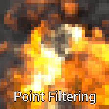
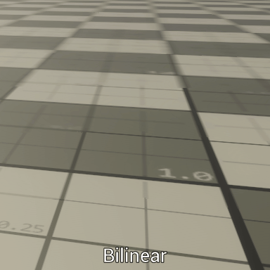
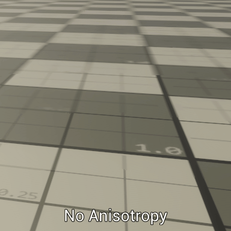
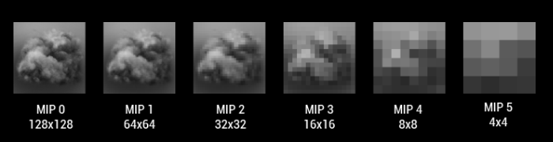

# Texture Sampling

## Sampling Options

Texture sampling options are not texture options per-se but more configuration on how the shader needs to read the texture using its **texture sampler**.

> These settings are often stored per-texture for pipeline convenience but it can lead to nonsense if the engine is not able to override these settings in shader graphs : it can lead to unnecessary importing multiple times the same texture with different addressing and filtering modes.

### Addressing Mode (Wrap Modes)

Addressing Mode is the configuration of the sampler that handles the behavior out of the 0..1 UV range. Different Wrap modes can be set per-axis : Repeat (Wrap) , Clamp or Mirror.

### Filtering Mode / Anisotropy Level

Filtering modes is the way your pixels will behave while being drawn on screen. Old devices (PlayStation 1) were not able for instance to perform texture filtering in order to blend one pixel color to another, the lack of filtering induced an effect of all pixels being visible. Modern engines can allow you to disable filtering at all what is called **point filtering**.

**Bilinear filtering** is a long known method that will blend the pixels of a texture horizontally and vertically so the transition between one pixel and another is smooth.

Bilinear Filtering is extremely fast but can lead to artifacts when used on objects set in perspective. Because the Graphics card will switch to lower Mip-Maps in the distance (see Texture Sampling section in shaders) :  the transition between a Mip and another can appear hard as a visible line in the depth of your scene such as in the example below. (Some mip fading to plain gray were added in order to highlight this artifact even more).

**Trilinear Filtering** adds another dimension to the texture filtering by blending the already blended pixels from one Mip to another. This method is a bit more expensive but today well assumed for textures that need to be tiled over large distances.

**Anisotropic Filtering** enhances **Bilinear** and **Trilinear** filtering by increasing the samples used for the texture sampling in order to enhance the grazing angle blurring that occurs automatically when the GPU tries to fetch the correct mip-map based on view angle and distance.

### sRGB/Linear

Often, the engine lets you set a sRGB/Linear flag on your textures. This flag is mainly used for texture samplers for reading color values. As your engine processes color in a linear way, your color textues have to be converted from Gamma Space (the visible color space, see Gamma / Linear rendering section) to linear space, in order for the lighting to be applied accurately and the colors to blend correctly.

This concept is really often confusing for the artists so if you have to decide if the texture has to be sRGB or Linear, ask yourself if the contained data are actual colors that you have authored in another software. If the answer is true, you’ll most likely have to use your texture as sRGB.

As there are some exceptions and a lot of cases where you could ask yourself about how to configure your texture, here is a table that you could use as reference. (Please note that specific features to your engine could invalidate its contents, so if you have a doubt, ask your CTO).

| **Type**                                    | **sRGB/Linear?**            | **Comments**                                                 |
| ------------------------------------------- | --------------------------- | ------------------------------------------------------------ |
| Albedo,ColorTint, EmissiveTint,SpecularTint | sRGB                        | All LDR Color and Tints, including specular are meant to be sRGB, for Emissive, only the tint has to be sRGB (if used in conjunction with a HDR Mask or value) |
| SpecularLevel,Roughness, Metallic           | Linear                      | Physically-Based values are often mathematical values taken from an arbitrary range, and have to be treated as linear values. |
| HDR Color                                   | Linear (sRGB in rare cases) | This case is tricky: By the book, HDR Values are meant to be treated as linear, absolute values. However, some software tend to apply a gamma curve for them to appear “gamma correct”, if you set up a process using HDR, avoid this kind of unneccessary correction and setup a linear export (see below) |
| Alpha mask                                  | Linear                      | Alpha is meant to be linear to be correct. (if you activate sRGB on a texture, it will not be applied on alpha channel), so if you create a separate alpha channel, It will be meant to be linear |
| Vector Maps (Normals, FlowMaps, Distortion) | Linear                      | These maps are meant to be linear. In 8-bit the values are centered on 0.5 so no gamma correction has to be applied or the values will become off-centered. |
| ProgressMaps                                | Linear                      | Progression Maps have to be kept as linear, otherwise the progression will show a dampening effect. |

### Mip-Mapping

When the texture is imported, the engine can generate a set of Mip-Maps for the imported texture.  Every Mip-Map of a texture is a **lower resolution version of the imported texture** at half, quarter, eighth, 16th… of the initial resolution.

The point in using Mip-Maps is to reduce texture filter aliasing when texel/pixel ratio is greater than one (if the displayed texture is too dense for the final pixel density), these kind of artifacts were present on older consoles and showed a lot of noise on distant textures, because of the inability of the texture units to find a proper pixel value to read. 

By using lower resolution textures, color data becomes blended and aliasing become reduced as the same pixel from the texture is read every time..

> **Performance Info:** Using Mip-Maps is also useful to maintain a consistent texture cache usage and keep good performance.  Disabling Mip-Maps on a texture induces **texture cache stalls**, a phenomenon where performance can degrade exponentially. 

## Sampling in Shaders

### Samplers and Textures

Samplers and Texture are two distinct elements when it comes to read textures in shaders. Textures are data containers (N Dimensional Arrays of pixels (1D/2D/3D/...)) while Samplers are GPU Objects that contain settings in order to Sample a texture. Every one of these settings is called a **Sampler State**.

Sampler states allows to control over filtering, out of range coordinates, mipmap control, texture array controls, or sRGB/linear handling.

Depending on your engine, some, many or most of these options are hidden or wrapped under more artist-friendly options in order to maintain good quality and performance

##### Texture Wrapping Mode

Texture Wrapping Mode handles how to read texture when using out-of range (0..1) coordinates. Basically a texture read in the 0..1 range will be read as-is and will wrap every unit of coordinates using a Wrapping mode named **Repeat**, Some engines will allow you to **Clamp** so the latest pixel of the texture will repeat indefinitely after the edge of the texture, or even **Mirror**.

Addressing mode can be set per-axis using the **ADDRESSU**, **ADDRESSV**, and **ADDRESSW** states but often, game engines lets you choose this setting once for all axises (some also provide per-axis as an advanced setting). 

Addressing modes can be set using a **CLAMP** (clamps coordinates between 0.0 and 1.0), **REPEAT** (Wrapping the texture out of range), or **MIRROR** (flips the axis every odd and even).

##### Texture Filtering

Filtering can be adjusted in various ways, depending on the Texel/Pixel ratio. Three filtering modes can be adjusted depending on various cases : When enlarging : **MAGFILTER** is used when the Texel/pixel ratio is < 1.0, When the Texel/pixel ratio is > 1, we use **MINFILTER** to set it when the kernel is shrunk down. In the case of using mip-maps, the **MIPFILTER** can be used to blend between mip-maps (thus enabling tri-linear filtering)

Filtering modes can be set to **POINT** (No filtering), **LINEAR** (Smooth) and **ANISOTROPIC**. The latter relies on view angle to filter using different (higher) mip-maps.

> For Further reading : See [Filtering Mode/Anisotropy Level](#Filtering Mode/Anisotropy Level)

##### Mipmap Control

When reading a texture, provided coordinates will help the GPU determine which mip to read depending on the texel/pixel ratio and the view angle. Mip-maps are selected automatically to be used using a `tex2D(s,t)` operation. 

Tex2D is the auto-mip function that will read a texture using its sampler s and coordinates t. This function is meant to be used in pixel shader only as the rasterization will determine the UV coordinate screen space derivative (how much UV changes from one pixel to its neighbor).

##### Texture Array slice Index

Texture objects can be of many dimensions (1D, 2D, 3D, Cube) but can also be stored into Texture Arrays, using the slice index enables the user to select which element of the array of textures you want to read from.

##### sRGB/Linear Sampling

sRGB/Linear Sampling flag enables the texture sampler to apply inverse-gamma correction for sRGB Textures (or not in the case of linear textures such as Motion Vectors, Masks or Normals). 

sRGB Sampling roughly applies the inverse function of the gamma correction in order to transform all color data into linear data that is mathematically correct for blending, lighting computations or even simple display.

For more information see [Color Correction](..\shaders\color.md) 

#####  

### Sampling Coordinates

In order to sample a texture using a sampler, a set of coordinates need to be provided.

##### UV Coordinates

##### World Coordinates

##### Screen-Space Coordinates

##### Lookup Coordinates

### Deforming Sampling Coordinates

## Texture Sampling and Performance

### Texture Dependency

### Texture Cache and Stalls

