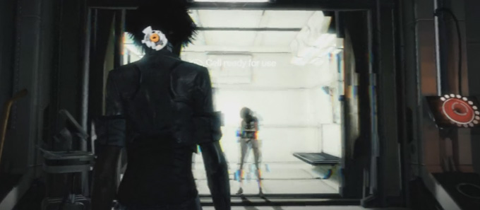

# The VFX job in Video Games

Visual Effects in video games involve a large scope of techniques, software, and methods encountered from prototyping to the end of production. This section is an introduction to anyone who would have an overview of the job. Most of what is described here is detailed in other sections of this documentation.

## The Visual Effect Artist

So what is exactly the job of a Visual Effects Artist? The question is real because profiles of VFX artists can differ, just as environment artists have specialties and domains of expertise (texturing, modeling, UV Mapping, sculpting, retopolgy, etc.). 

*Cool stuff happens often, and your team reacts accordingly*

The VFX Artist is generally a strange beast halfway between a Texture Artist, an Animator, a Modeler, often even a Programmer. Most of the time it possesses a playful mind with a lot of creativity to achieve things unfathomable. So the stakes are high but really often the work is really rewarding because we are the ones who do the cool, shiny stuff.

### Our Daily Bread

Our job is to author various kinds of visual effects : explosions, splashes, light effects, special powers for characters, gameplay effects, weather effects, and a lot more. All these are intended to be put in the game and we will have to be able often to integrate them into the gameplay to test them in real game conditions : doing so helps us decide of the quality of the effect, the impact on the gameplay and the understanding of the game and also evaluate the performance impact on the game's framerate. 

*Work in progress inside a Blockout level*

Most of the time, we work blindly in a work-in-progress game project with characters, animation, environment that need polish, or even work on. This involves from us a capacity of projection into the future to assess how we are gonna design our effect. Hopefully, this can be achieved by discussing a lot with the other artists, programmers in order to keep in sync to what will be done.

To sum up things, our job is mainly about anticipating the needs about sexiness and readability of the game, and most of these will come forth after a lot of stuff is already in place in your game. This means we will have to perform a lot of effort to work early, keep it ready, and prepare for building a lot in the end.

(Oh, and most of the time we will do have to cope with a poor framerate and try not to ruin it further.)

### Technical Art

Before all of this, VFX Artists are Technical Artists, and more precisely a subset of the technical art domain.  Most of the time we will stick to do particle effects but being good at VFX is knowing most of the technical art field processes.

**The technical art field is really wide and includes the following processes:**

* Artist tool scripting
* Shader authoring
* Procedural generation
* Visual effects (particles, animations)
* Post-processing effect authoring
* Rigid body scene destruction, setup, simulation and animation
* ...

So learning fields out of visual effects are a good idea, it is not necessary when you are junior to the job to have a full skill set ready, but try to save some time to learn all these along the way.

### Real-Time vs CG VFX

It is also a common misunderstanding that VFX in pre-rendered industry(movie, commercials, animation,...) and VFX in games are the same jobs: the two have similarities on the software used, some tricks, but the methods and the challenges are often different. 

VFX in games have often a really tight budget in production and require a lot of adaptability to come up with ideas, quickly, mostly at the end of the pipeline, and implement them without side effects on performance or readability of the image.  

Game Companies often name us FX Artists, Particle Artists, or sometimes SFX Artists (for Special Effects, which can be confusing as Sound Effect Artists have the same acronym).

## How to become one?

How to acquire sufficient skills for being a VFX Artist can be tricky if you lack the minimal information about where to find resources, documentation or even know the good people who share information.

This section is a basic startup guide and reflects only my point of view. If you have more information, I'd be glad to discuss it with you.

### Schools, projects and internships

There are very few Schools nowadays (2017) that teaches Visual Effects, most of the time, benefactors from the industry will try to teach in some schools technical art but this is quite rare at the moment.

#### School yearly projects

Most of the time, you will learn about making games in a specialized college or university by making year-long projects and acquiring information mostly on the internet. If your tutors have experience in the game industry it is likely that you will be able to learn a lot from them depending on their field of expertise.

If you learn a common middleware engine such as **Unreal** or **Unity** you will find a lot of information over internet and even dedicated websites.

#### Internships

Often, your school will require you to experience an internship, or will grant you the right to do a voluntary internship during summer vacation. These can be pretty valuable at the condition to find the right place to go. Some studios will publish an internship application for VFX Artist, but it is not so common. If you find one of these, you can apply but make sure you will be mentored enough in order to have a good start. 

Other times, you can even try to apply directly for a VFX Artist position, especially if the company is looking for a junior VFX. This can be considered a bit cavalier so do not be surprised if you encounter a strong response from the company. Luckily some studios have a hard time finding good VFX Artists, and internship applications can be accepted if the student is motivated.

> Warning: Some companies tend to overuse internships and exploit interns instead of teaching them: if the team is rather small and there is no VFX Artist in house to help you, you won't be able to experience your internship to the fullest by being all by yourself.
>
> This can be a double-sided blade for you. On one side you can prove yourself if you are confident enough, but on the other side you won't be able to learn for a more experienced VFX artist. Do not neglect this, as many senior VFX artists, even though lacking cutting-edge knowledge, have the advantage of the production experience.

### Changing jobs

Changing job to become VFX Artist is also another solution in order to join the VFX community but will require you to invest yourself fully into the new job. Most of the time, changing jobs can be seen as indecision or failure in your current position by your fellow comrades. If you can change job within your current company, it will however not be the case as people know you. Switching to VFX is often the transition made by really technical artists who have started tasting the job, then finally take the leap to fulfill their new passion full-time. Learning can be made daily, or thanks to fellow VFX Artists, in afterhours.

### By yourself

Of course there is always a way to learn how to make VFX by yourself and train yourself. The internet is full of resources, tutorials and information on how to learn the job. If you intend to learn, dig inside this website without fear and start learning by yourself. The documentation is rather dense, but you will eventually find what you came for. Learning by yourself will require you a lot of willpower but the rewards are worth the effort. 

