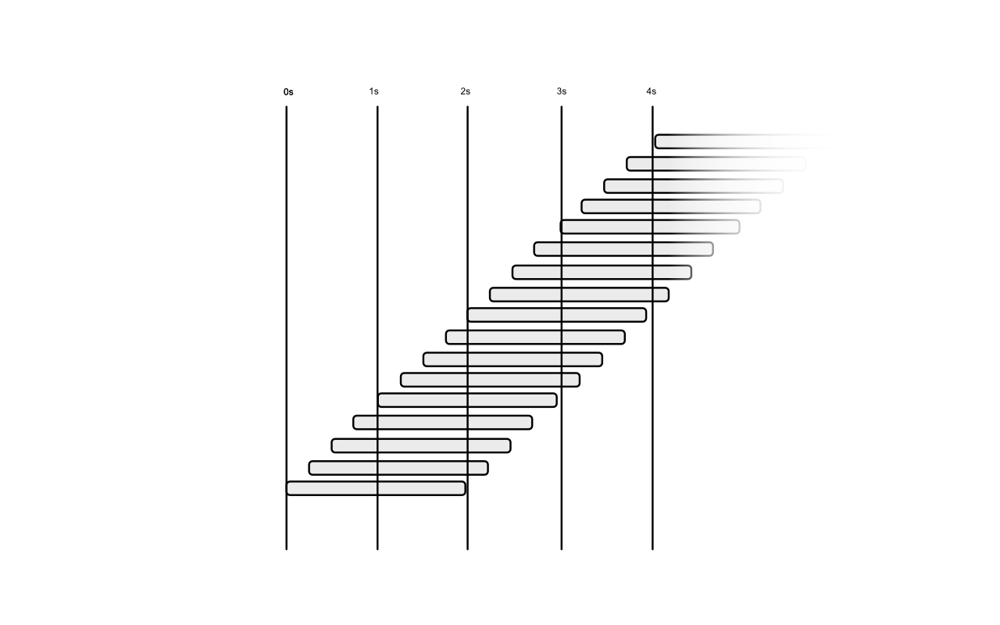
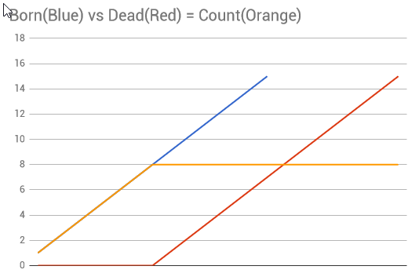
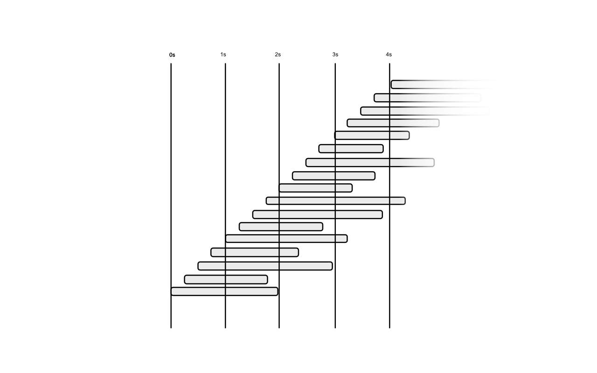
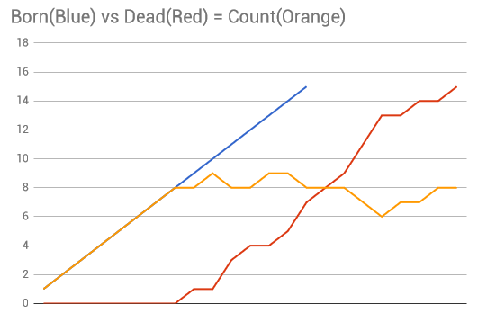
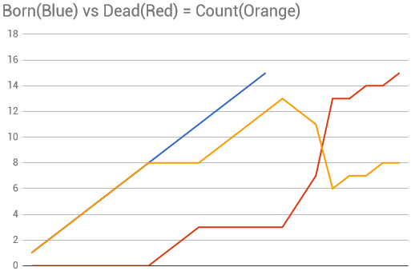

# Particle Systems

## How Particle Systems Work

### Basic Particle System Concepts

In the most general case, a particle simulation represents a group of independent, living objects, in a continuous (non-discrete) space*. Particles carry a per-element state that can vary depending of your simulation complexity. The particle state is a composition of various **attributes **that are used to define one particle.

In the most general cases particles carry the following attributes:

- Current Age
- Life expectancy (lifetime)
- Momentum : Current Self-Velocity
- Current Position

Additional attributes can be stored on particles such as color, size, weight, drag coefficient, … depending on what is relevant for the simulation to store.

What we call **simulation **is how to update one step (every frame) every living particle in the pool of living particles. Updating a particle is generally updating the values of every attribute of every particle.

<u>This generally includes:</u>

- Aging particles : adding current frame DeltaTime to every particle age.
- Reaping particles : checking if a particle is old enough to die, and remove them from the simulation if age is greater than life expectancy.
- Applying forces & modifiers to update current velocity.
- Integrating velocity to positions: Updating positions of particles depending on their current velocity.

In parallel of updating particles, the simulation can be fed with newborn particles : this process is called **emission**, spawn, sourcing or injection (depending on your software). This process adds to the pool of particles new ones that will be solved until they die.

Upon adding new particles, the emission process bestows to the newborns an **initial state**, using initial attribute values that are required for the particles to be updated.

### Emission, Lifetime and Death

When designing particles systems we often define maximum number of particles that will reside in one effect. The first reason of doing this is to prevent your effect to grow indefinitely and ruin progressively the performance of the game. 

The three handles we have for ensuring particles are living in a reasonable flock are the amount we can create over time (or over any other criteria), the amount of time these units will live, and of course any rule or constraint that could kill a particle under certain constraints.

####Spawn Rate vs Bursts

Many methods can be used to spawn particles, all these are options of the emitter module. This module controls how many new particles have to be created at every frame:

* **<u>Rate (based on time) :</u>** the emitter will emit N particles per second, evenly distributed over time. This means a rate of 10p/s will emit a particle every 100ms. 
  * However, if the rate is described as a random distribution with a min and a max, the interval between two particles emitted will generally be computed every new particle spawned. For instance a random between 5 and 10 particle per second will compute a delay until next particle between 100ms and 200ms every newborn particle
  * When rate is greater than framerate, multiple particles can be spawned at once. However the spawned particles will have the same age at birth instead of having distributed age (as if they were  spawned at a higher framerate, on multiple frames). A solution to this is to perform a partial update right after the birth to simulate the relative amount of aging
* **<u>Bursts (based on time) :</u>** are instant spawn of a given count of particles at a given time. All the particles are spawned with the same age.
* **<u>Rate (based on distance) :</u>** this mode enables to spawn particle when the emitter source moves along a certain distance. The particles will be spawned evenly between the current position and the previous position. Also, like the time-based rate, some engine perform pre-update of particles to age them accordingly to their progression, as if they were spawned at a higher framerate.

#### The Birth/Death ratio

This ratio can be easily computed and gives us an information of how many particles live at a time during a simulation. Let's say we spawn 4 particles per second, and every particle lives for 2s, over time it is quite safe to say that we shall observe 8 particles at a time. Here is a figure that explains this mechanism.



In this figure every gray label represents the life cycle of a particle at a time. At T=0 there are no particles, at T=1s, 4 particles have been emitted and so far none is dead already. The first death will happen when the first emitted particle will die, at T=2s (assuming that this particle was born at T=0). Starting T=2s, 4  particles per second will die, the same as the birth rate, because all particles are expected to die 2s after birth.




Using a constant spawn rate and a constant lifetime will ensure that the amount of living particles will increase from 0 to N, following the equation N = Rate * LifeTime

#### When random ruins the party

However, when making particles, randomness in spawn and lifetime tend to complicate this equation.



In this figure, the lifetime is now random between 1s and 3s. It is now almost impossible to tell the actual amount of particles living at a given time. Because previously it was easy to state that particles would die at the exact same rate as they were spawned, here, the death rate is scarse. 

However, due to random distribution, It is also easy to state that, over a long time, the average particle lifetime would be the exact average between 1s and 3s... 2s. In this case, our N would be N = Rate * avg(MinLifeTime, MaxLifeTime), and would tend to be 8 over a long period of time.



in this scenario, particles will tend to oscillate between 6 and 10 as shown in this graph.

#### Ratio over time, and extreme cases.

In the previous example, we saw that the random lifetime over time tends to its average. However, life is often a bitch and over a period of time, our lifetime dice rolls can be successively low or high. Let's say that we have pretty bad luck and we spawn successively particles with a rather high lifetime, the amount of living particles can become dramatically high or low.



in this figure, few particles die at some point, increasing dramatically the amount of living particles.

### Timing, Randomness and Integration

Particles can be 'ticked' (means, updated, just like a tick-tock clock) at a fixed pace or be dependent on the frame rate of your game. Choosing a method of ticking your particles can be critical for your game performance, effect quality but can have dramatic side effects. 

The main issue you will have to deal with is framerate, if your particle simulation is ticked with the framerate, your simulated particle will suffer precision when the framerate will drop. This can be explained easily by this figure:

*figure presenting a curve with change peak and sampled before and after the change peak*

Running at a fixed pace has its own advantage, meaning that your particles will not suffer framerate imprecisions, but instead can lead to even worse performance. Say your game is already slow because of your particle systems, and you need to update too many particles for your hardware, you can even have multiple passes of update for one frame of rendering.

Hopefully, some engines use a N*T update pass meaning that it will do in one pass the computation with a Delta time N times greater, N corresponding to the number of frames it would have required to update. The downside of this system is, as for the variable rate update, as Time increases, your simulation precision does decrease proportionally.


## General Particle Concepts

### Age, Lifetime and Relative Age

Particles generally are designed to live and die at a predetermined age.  This age of death is often called **Lifetime** and is computed per-particle at birth if needed (for example when dealing with constant lifetime)

During spawn, particles are initialized with an age of zero, and every update, they will age of the current **deltaTime** (fixed if running in a fixed update loop, or the current Framerate's delta time otherwise). If a particle's age goes older than its lifetime, it's been reaped and removed from the simulation.

> Note: Whether the particle will be reaped at the current frame or the next one depends on the particle engine

### Velocity integration and position

Particles are (most of the time) simulated with velocity in mind. **Velocity** is the vector that represents the distance the particle will travel for a given interval, at a given time. (Most of the time the velocity is expressed in game engine units per second). 

> In physics, this is similar to the **momentum** of the element. 

The **speed** is the length of the Velocity vector and it represents its actual distance travelled over time.

<u>Every update, for every particle, its velocity is *integrated* to the position</u> based on the delta time: the particle engine will move the particle in the velocity direction of a given fraction of time : the delta time. Basically if you run your simulation at 10 fps, the delta time will be 0.1s and if your particle has a velocity of (2,2,1), the position will be offset of (2,2,1) * 0.1 = (0.2,0.2,0.1)

> Velocity integration happens most of the time **after** computing all forces and adding them to the velocity. 

### Billboard Orientation

When using particles, you often want to scale them and/or orient them along precise axis in order to achieve particular effects, such as velocity orientation, fixed rotation around an axis, or even lock your billboard totally.

#### 2D Camera Facing (based on Near Plane)

This orientation assumes all the particle will face the camera near-plane (extended to the infinite). This is the most common camera facing method used for sprites. It ensures all sprites remain square on screen, regardless of the field-of-view.

 

 

#### 3D Camera Facing (based on camera Position)

This orientation assumes all particles will look at the position of the camera, so all the quads are not parallel but instead describe a hemicycle towards the camera. This rendering method does not align quads to screen space, and will tend to avoid the camera if it comes too close.


 

#### Velocity-Based Orientation

Velocity-Based Orientation will tend to orient one axis alongside the velocity vector of your particle, and adjust rotation around this vector to face the camera. This mode is pretty convenient to render sparkles and streams of particles that need strong sense of direction (water streams, flamethrowers, waterfalls, ...)


This method has its limits and can break the magic when viewed at grazing angles : as the camera vector comes co-linear  to the velocity vector, the particle becomes stretched in perspective and will tend to show itself as it is : a plane rectangle. 

Worse : if the camera "crosses" the grazing angle, these quads can be seen revolving around their rotation axis.

#### Rotation around fixed axis

This mode is pretty much the same as the velocity-based orientation, except that the direction vector is not based on the particle velocity, but instead given by the artist.


This mode can be used to display billboard objects in the distance quite easily such as trees, backdrops. But has the same drawback as velocity-oriented quads.

#### Fixed Orientation.

This mode orients a particle with fixed axis, making the quad locked in its position. For example facing up and being locked to both horizontal axis


### Billboard Pivot & Offset

One of the features most particle system solutions offer is to offset the particle billboard’s vertices depending on a 2D offset to adjust the center of the particle, and another axis to move the particle towards or away the camera.

The 2D offset helps sprites behaving correctly by setting the transform center of the particle (especially for rotation and scale), this helps adjusting the texture to the closest outline of the texture instead of reserving empty space around the center of the image.

Setting a pivot this way enables also to customize the center of scale and rotation of the quad. Sometimes the particle engines can allow to set the pivot outside the bounds of the quad to create orbital motion when used in conjunction with sprite rotation.

### Non-Square Particles

In most modern particle engines there are features to enable more complex geometry for particles, such as octagons or convex hulls. These features are mainly used to reduce overdraw to the minimum and have an efficient usage of the drawn surfaces.

**<u>Octagons :</u>**

One early and easy optimization is to use octagons instead of quads to render particles, by using these, most of the time there was a cropping factor to adjust the corner cropping amount depending on the needs and the overdraw. This factor was mainly dependent of the shape of your sprite but not accurate enough for off-centered particles.


**<u>Closest Convex Hull:</u>**

Instead of using an analytic octagon, the closest convex hull method uses texture analysis to determine the closest convex hull (based on alpha or color value threshold) and often store these information as texture metadata. 


### Flipbooks (and Sub-UVs)

Flipbooks are packed frames of animation within a Texture Sheet. most of the time the sheet is divided in rows and columns to hold all the frames of the animation.


To display the sprite animation, the particle engine will calculate at a given time, the correct UVs for the sprite to match the current frame of animation. The rectangle within the UV space corresponding to one frame is called a sub-UV.

More elaborate shaders can use a secondary Sub-UV rectangle and a blend factor to perform frame blending when playing flipbook animations.

Even more elaborate shaders can also use Motion Vector / Optical Flow maps to deform a sprite towards the shape of the next frame.

### Camera Fading, Soft Particles and Camera Offset

Soft Particles, Camera Fading and Particle offset are features to alter the depth presence of a particle depending on its distance to the viewer and the world they evolve in. These three features are often dissociated but prove useful in many cases by acting together:

#### Soft Particles

Soft particles are a method to smoothen the intersection between a sprite and opaque geometry. This method involves reading the scene depth and compare it to the sprite's pixel depth. By using an attenuation distance, the pixel can be faded if coming tool close to the depth of the pixel behind it.

This method is extremely useful to blend particles inside large objects.


#### Camera Offset

Camera offset is a simple offset applied to the particle that enables the quad to exist at an offset position from its actual position. This offset is applied on the view vector so it pushes the particles towards the point of view or away from it. This method enables adjusting an a quad around a source so it tends to appear always in front of it, or behind it. Combined with Soft particles, a camera offset towards the camera enables more surface to cover the object at the source.


#### Camera Fading

Camera fading is a way to make the quad fading as it approaches the point of view. This method is a good way to avoid near-plane clipping


## Other Particle Concepts

### Sorting Particles

Sorting particles is really often thought as the grail of making good visual effects. But it is not really in most cases. Making effects has always been a work of compositing effects on top of other effects. And most of the time, sorting effects has been done by hand. Here are two examples of particles without and with depth sorting.

<video loop="true" autoplay="true" ><source  src="../img/sorting-none.mp4" type='video/mp4' /></video>

<video loop="true" autoplay="true" ><source  src="../img/sorting-depth.mp4" type='video/mp4' /></video>

In some game engines, you have access to a variety of sorting factors in order to control the order of rendering of every effect you make : engineering often consider this as an absolute  requirement but it is not necessarily what we want.

#### Overall particle sorting

This method involves that all particles will be part of a big "meta-simulation" where all quads of all emitters of all effects in the scene will be sorted altogether and rendered in correct sorted order. This is something that happens a lot in some in-house engines, and strangely for strategy games (maybe for a better understanding of the game board when view at grazing angles). 

Doing an overall sorting pass involves that your particle shaders will be limited to one "master" particle shader containing most of the rendering features, and will be applied to all particle in one pass : for an artist it can be considered a big restriction in terms of shader authoring creativity.

Another constraint of this system is that particles cannot use exotic blending modes and will probably share a common blend mode (most of the time it is **premultiplied alpha** blending which enables to render either in alpha blending and additive)

On the other side, rendering an overall simulation has its benefits : performance. Doing so wraps all the emitters inside a single draw call and reduces greatly the CPU rendering cost (even though this CPU time is often used to sort particles instead).

#### Entity/Layer/Particle Sorting

This system takes a different approach from an overall simulation sorting. Instead of considering all particles part of a single sorting pass, this system does sorting at different levels.

- First, the **Entity Level** will take all systems in the **scene** and will use the game engine's back to front sorting to render them base on scene object's bounding boxes. This will have the effect to have stable entity sorting and the ability to place in-between transparent objects (such as windows, glass objects, water, ...) and thus the ability to sort particles behind and over these other objects.
- Next, The **Layer** sorting happens if your particle system contains multiple Layers, Emitters, with different shading. Unreal Cascade does that (see figure below), using one column per-layer. Meaning that all the effect emitters, will be rendered from left to right as different layers.
- Finally the **Particle** sorting can optionally happen inside a particle layer if the particles of this layer 1need sorting (for instance to apply correct lighting).

This system involves designing effects as a composition of layers and can prevent some effects to be made (for instance, particles of one layer revolving around particles of another layer, with correct sorting). But with this system, any shader can be used as a layer, meaning increasing artistic choice.

By keeping effects confined in layers, this system offers some stability to the rendering and interpenetrating effects seems more overlapped than intertwined (which can be either a good thing or a bad thing, depending on the situation).

The downside of this system is that every layer of every instance of an effect becomes a draw call and will cost more in terms of CPU than a meta-simulation. However this is really common in game engines and the cost is most of the time really affordable.

#### Particle sorting pros and cons

While particle sorting can be helpful at times, it is often unnecessary and unused. Here is a wrap-up of things to know about particle sorting.

- (Con) Computational cost: Sorting particle can come really expensive and even though most of the time the tech scales well with large amounts of particles (due to partitioning algorithms and other optimizations), its cost is still being drawn back when it comes to sort multiple small entities, compared to a large world (Overall particle simulation we have seen above).
- (Pro) Needed for Particle Lighting, and dealing with rather opaque, yet blended particles: these cases are the most prone to display sorting discrepancies. The main killers here will be :
  - Ability to revolve your point of view around your effect
  - Use of alpha blending (and premultiplied alpha blending), additive is fine
- (Con) Do not use if using additive blending: Additive blending is non-commutative and thus will render the same regardless of sorting.
- (Pro) Some sorting equalizes streams of particles: for instance using a sorting by relative age will ensure a smoke column will be rendered correctly without fold-outs (one particle is supposed to be "behind" its top predecessor and/or "in front" of its successor, but is not)
- (Con) Depth-sorting artifacts : when revolving around your effect, when your sorting order changes, it happens without transition, as the GPU is unable to blend when a particle appears on top of the other while it was the opposite at the previous frame. This is often called sort popping and cannot be addressed easily.


### Memory Management

Particle Memory is often underestimated by artists and is a key to keep assets optimized. Particle memory is most of the time managed by pools by emitter, meaning that one system has a target number of particles that can be allocated.

This number is most of the time set manually to an initial allocation count, but some tools have the ability to compute a decent target number (based on spawn and lifetime of particles).

Some other engines (such as Unreal Cascade) can even grow the memory if the spawned particles exceed the initial allocation count, which can be convenient if an effect needs to be scaled depending on a game factor (for instance, a given number of players)

### Effect Bounds

Particles can be really resource consuming so most game engines feature optimizations to save performance. A good method to reduce performance is to perform **view-frustum culling** : in layman's terms,  the engine will put on hold the simulation of the particles, and their rendering if the bounding box of the system goes off-screen. 

#### Static bounds vs. Dynamic bounds

Bounds computation for particle is most of the time performance consuming, scaling linearly with the amount of particles in the simulation. Activating this feature is sometimes mandatory for effects controlled by the gameplay, and that can take multiple forms.

<u>However most engines provide tricks to reduce the cost of this computation:</u>

- Deferring the computation on one out of N frames
- Deferring the computation on one out of N particles (for large systems evenly distributed)
- Enlarging all the frames, recalculating at other times.
- Computed procedurally (based on emitter position over time)

#### Refining bound culling

Most of the time this option is enabled by default as it is a huge performance saver. However, there are times where it is not wise to disable all behavior when going off-screen:

- The effect is supposed to happen but you are not looking at it. When you turn the camera towards the effect, it has to be in the state where it should be.
- The effect is revolving around you, spawning a trail, but when you turn around,  the particles that should have spawned did not spawn.
- The effect is revolving around you, spawning a trail, but when going offscreen, everything disappears.

These are some of the examples that can happen if you deal with static bounds, or view-frustum culling however there are some engines with solutions:

- Tick off-screen effects at a lower rate (1 out of N frames)
- Tick off-screen effects at full rate but do we not render them

### LODs and distance Culling

llkjh

##Seeding, Randomness and Statistics

### RNGs, Seed, and Determinism

**Random Number Generator** (RNG abbreviated) is a piece of computer code that produce random numbers every time it is queried. It is often based on complex mathematical suites and is often described by a uniqueness parameter : the **seed**.

The seed is the key to obtain (or not) a given sequence of random numbers every time the RNG is queried. For example a RNG outputting integers between 0 and 9 will produce

Seed: 1 : Sequence 8 4 5 1 7 0 3 4 2 5 1 0 9 9 3 5 7 6 3 1 ...

Seed: 2 : Sequence 5 0 1 8 2 2 0 9 1 3 7 5 0 1 4 7 9 6 1 3 ...

Seed: 3 ….

…..

The seed ensures that a RNG is **deterministic **so that the queried sequence will be the same every time the RNG is configured at a given **seed**.

In general, for effect’s random to be totally undeterministic every play, the seed for an effect will be a composition of a unique number for the effect, another one for the instance of the effect in the scene, and another unique token of the moment of triggering the effect : for example the duration since the game started.

So in the most random case, Seed could be computed as:

S = EffectID + TimeSinceGameStartup + InstanceID

But by adjusting the number of variables taken into account to generate the seed you can ensure your effect could be synchronized in some cases.

For example, if you want to ensure a set of random explosions (from the same effect) during a cinematic to be played exactly with the same random behavior, they would rely on the **InstanceID** and the **EffectID** to generate the seed

… But not **TimeSinceGameStartup**, as it is not precise enough (the cinematic can be started at any time, and even if it is the introduction movie of the game, game time can vary a little, enough to generate a different sequence).

Finally if you want to reuse your effect many times during the cinematic, but to have a different random every time it is triggered while keeping the same random across all cinematic plays, you can add a **PlayCount **token to the seed that will increase every time your effect is played.

### Distributions

In statistics, distributions are the homogeneity of random numbers generation. It is basically a function of the RNG that will be able to output numbers based on rules.

Linear distribution : A linear distribution will output numbers in a range with equal probabilities to be at every values upon a large sequence.

Periodic distribution : A periodic distribution will output numbers in a range with equal probabilities upon a given sequence period. For instance a 0..9 rng with a periodicity of 10 can output the given sequence :

```
394784105239478410523947841052394784105239478410523947841052
```

