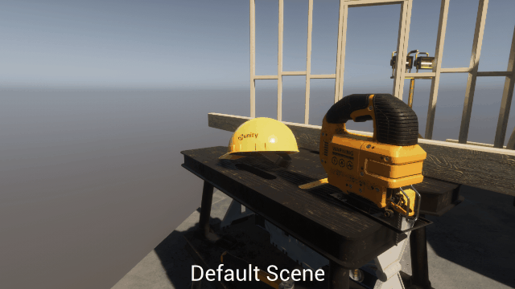

# Post-Processing and Camera FX

## Post-processing general concepts

Post-processing are generally effects applied full-screen that do not depend on any particular object of the scene and that will apply a modification of the rendering using generally the color and the depth buffer. Post-processes are shaders that are applied full-screen and that do not require any particular geometry to be rendered.

Other general-purpose camera effects can occur, not necessarily in full screen and are detailed inside the Other Camera Effects section.

## Standard Post-Processing Effects

### Blur & Depth of Field (DoF)

Blur and depth of field post-processes are an attempt to match a camera depth of field effect induced by a physical camera lens. Depth of field produces a blur effect for areas of the image that are too far from a point-of-focus. 

Depending on the engine and the shader you can control the depth of the focus area and the amount of Near blur and Far blur. Some engines will also compute bokeh highlights inside blur passes.

Simple DoF implementations will compute a blurred version of the scene color, and use a depth mask to interpolate between the blurred version and the non-blurred version. However, more advanced methods enable reducing artifacts such as near-blur bleeding, or use multi-scale radius for the transition areas. 

### Bloom / Lens flare

Bloom and Lens flare effects are full screen passes that will simulate highlight reflections on the camera physical lens. 

### Screen-Space Light shafts

Screen-space light shafts is a solution  

### Vignette, Grain, Lens Distortion and Chromatic Aberrations

b b  b bn bnnb  

### Color grading and Tone Mapping

Color grading and tone mapping will process color according to the physical response of a film celluloid or a  digital camera sensor. Tone mapping will balance the luminance values based on an exposure response curve, while Color Grading will perform color adjustments to simulate colorimetric response.

Most of the time, Just before applying Color Grading, the Tonemapper will perform gamma correction so all the Color grading will happen in LDR Space.

Color grading is also used to perform artistic color adjustments. Color grading settings and computations can vary a lot between engines, from simple Brightness/Contrast/Saturation settings to Highlight/Midtone/Shadow toning and coloration to curve remapping. A modern technique is to bake all modifications of many computations into a 3D Lookup Texture to perform LUT-Based Color Grading.

##### LUT-Based Color Grading

In a Lookup-Table based color The process of color grading is to match one output color per input color. It is really interesting as many cell films responses can be reproduced using commercial LUTs. Some engine will provide you tools to generate your own LUT texture, but other software such as DaVinci Resolve can help you generate them as well.

 

### Gameplay Postprocesses

Gameplay postprocesses are part of the Visual Effect Job as they will be defined as camera effect. While many effects can be achieved using standard postprocesses, some will require writing custom shaders in order to achieve wanted rendering effect. Depending on your engine, there is always a way to make these work, even without a post-processing system.

Gameplay postprocesses can be rendered full-screen using full shader passes or use screen-space particles to achieve localized effects. In the example below

### Optimizations

## Other Camera Effects

### Punctual Lens Flares

### Camera Shakes

### Distortion / Refraction

