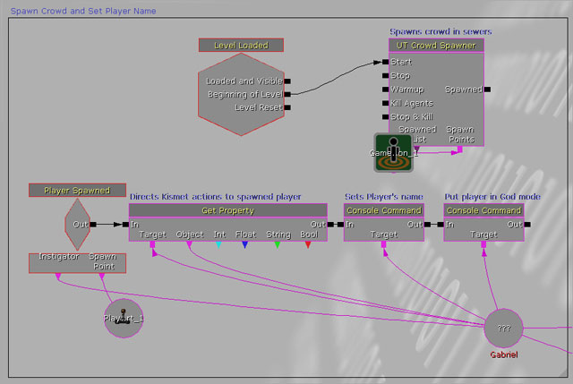

# Scripting

Scripting is part of the work of tech artists, it gathers a lot of tasks from processing data in large batches to making actual tools for artists. It involves the knowledge of a scripting (or programming) language, or the knowledge of a visual scripting language.

## Scripting vs. Visual Scripting

Scripting is often considered a daunting task for most of us especially when it comes to learn scripting into a new tech art environment. Most engines nowadays provides script support in various flavors and are more or less accessible to artists.

### Visual Scripting and Node based editors.

Visual Scripting has been popularized since 2007 and the Unreal Engine 3's visual scripting language : *Kismet*. This language provided high-level functions in order to manage actors within a scene, provide basic level and gameplay interactions, trigger cinematics and spawn new entities into the game.

*Sample Kismet Graph (source: [UDN](https://docs.unrealengine.com/udk/Three/KismetUserGuide.html))*

This visual scripting was easy enough for people to start working in some simple scenes and prototype gameplay. Compared to this system, *UnrealScript*, the text-based counterpart was more powerful in terms of capabilities but another league to reach for users. Let alone C++ if your studio had access to engine source code, which unlocks full potential but closes the door at most of all tech artists.

#### From Kismet to Blueprint : Node-Based Level design to Node-Based Game design

Later on, Unreal Engine 4 brought more of the UnrealScript's features into Visual Language by bringing the *Blueprint* visual script system as a core feature of the engine. In this scripting language, users have access to  the same level of features they could find in kismet, but all this was extended by adding visually almost everything you could do in UnrealScript. The main goal here is now we are able to create new game entities with their own behavior, instead of only managing entities in a level.

#### Advantages and Drawbacks of using visual Scripting

Visual Scripting, besides being artist-friendly encourages people diving into game logic without fear. By this, people can start learning how the engine works and what can be done, or not. Most of the pleasure of writing scripts resides in user experience: In a node graph you can read everything by navigating from one node to another, zoom in and out, and create new nodes using user interface. 

Most of the time creating nodes will prompt you with a menu with categorized items, a search bar. This feature is the main entry point when it comes to learning. If you have a search field it becomes a child's play to search and find what you are looking for.

When it comes to read and understand the graph, the advantage in comparison to text-based scripting is you can see visually relationships between entities and the actual flow. So when it comes to read a complex level design graph, Visual Scripting is an excellent candidate.

However, Visual Scripting, besides being an excellent asset in terms of ease of use and prototyping, can mislead people into bad usage and overly complex graphs. This happens often in production when something simple has mutated into an unmaintainable knot of noodles that produces bugs and needs to be straightened into actual code.

In this case, you should not be using visual scripting anymore and turn to more robust, text-based solutions.

## Learning a scripting language

Learning a scripting language is an investment : at a cost of a painful learning curve, benefits are worth the effort. There are many scripting languages available, some of them more popular than others. Basically, the  popularity of a language will orient you towards it as you will find information, examples, and libraries more easily.

### Openness vs. Closed Scripting

There is debate among scripters about what to learn and what to invest in our arsenal. There are so many scripting languages out there that it is almost impossible for a scripter to know a wide range of scripting languages and master them in a regular basis. Also, the more a language diverges from the others (in terms of syntax, grammar), the more likely we will shut ourselves into this language.

That's why for example 3DSMax scripters often have a hard time transitioning from MAXScript to Python or JavaScript, which are more open scripting languages.

On the contrary, open language implementations in software seems often clunky or just a 'wrapper' of the functions of another language, with poor function names, documentation and structure.

#### Python

Python is a pretty young scripting language which stands out by its strict formatting that encapsulates blocks into indented paragraphs. You can find an introduction to python on [this page](..\scripting\pythoncheatsheet.md).

#### JavaScript

JavaScript is a really old scripting Language that has evolved towards web and network communication. However, there are some implementations in graphic software such as Adobe suite (Photoshop, Illustrator, ...) with often custom closed API.

#### Lua

Lua is a language that is commonly seen integrated in video game engines. It is easy to learn and integrate but it is quite slow to execute. Some software do provide a Lua integration in order to perform batching.

#### C# (C-Sharp)

C# is a modern language developed by Microsoft since around 2000 and that is influenced by C++ and Java. This language is pretty easy to learn, mainly due to good Code editors (IDEs) that enable good code discovery. In modern game engines, you will be able to script using this language. 